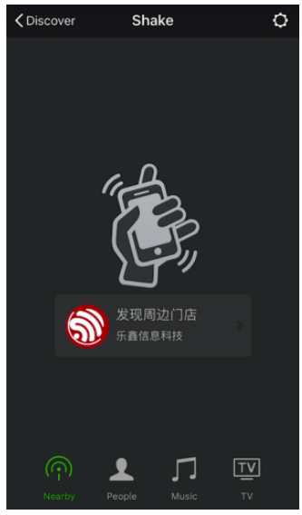

<a name="BLE-AT"></a>
## [ESP32 Only] BLE AT Examples

* Example 1. [ESP32 Only] [BLE AT Examples](#exam-BLE)
* Example 2. [ESP32 Only] [iBeacon Examples](#exam-iBeacon)
* Example 3. [ESP32 Only] [UART-BLE Passthrough Mode](#exam-UARTBLE)

<a name="exam-BLE"></a>
### Example 1. [ESP32 Only] [BLE AT Example](#BLE-AT)
Below is an example of using two ESP32 modules, one as a BLE server (hereafter named "ESP32 Server"), the other one as a BLE client (hereafter named "ESP32 Client"). The example shows how to use BLE functions with AT commands.  
***Notice:***

* The ESP32 Server needs to download a "service bin" into Flash to provide BLE services.
    * To learn how to generate a "service bin", please refer to esp-at/tools/readme.md.
    * The download address of the "service bin" is the address of "ble_data" in esp-at/partitions_at.csv.

1. BLE initialization:  

    ESP32 Server:

        Command:
        AT+BLEINIT=2                              // server role
        
        Response:
        OK

    ESP32 Client:

        Command:
        AT+BLEINIT=1                              // client role
        
        Response:
        OK
2. Establish BLE connection:  

    ESP32 Server:   
    (1) Query the BLE address. For example, its address is "24:0a:c4:03:f4:d6".

        Command:
        AT+BLEADDR?                              // get server's BLE address
        
        Response:
        +BLEADDR:24:0a:c4:03:f4:d6
        OK
    (2) Start advertising.

        Command:
        AT+BLEADVSTART
        
        Response:
        OK

    ESP32 Client:  
    (1) Start scanning.  

        Command:
        AT+BLESCAN=1,3
        
        Response:
        +BLESCAN:<BLE address>,<rssi>,<adv_data>,<scan_rsp_data>
        OK
    (2) Establish the BLE connection, when the server is scanned successfully.  

        AT+BLECONN=0,"24:0a:c4:03:f4:d6"
        
        Response:
        OK
        +BLECONN:0,"24:0a:c4:03:f4:d6"
    
    ***Notes:***   
    * If the BLE connection is established successfully, it will prompt `+BLECONN:<conn_index>,<remote_BLE_address>`  
    * If the BLE connection is broken, it will prompt `+BLEDISCONN:<conn_index>,<remote_BLE_address>`  

3. Read/Write a characteristic:  

    ESP32 Server:  
    (1) Create services.  
    
        AT+BLEGATTSSRVCRE
        
        Response:
        OK
    (2) Start services.  
    
        AT+BLEGATTSSRVSTART
        
        Response:
        OK
    (3) Discover characteristics.  
    
        AT+BLEGATTSCHAR?          
        
        Response:
        +BLEGATTSCHAR:"char",1,1,0xC300
        +BLEGATTSCHAR:"desc",1,1,1
        +BLEGATTSCHAR:"char",1,2,0xC301
        +BLEGATTSCHAR:"desc",1,2,1
        +BLEGATTSCHAR:"char",1,3,0xC302
        +BLEGATTSCHAR:"desc",1,3,1
        OK

    ESP32 Client:  
    (1) Discover services.  
    
        AT+BLEGATTCPRIMSRV=0   
        
        Response:
        +BLEGATTCPRIMSRV:0,1,0x1801,1
        +BLEGATTCPRIMSRV:0,2,0x1800,1
        +BLEGATTCPRIMSRV:0,3,0xA002,1
        OK
    ***Notice:***  
    * When discovering services, the ESP32 Client will get two more default services (UUID:0x1800 and 0x1801) than what the ESP32 Server will get.
    * So, for the same service, the \<srv\_index> received by the ESP32 Client equals the \<srv\_index> received by ESP32 Server + 2.
    * For example, the \<srv\_index> of the above-mentioned service, 0xA002, is 3 when the ESP32 Client is in the process of discovering services. But if the ESP32 Server tries to discover it with command `AT+BLEGATTSSRV?`, the \<srv\_index> will be 1.

    (2) Discover characteristics.  
    
        AT+BLEGATTCCHAR=0,3
        
        Response:
        +BLEGATTCCHAR:"char",0,3,1,0xC300,2
        +BLEGATTCCHAR:"desc",0,3,1,1,0x2901
        +BLEGATTCCHAR:"char",0,3,2,0xC301,2
        +BLEGATTCCHAR:"desc",0,3,2,1,0x2901
        +BLEGATTCCHAR:"char",0,3,3,0xC302,8
        +BLEGATTCCHAR:"desc",0,3,3,1,0x2901
        +BLEGATTCCHAR:"char",0,3,4,0xC303,4
        +BLEGATTCCHAR:"desc",0,3,4,1,0x2901
        +BLEGATTCCHAR:"char",0,3,5,0xC304,8
        +BLEGATTCCHAR:"char",0,3,6,0xC305,16
        +BLEGATTCCHAR:"desc",0,3,6,1,0x2902
        +BLEGATTCCHAR:"char",0,3,7,0xC306,32
        +BLEGATTCCHAR:"desc",0,3,7,1,0x2902
        OK  

    (3) Read a characteristic. Please note that the target characteristic's property has to support the read operation.
    
        AT+BLEGATTCRD=0,3,1
        
        Response:
        +BLEGATTCRD:0,1,30
        OK
    ***Note:***  
    * If the ESP32 Client reads the characteristic successfully, message `+READ:<conn_index>,<remote BLE address>` will be prompted on the ESP32 Server side.

    (4) Write a characteristic. Please note that the target characteristic's property has to support the write operation.  

        AT+BLEGATTCWR=0,3,3,,2
        
        Response:
        >       // waiting for data
        OK
    ***Note:***  
    * If the ESP32 Client writes the characteristic successfully, message `+WRITE:<conn_index>,<srv_index>,<char_index>,[<desc_index>],<len>,<value>` will be prompted on the ESP32 Server side.  

4. Notify of a characteristic:  

    ESP32 Client:  
    (1) Configure the characteristic's descriptor. Please note that the target characteristic's property has to support notifications.  
    
        AT+BLEGATTCWR=0,3,6,1,2       
        
        Response:
        >       // waiting for data
        OK
    ***Note:***
    * If the ESP32 Client writes the descriptor successfully, message `+WRITE:<conn_index>,<srv_index>,<char_index>,<desc_index>,<len>,<value>` will be prompted on the ESP32 Server side.

    ESP32 Server:  
    (1) Notify of a characteristic. Please note that the target characteristic's property has to support notifications.  

        AT+BLEGATTSNTFY=0,1,6,3
        
        Response:
        >       // waiting for data
        OK
    ***Note:***  
    * If the ESP32 Client receives the notification, it will prompt message `+NOTIFY:<conn_index>,<srv_index>,<char_index>,<len>,<value>`.
    * For the same service, the \<srv\_index> on the ESP32 Client side equals the \<srv\_index> on the ESP32 Server side + 2.

5. Indicate a characteristic:  

    ESP32 Client:  
    (1) Configure the characteristic's descriptor. Please note that the target characteristic's property has to support the indicate operation.  
    
        AT+BLEGATTCWR=0,3,7,1,2       
        
        Response:
        >       // waiting for data
        OK
    ***Note:***  
    * If the ESP32 Client writes the descriptor successfully, message `+WRITE:<conn_index>,<srv_index>,<char_index>,<desc_index>,<len>,<value>` will be prompted on the ESP32 Server side.  

    ESP32 Server:   
    (1) Indicate characteristic. Please note that the target characteristic's property has to support the indicate operation.  

        AT+BLEGATTSIND=0,1,7,3
        
        Response:
        >       // waiting for data
        OK
    ***Note:***  
    * If the ESP32 Client receives the indication, it will prompt message `+INDICATE:<conn_index>,<srv_index>,<char_index>,<len>,<value>`
    * For the same service, the \<srv\_index> on the ESP32 Client side equals the \<srv\_index> on the ESP32 Server side + 2.


<a name="exam-iBeacon"></a>
### Example 2. [ESP32 Only] [iBeacon Examples](#BLE-AT)
The following demonstrates two examples of iBeacon for ESP32 modules:

 * ESP32 advertising iBeacons, which can be discovered by the “Shake Nearby” function of WeChat.
 * ESP32 scanning iBeacons.

This is the structure of iBeacon Frame.

|Type | Length (byte) | Description |
|---|---|---|
|iBeacon prefix | 9 | 02 01 06 1A FF 4C 00 02 15|
|Proximity UUID | 16 | Used to identify vendor|
|Major | 2 | Used to identify store|
|Minor | 2 | Used to identify the location of a specific Beacon within a store|
|TX power | 1 | Used to calculate the distance between the ESP32 device and the phone|

#### Example 2.1. ESP32 Device Advertising iBeacons
1. Initialize the role of the ESP32 device as a BLE server:

    ```
    AT+BLEINIT=2                              // server role  

    Response：
    OK
    ```
2. Start advertising. Configure the parameters of the iBeacon advertisement as the following table shows:

|Type | Content|
|---|---|
|iBeacon prefix | 02 01 06 1A FF 4C 00 02 15|
|Proximity UUID | FDA50693-A4E2-4FB1-AFCF-C6EB07647825|
|Major | 27 B7|
|Minor | F2 06|
|TX power | C5|

The AT command should be as below:

    ```
    AT+BLEADVDATA="0201061aff4c000215fda50693a4e24fb1afcfc6eb0764782527b7f206c5"
 
    OK
    
    AT+BLEADVSTART               // Start advertising
 
    OK
    ```
Open WeChat on your mobile phone and then select “Shake Nearby” to discover the ESP32 device that is advertising.
   

#### Example 2.2. ESP32 Device Scanning for iBeacons
Not only can the ESP32 device transmits iBeacons, but it can also work as a BLE client that scans for iBeacons and gets the advertisement data which can then be parsed by the host MCU.  
**Notice:**   
If the ESP32 device has already been initialized as a BLE server, you need to call AT+BLEINIT=0 to de-init it first, and then re-init it as a BLE client.

1. Initialize the role of the ESP32 device as a BLE client:

    ```
    AT+BLEINIT=1                              // client role 

    Response：
    OK
    ```
2. Enable a scanning for three seconds:

    ```
    AT+BLESCAN=1,3

    Response：
    OK
    ```
You will get a scanning result that looks like:

    ```
    +BLESCAN:24:0a:c4:02:10:0e,-33,0201061aff4c000215fda50693a4e24fb1afcfc6eb0764782527b7f206c5,
    +BLESCAN:24:0a:c4:01:4d:fe,-74,02010207097a4f68664b43020aeb051220004000,
    +BLESCAN:24:0a:c4:02:10:0e,-33,0201061aff4c000215fda50693a4e24fb1afcfc6eb0764782527b7f206c5,
    ```


<a name="exam-UARTBLE"></a>
### Example 3. [ESP32 Only] [UART-BLE Passthrough Mode](#BLE-AT)
Below is an example of using two ESP32 modules, one as a BLE server (hereafter named "ESP32 Server"), the other one as a BLE client (hereafter named "ESP32 Client"). The example shows how to build BLE SPP (Serial Port Profile, UART-BLE passthrough mode) with AT commands.
***Notice:***  

* The ESP32 Server needs to download a "service bin" into Flash to provide BLE services.
    * To learn how to generate a "service bin", please refer to esp-at/tools/readme.md.
    * The download address of the "service bin" is the address of "ble_data" in esp-at/partitions_at.csv.

1. BLE initialization:  

    ESP32 Server:

        AT+BLEINIT=2                              // server role
        
        OK
        
        AT+BLEGATTSSRVCRE                         // Create services

        OK

        AT+BLEGATTSSRVSTART                       // Start services
        
        OK


    ESP32 Client:

        AT+BLEINIT=1                              // client role
        
        OK
2. Establish BLE connection:  

    ESP32 Server:   
    (1) Query the BLE address. For example, its address is "24:0a:c4:03:f4:d6".

        Command:
        AT+BLEADDR?                              // get server's BLE address
        
        Response:
        +BLEADDR:24:0a:c4:03:f4:d6
        
        OK
    (2) Optional Configuration, configure advertisement data. Without the configuration, the payload of the broadcasting packet will be empty.

        Command:
        AT+BLEADVDATA="0201060A09457370726573736966030302A0"
        
        /*  The adv data is 
         *  02 01 06  //<length>,<type>,<data>
         *  0A 09 457370726573736966 //<length>,<type>,<data> 
         *  03 03 02A0  //<length>,<type>,<data> 
         */
        
        Response:
        OK
    (3) Start advertising.

        Command:
        AT+BLEADVSTART
        
        Response:
        OK

    ESP32 Client:  
    (1) Start scanning.  

        Command:
        AT+BLESCAN=1,3
        
        Response:
        +BLESCAN:<BLE address>,<rssi>,<adv_data>,<scan_rsp_data>
        
        OK
    (2) Establish the BLE connection, when the server is scanned successfully.  

        AT+BLECONN=0,"24:0a:c4:03:f4:d6"
        
        Response:
        OK
        +BLECONN:0,"24:0a:c4:03:f4:d6"
    
    ***Notes:***   
    * If the BLE connection is established successfully, it will prompt `+BLECONN:<conn_index>,<remote_BLE_address>`  
    * If the BLE connection is broken, it will prompt `+BLEDISCONN:<conn_index>,<remote_BLE_address>`  
3. Discover services.  

    ESP32 Server:  
    (1) Discover local services.  
    
        AT+BLEGATTSSRV?     
             
        Response:
        +BLEGATTSSRV:1,1,0xA002,1

        OK
    (2) Discover characteristics.  
    
        AT+BLEGATTSCHAR?          
        
        Response:
        +BLEGATTSCHAR:"char",1,1,0xC300
        +BLEGATTSCHAR:"desc",1,1,1
        +BLEGATTSCHAR:"char",1,2,0xC301
        +BLEGATTSCHAR:"desc",1,2,1
        +BLEGATTSCHAR:"char",1,3,0xC302
        +BLEGATTSCHAR:"desc",1,3,1
        
        OK

    ESP32 Client:  
    (1) Discover services.  
    
        AT+BLEGATTCPRIMSRV=0   
        
        Response:
        +BLEGATTCPRIMSRV:0,1,0x1801,1
        +BLEGATTCPRIMSRV:0,2,0x1800,1
        +BLEGATTCPRIMSRV:0,3,0xA002,1
        
        OK
    ***Notice:***  
    * When discovering services, the ESP32 Client will get two more default services (UUID:0x1800 and 0x1801) than what the ESP32 Server will get.
    * So, for the same service, the \<srv\_index> received by the ESP32 Client equals the \<srv\_index> received by ESP32 Server + 2.
    * For example, the \<srv\_index> of the above-mentioned service, 0xA002, is 3 when the ESP32 Client is in the process of discovering services. But if the ESP32 Server tries to discover it with command `AT+BLEGATTSSRV?`, the \<srv\_index> will be 1.

    (2) Discover characteristics.  
    
        AT+BLEGATTCCHAR=0,3
        
        Response:
        +BLEGATTCCHAR:"char",0,3,1,0xC300,2
        +BLEGATTCCHAR:"desc",0,3,1,1,0x2901
        +BLEGATTCCHAR:"char",0,3,2,0xC301,2
        +BLEGATTCCHAR:"desc",0,3,2,1,0x2901
        +BLEGATTCCHAR:"char",0,3,3,0xC302,8
        +BLEGATTCCHAR:"desc",0,3,3,1,0x2901
        +BLEGATTCCHAR:"char",0,3,4,0xC303,4
        +BLEGATTCCHAR:"desc",0,3,4,1,0x2901
        +BLEGATTCCHAR:"char",0,3,5,0xC304,8
        +BLEGATTCCHAR:"char",0,3,6,0xC305,16
        +BLEGATTCCHAR:"desc",0,3,6,1,0x2902
        +BLEGATTCCHAR:"char",0,3,7,0xC306,32
        +BLEGATTCCHAR:"desc",0,3,7,1,0x2902
        
        OK  
4. Configure BLE SPP:

    ESP32 Client:  
    (1) Set a characteristic that enables writing permission to TX channel for sending data. Set another characteristic that supports notification or indication to RX channel for receiving data.
    
        AT+BLESPPCFG=1,3,5,3,7
        
        Response:
        OK
    (2) Enable BLE SPP:
    
        AT+BLESPP
        
        Response:
        OK
        >	                 // waiting for serial data
**Note**:
After ESP32 Client enabling BLE SPP, data received from serial port will be transmitted to the BLE server directly.


    ESP32 Server:  
    (1) Set a characteristic that supports notification or indication to TX channel for sending data. Set another characteristic that enables writing permission to RX channel for receiving data.
    
        AT+BLESPPCFG=1,1,7,1,5
        
        Response:
        OK
    (2) Enable BLE SPP:
    
        AT+BLESPP
        
        Response:
        OK
        >	                 // waiting for serial data

**Notes**:  

 * After ESP32 Server enables BLE SPP, the data received from serial port will be transmitted to the BLE client directly.
 * If the ESP32 Client does not enable BLE SPP first, or uses other device as BLE client, then the BLE client needs to listen to the notification or indication first. For example, if the ESP32 Client does not enable BLE SPP first, then it should enable listening with command `AT+BLEGATTCWR=0,3,7,1,1` first for the ESP32 Server to transmit successfully.
 * For the same service, the `<srv_index>` on the ESP32 Client side equals the `<srv_index>` on the ESP32 Server side plus 2.
