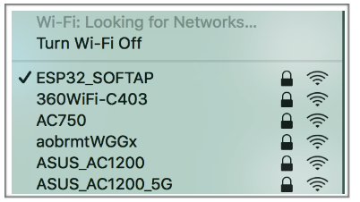

<a name="TCPIP-AT"></a>
## TCP/IP AT Examples
* Example 1. [ESP as a TCP Client in Single Connection](#exam-TCPclient) 
* Example 2. [ESP as a TCP Server in Multiple Connections](#exam-TCPserver)
* Example 3. [UDP Transmission](#exam-UDPTrans)
* Example 4. [UART-Wi-Fi Passthrough Transmission](#exam-UWFPTT)  


<a name="exam-TCPclient"></a>
### Example 1. [ESP as a TCP Client in Single Connection](#TCPIP-AT)  
1. Set the Wi-Fi mode:  

   ```
   Command:
   AT+CWMODE=3                  // SoftAP+Station mode
        
   Response:
   OK
   ```
2. Connect to the router:

   ```
   AT+CWJAP="SSID","password"               // SSID and password of router
        
   Response:
   OK
   ```
3. Query the device's IP:

   ```
   AT+CIFSR
        
   Response:
   192.168.3.106                            // device got an IP from router
   ```
4. Connect the PC to the same router which ESP is connected to. Use a network tool on the PC to create a TCP server. For example, the TCP server on PC is 192.168.3.116, port 8080.
5. ESP is connected to the TCP server as a client:

   ```
   AT+CIPSTART="TCP","192.168.3.116",8080   // protocol、server IP & port
   ```
6. Send data:

   ```
   AT+CIPSEND=4             // set date length which will be sent, such as 4 bytes
   >TEST                     // enter the data, no CR
   
   Response:
   SEND OK
   ```
   **Note：**
   If the number of bytes inputted are more than the length (n) set by `AT+CIPSEND`, the system will reply `busy`, and send the first n bytes.
And after sending the first n bytes, the system will reply `SEND OK`.  
7. Receive data:

   ```
   +IPD,n:xxxxxxxxxx               // received n bytes, data=xxxxxxxxxxx
   ```

<a name="exam-TCPserver"></a>
### Example 2. [ESP as a TCP Server in Multiple Connections](#TCPIP-AT)  
When ESP works as a TCP server, multiple connections should be enabled; that is to say, there should be more than one client connecting to ESP.  
Below is an example showing how a TCP server is established when ESP works in the SoftAP mode. If ESP works as a Station, set up a server in the same way after connecting ESP to the router.

1. Set the Wi-Fi mode:  

   ```
   Command:
   AT+CWMODE=3                  // SoftAP+Station mode
        
   Response:
   OK
   ```
2. Enable multiple connections. 

   ```
   AT+CIPMUX=1
        
   Response:
   OK
   ```
3. Set up a TCP server. 

   ```
   AT+CIPSERVER=1                           // default port = 333
        
   Response:
   OK
   ```
4. Connect the PC to the ESP SoftAP.  
   
5. Using a network tool on PC to create a TCP client and connect to the TCP server that ESP created.   
**Notice**:   
   When ESP works as a TCP server, there is a timeout mechanism. If the TCP client is connected to the ESP TCP server, while there is no data transmission for a period of time, the server will disconnect from the client. To avoid such a problem, please set up a data transmission cycle every two seconds.
6. Send data:

   ```
   // ID number of the first connection is defaulted to be 0
   AT+CIPSEND=0,4             // send 4 bytes to connection NO.0
   >TEST                      // enter the data, no CR
   
   Response:
   SEND OK
   ```
   **Note：**
   If the number of bytes inputted are more than the length (n) set by `AT+CIPSEND`, the system will reply `busy`, and send the first n bytes.
And after sending the first n bytes, the system will reply `SEND OK`.  
7. Receive data:

   ```
   +IPD,0,n:xxxxxxxxxx               // received n bytes, data=xxxxxxxxxxx
   ```
8. Close the TCP connection.

   ```
   AT+CIPCLOSE=0
   
   Response:
   0,CLOSED
   OK
   ```

<a name="exam-UDPTrans"></a>
### Example 3. [UDP Transmission](#TCPIP-AT)   
1. Set the Wi-Fi mode:  

   ```
   Command:
   AT+CWMODE=3                  // SoftAP+Station mode
        
   Response:
   OK
   ```
2. Connect to the router:

   ```
   AT+CWJAP="SSID","password"               // SSID and password of router
        
   Response:
   OK
   ```
3. Query the device's IP:

   ```
   AT+CIFSR
        
   Response:
   +CIFSR:STAIP,"192.168.101.104"              // device got an IP from router
   ```
4. Connect the PC to the same router which ESP is connected to. Use a network tool on the PC to create UDP transmission. For example, the PC's IP address is 192.168.101.116, port 8080.
5. Below are two examples of UDP transmission.
  
#### Example 3.1. UDP Transmission with Fixed Remote IP and Port
In UDP transmission, whether the remote IP and port are fixed or not is determined by the last parameter of `AT+CIPSTART`. 0 means that the remote IP and port are fixed and cannot be changed. A specific ID is given to such a connection, ensuring that the data sender and receiver will not be replaced by other devices.  

1. Enable multiple connections:

   ```
   AT+CIPMUX=1
   
   Response:
   OK
   ```
2. Create a UDP transmission, with the ID being 4, for example.

   ```
   AT+CIPSTART=4,"UDP","192.168.101.110",8080,1112,0
   
   Response:
   4,CONNECT
   OK
   ```
   Notes:  
    * `"192.168.101.110"` and `8080` are the remote IP and port of UDP transmission on the remote side, i.e., the UDP configuration set by PC.
    * `1112` is the local port number of ESP. Users can define this port number. A random port will be used if this parameter is not set.
    * `0` means that the remote IP and port are fixed and cannot be changed. For example, if another PC also creates a UDP entity and sends data to ESP port 1112, ESP can receive the data sent from UDP port 1112. But when data are sent using AT command `AT+CIPSEND=4,X`, it will still be sent to the first PC end. If parameter `0` is not used, the data will be sent to the new PC.
3. Send data:

   ```
   AT+CIPSEND=4,7              // send 7 bytes to transmission NO.4
   >UDPtest                    // enter the data, no CR
   
   Response:
   SEND OK
   ```
   **Note：**
   If the number of bytes inputted are more than the length (n) set by `AT+CIPSEND`, the system will reply `busy`, and send the first n bytes.
And after sending the first n bytes, the system will reply `SEND OK`.  
4. Receive data:

   ```
   +IPD,4,n:xxxxxxxxxx               // received n bytes, data=xxxxxxxxxxx
   ```
5. Close UDP transmission No.4

   ```
   AT+CIPCLOSE=4
   
   Response:
   4,CLOSED
   OK
   ```
   
#### Example 3.2. UDP Transmission with Changeable Remote IP and Port
1. Create a UDP transmission with the last parameter being 2.

   ```
   AT+CIPSTART="UDP","192.168.101.110",8080,1112,2
   
   Response:
   CONNECT
   OK
   ```
   Notes:
    * `"192.168.101.110"` and `8080` here refer to the IP and port of the remote UDP transmission terminal which is created on a PC in above Example 2.
    * `1112` is the local port of ESP. Users can define this port. A random port will be opened if this parameter is not set.
    * `2` means the means the opposite terminal of UDP transmission can be changed. The remote IP and port will be automatically changed to those of the last UDP connection to ESP.
2. Send data:

   ```
   AT+CIPSEND=7                // send 7 bytes 
   >UDPtest                    // enter the data, no CR
   
   Response:
   SEND OK
   ```
   **Note：**
   If the number of bytes inputted are more than the length (n) set by `AT+CIPSEND`, the system will reply `busy`, and send the first n bytes.
And after sending the first n bytes, the system will reply `SEND OK`.  
3. If you want to send data to any other UDP terminals, please designate the IP and port of the target terminal in the command.

   ```
   AT+CIPSEND=6,"192.168.101.111",1000          // send six bytes
   >abcdef                                      // enter the data, no CR
   
   Response:
   SEND OK
   ```
4. Receive data:

   ```
   +IPD,n:xxxxxxxxxx               // received n bytes, data=xxxxxxxxxxx
   ```
5. Close UDP transmission.

   ```
   AT+CIPCLOSE
   
   Response:
   CLOSED
   OK
   ```
   
<a name="exam-UWFPTT"></a>
### Example 4. [UART-Wi-Fi Passthrough Transmission](#TCPIP-AT)  
ESP-AT supports UART-Wi-Fi passthrough transmission only when ESP works as a TCP client in single connection or UDP transmission.
#### Example 4.1. [ESP as a TCP Client in UART-Wi-Fi Passthrough (Single Connection Mode)](#TCPIP-AT)
1. Set the Wi-Fi mode:  

   ```
   Command:
   AT+CWMODE=3                  // SoftAP+Station mode
        
   Response:
   OK
   ```
2. Connect to the router:

   ```
   AT+CWJAP="SSID","password"               // SSID and password of router
        
   Response:
   OK
   ```
3. Query the device's IP:

   ```
   AT+CIFSR
        
   Response:
   +CIFSR:STAIP,"192.168.101.105"              // device got an IP from router
   ```
4. Connect the PC to the same router which ESP is connected to. Use a network tool on the PC to create a TCP server. For example, the PC's IP address is 192.168.101.110, port 8080.
5. Connect the ESP device to the TCP server as a TCP client.

   ```
   AT+CIPSTART="TCP","192.168.101.110",8080
   
   Response:
   CONNECT
   OK
   ```
6. Enable the UART-WiFi transmission mode.

   ```
   AT+CIPMODE=1
   
   Response:
   OK
   ```
7. Send data.

   ```
   AT+CIPSEND                
   
   Response:
   >                // From now on, data received from UART will be transparent transmitted to server
   ```
8. Stop sending data.  
   When receiving a packet that contains only `+++`,  the UART-WiFi passthrough transmission process will be stopped. Then please wait at least 1 second before sending next AT command.  
   Please be noted that if you input `+++` directly by typing, the `+++`, may not be recognised as three consecutive `+` because of the Prolonged time when typing.    
   **Notice**:  
   The aim of ending the packet with +++ is to exit transparent transmission and to accept normal AT commands, while TCP still remains connected. However, users can also deploy command `AT+CIPSEND` to go back into transparent transmission.
9. Exit the UART-WiFi passthrough mode.

   ```
   AT+CIPMODE=0
   
   Response:
   OK
   ```
10. Close the TCP connection.

   ```
   AT+CIPCLOSE
   
   Response:
   CLOSED
   OK
   ```
     
#### Example 4.2. [UDP Transmission in UART-Wi-Fi Passthrough Mode](#TCPIP-AT)
Here is an example of the ESP working as a SoftAP in UDP transparent transmission.

1. Set the Wi-Fi mode:  

   ```
   Command:
   AT+CWMODE=3                  // SoftAP+Station mode
        
   Response:
   OK
   ```
2. Connect the PC to the ESP SoftAP.  
   
3. Use a network tool on PC to create a UDP endpoint. For example, the PC's IP address is `192.168.4.2` and the port is `1001`.
4. Create a UDP transmission between ESP32 and the PC with a fixed remote IP and port.

   ```
   AT+CIPSTART="UDP","192.168.4.2",1001,2233,0
   
   Response:
   CONNECT
   OK
   ```
5. Enable the UART-WiFi transmission mode.

   ```
   AT+CIPMODE=1
   
   Response:
   OK
   ```
6. Send data.

   ```
   AT+CIPSEND                
   
   Response:
   >                // From now on, data received from UART will be transparent transmitted to server
   ```
7. Stop sending data.  
   When receiving a packet that contains only `+++`,  the UART-WiFi passthrough transmission process will be stopped. Then please wait at least 1 second before sending next AT command.  
   Please be noted that if you input `+++` directly by typing, the `+++`, may not be recognised as three consecutive `+` because of the Prolonged time when typing.    
   **Notice**:  
   The aim of ending the packet with +++ is to exit transparent transmission and to accept normal AT commands, while TCP still remains connected. However, users can also deploy command `AT+CIPSEND` to go back into transparent transmission.
8. Exit the UART-WiFi passthrough mode.

   ```
   AT+CIPMODE=0
   
   Response:
   OK
   ```
9. Close the UDP transmission.

   ```
   AT+CIPCLOSE
   
   Response:
   CLOSED
   OK
   ```
