Web Server AT Example
=======================

:link_to_translation:`zh_CN:[中文]`

This document mainly introduces the use of AT web server, mainly involving the following applications:

.. contents::
   :local:
   :depth: 1

.. note::

   The default firmware does not support web server AT commands, please refer to :doc:`../AT_Command_Set/Web_server_AT_Commands` to enable the web server.

Wi-Fi Provisioning Using a Browser
-------------------------------------

Introduction
^^^^^^^^^^^^^^

With the web server, mobile phone or PC is able to control {IDF_TARGET_NAME}'s Wi-Fi provisioning service. You can use a mobile phone or computer to connect to the SoftAP of the {IDF_TARGET_NAME}, open the web pages via browser, start provisioning service, and then the {IDF_TARGET_NAME} can connect to the target router as you set.

Introduction to Operation Steps
^^^^^^^^^^^^^^^^^^^^^^^^^^^^^^^^

The whole process can be divided into the following three steps:  

.. contents::
   :local:
   :depth: 1

Use STA Device to Connect to {IDF_TARGET_NAME} Device
"""""""""""""""""""""""""""""""""""""""""""""""""""""

Firstly, {IDF_TARGET_NAME} needs to be configured to softAP + STA mode, and creates a web server to wait for Wi-Fi provisioning messages. In this case, a mobile phone or a PC can connect to the {IDF_TARGET_NAME} softAP as a station. The corresponding AT commands are as follows:

#. Clear the previous Wi-Fi provisioning information.

   - Command
   
     ::
 
       AT+RESTORE

#. Set the Wi-Fi mode to Station+SoftAP.

   - Command
   
     ::
 
       AT+CWMODE=3

#. Set the configuration of an {IDF_TARGET_NAME} SoftAP. (For example, set the default connection ssid to "pos_softap", Wi-Fi without password.)

   - Command
   
     ::
 
       AT+CWSAP="pos_softap","",11,0,3

#. Enable multiple connections.

   - Command
   
     ::
 
       AT+CIPMUX=1

#. Create a web server, port: 80, connection timeout: 25 s (default maximum is 60 s).

   - Command
   
     ::
 
       AT+WEBSERVER=1,80,25

After starting the web sever according to the above commands, you can turn on the Wi-Fi connection function on your STA device, and connect it to the softAP of the {IDF_TARGET_NAME}:

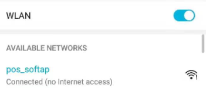

   Connection to the {IDF_TARGET_NAME} AP

Use the Browser to Send Wi-Fi Connection Information
"""""""""""""""""""""""""""""""""""""""""""""""""""""""

After your STA device connected to the {IDF_TARGET_NAME} softAP, it can send Wi-Fi connection information to {IDF_TARGET_NAME} in an HTTP request. Please note that if your target AP is the hotspot of the device which opens the web pages, you may not receive the Wi-Fi connection result.
You can enter the default IP address of the web server in the browser (the default IP is 192.168.4.1, or you can query the current SoftAP IP address by command AT+CIPAP?), open the Wi-Fi provisioning interface, and enter the ssid and password of the router to be connected, click "Connect" to let {IDF_TARGET_NAME} start connecting to the router:

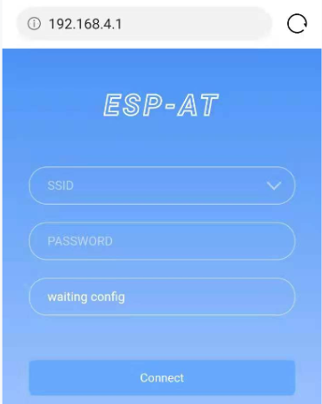

   Opening the Wi-Fi Provisioning Interface

Or you can click the drop-down box of SSID to list all APs nearby, select the target AP and enter the password, and then click "Connect" to let the {IDF_TARGET_NAME} start connecting to the router:

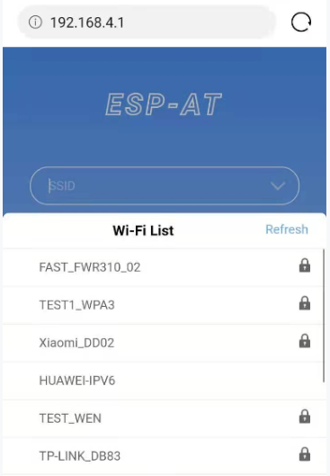

   Schematic Diagram Of Browser Obtaining Wi-Fi AP List

Get the Result of Wi-Fi Connection
""""""""""""""""""""""""""""""""""""

After the Wi-Fi connection is established successfully, the web page will be displayed as follows:

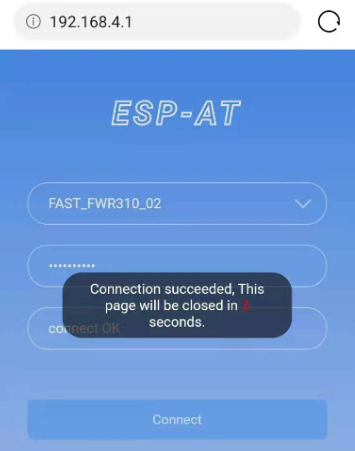

   Wi-Fi Connection Established Successfully

**Note** 1: After the Wi-Fi connection is established successfully, the webpage will be closed automatically. If you want to continue to access the webpage, please re-enter the IP address of the {IDF_TARGET_NAME} and reopen the webpage.

At the same time, the following messages will be returned from the ESP-AT command port:

::

    +WEBSERVERRSP:1      // meaning that {IDF_TARGET_NAME} has received Wi-Fi connection information  
    WIFI CONNECTED       // meaning that {IDF_TARGET_NAME} is connecting 
    WIFI GOT IP          // meaning that {IDF_TARGET_NAME} connect successfully to the destination router
    +WEBSERVERRSP:2      // meaning that STA device has received Wi-Fi connection result, and web resources can be released  

If the {IDF_TARGET_NAME} fails to connect to the router, the web page will display:

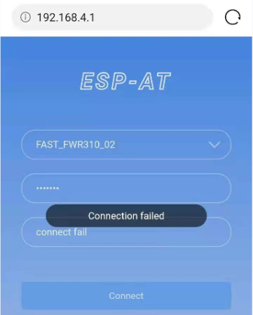

   Failed Connection to the Router

At the same time, the following messages will be returned from the ESP-AT command port:

::

    +WEBSERVERRSP:1      // meaning that {IDF_TARGET_NAME} has received Wi-Fi connection information, but failed to connect to the router.

Troubleshooting
^^^^^^^^^^^^^^^^^^^

**Note** 1: The network configuration page received a prompt "Connection failed". Please check whether the Wi-Fi AP of the {IDF_TARGET_NAME} module is correctly turned on, and the relevant configuration of the AP, and confirm that the correct AT command has been entered to successfully enable the web server.

OTA Firmware Upgrade Using a Browser
---------------------------------------

Introduction
^^^^^^^^^^^^^^

After the browser opens the web page of the web server, you can choose to enter the OTA upgrade page to upgrade the firmware in the app partitions or the certificate binaries in other partitions (please refer to :doc:`../Compile_and_Develop/How_to_update_pki_config` for more about certificate information).

Introduction to Operation Steps
^^^^^^^^^^^^^^^^^^^^^^^^^^^^^^^^

.. contents::
   :local:
   :depth: 1

Open the OTA Configuration Page
""""""""""""""""""""""""""""""""""""

As shown in the figure, click on the "OTA" option in the lower right corner of the web page, and after opening the OTA configuration page, you can view the current firmware version and AT Core version:

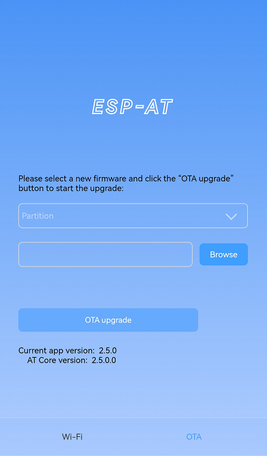

   OTA Configuration Page

**Note** 1: The configuration interface can only be opened when the STA device is connected to the AP of the {IDF_TARGET_NAME}, or the STA device accessing the OTA configuration page is connected to the {IDF_TARGET_NAME} in the same subnet.

**Note** 2: The "current app version" displayed on the webpage is the version number of the application. You can change the version number through ``./build.py menuconfig`` --> ``Component config`` --> ``AT`` --> ``AT firmware version`` (see :doc:`../Compile_and_Develop/How_to_clone_project_and_compile_it`). In this case, you can manage your application firmware version.

Selecting the Partition to Upgrade
"""""""""""""""""""""""""""""""""""""""

As shown in the figure, click the drop-down box of "Partition" to obtain all partitions that can be upgraded:

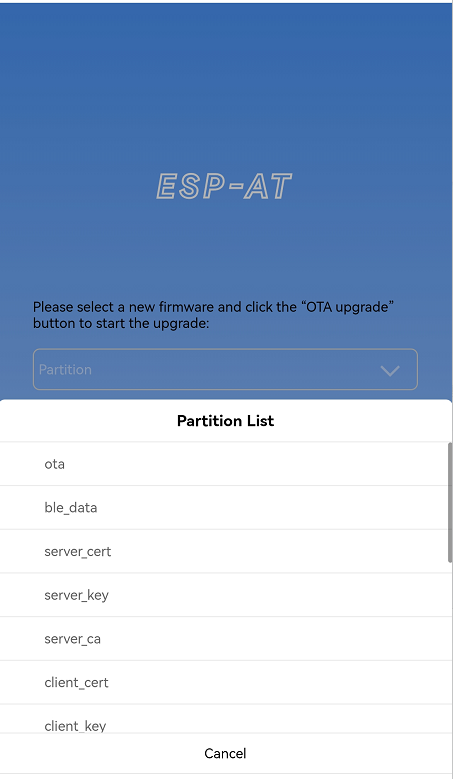

   Obtaining All Partitions That Can Be Upgraded

Send the New Firmware
"""""""""""""""""""""""""""""""""

As shown in the figure, click the "Browse" button on the page and select the new firmware to be sent:

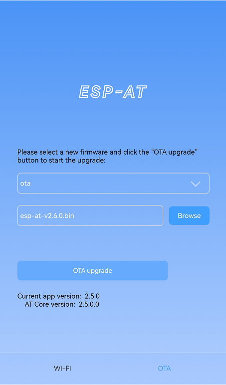

   Selecting the New Firmware to Be Sent

Then you can click "OTA upgrade" button to send the firmware.

**Note** 1: For the ``ota`` partition, the web page will check the selected firmware. The suffix of the firmware name must be ``.bin``. Please make sure that the firmware size does not exceed the size of the ``ota`` partition defined in the ``partitions_at.csv`` file. For more information on this file, please refer to :doc:`../Compile_and_Develop/How_to_add_support_for_a_module`.

**Note** 2: For other partitions, the web page will check the selected firmware. The suffix of the firmware name must be ``.bin``. Please make sure that the firmware size does not exceed the size defined in the ``at_customize.csv`` file. For more information on this file, please refer to :doc:`../Compile_and_Develop/How_to_customize_partitions`.

Get the Result of OTA
"""""""""""""""""""""""

As shown in the figure, if the {IDF_TARGET_NAME} OTA successfully, it will prompt "OTA Succeeded":

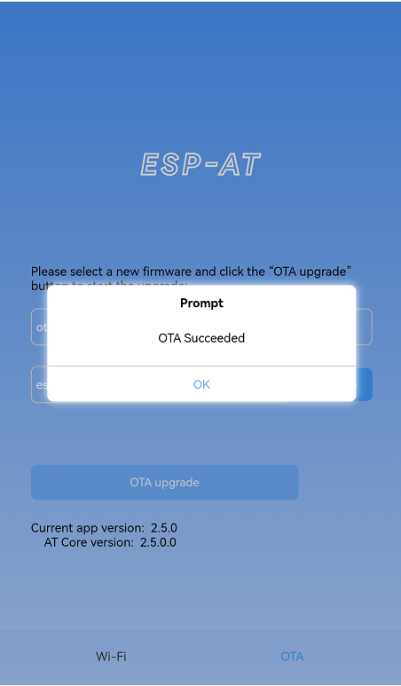

   The New Firmware Sent Successfully

At the same time, the following messages will be returned from the ESP-AT command port:

::

    +WEBSERVERRSP:3      // meaning that {IDF_TARGET_NAME} begin to receive OTA data
    +WEBSERVERRSP:4      // meaning that {IDF_TARGET_NAME} has received all firmware data

If the {IDF_TARGET_NAME} OTA failed, it will prompt "OTA Failed":

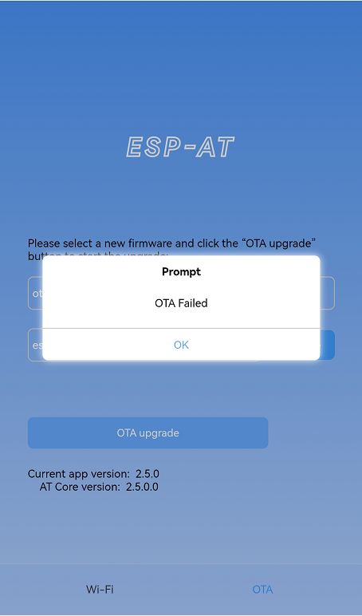

   Failed Sending of the New Firmware

At the same time, the following message will be received on the serial port:

::

    +WEBSERVERRSP:3      // meaning that {IDF_TARGET_NAME} begin to receive OTA data
    +WEBSERVERRSP:5      // meaning a failure of receiving OTA data failed. You can choose to reopen the OTA configuration interface and follow the above steps to restart the firmware upgrade

**Note** 1: For the ``ota`` partition, you need to execute :ref:`AT+RST <cmd-RST>` to restart the {IDF_TARGET_NAME} to apply the new firmware.

**Note** 2: {IDF_TARGET_NAME} will only verify the received ``ota`` firmware content. The firmware data received by other partitions will not be verified, so please make sure its content is correct.

Wi-Fi Provisioning Using a WeChat Applet
-------------------------------------------

Introduction
^^^^^^^^^^^^^

The WeChat applet can automatically connect to the WiFi AP of the {IDF_TARGET_NAME}, and then send the ssid and password required by the {IDF_TARGET_NAME} to connect to the network.

.. important::
  The ESP-AT WeChat applet will be discontinued on December 31, 2024. During this period, please make arrangements for the transition of its functionalities. If you still have related needs after this date, please contact `Espressif's business <https://www.espressif.com/en/contact-us/sales-questions>`_ team. We will be dedicated to providing you with support and solutions. Thank you for your understanding and support.

Introduction to Operation Steps
^^^^^^^^^^^^^^^^^^^^^^^^^^^^^^^^

The whole process can be divided into the following four steps:

.. contents::
   :local:
   :depth: 1

Configure {IDF_TARGET_NAME} Device Parameters
"""""""""""""""""""""""""""""""""""""""""""""

Firstly, {IDF_TARGET_NAME} needs to be configured to softAP + STA mode, and creates a web server to wait for Wi-Fi provisioning messages. In this case, a mobile phone or a PC can connect to the {IDF_TARGET_NAME} softAP as a station. The corresponding AT commands are as follows:

#. Clear the previous Wi-Fi provisioning information.

   - Command
   
     ::
 
       AT+RESTORE

#. Set the Wi-Fi mode to Station+SoftAP.

   - Command
   
     ::
 
       AT+CWMODE=3

#. Set the configuration of an {IDF_TARGET_NAME} SoftAP. (For example, set the default connection ssid to "pos_softap", and password to "espressif".)

   - Command
   
     ::
 
       AT+CWSAP="pos_softap","espressif",11,3,3

  .. note::

     By default, the WeChat applet initiates a connection to the SoftAP whose ssid is `pos_softap` and password is `espressif`. Please make sure to set the parameters of the {IDF_TARGET_NAME} according to the above configuration.

#. Enable multiple connections.

   - Command
   
     ::
 
       AT+CIPMUX=1

#. Create a web server, port: 80, connection timeout: 40 s (default maximum is 60 s).

   - Command
   
     ::
 
       AT+WEBSERVER=1,80,40

Load WeChat Applet
"""""""""""""""""""""""

Open the mobile phone WeChat, scan the following QR code:

   Getting the QR Code of the Applet

Open the WeChat applet and enter the Wi-Fi provisioning interface:

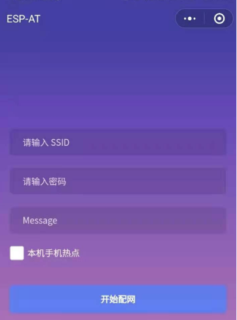

   Wi-Fi Provisioning Interface

Target AP Selection
"""""""""""""""""""""

After loading the WeChat applet, there are two situations according to different target AP:

Situation 1. If your target AP is the hotspot of the mobile phone which running the WeChat applet, please select the "Local phone hotspot" option box on the WeChat applet page.

Situation 2. If your target AP is just another AP, not as the special situation one as above, then please do not select the "Local phone hotspot" option box.

Use the WeChat Applet to Send Wi-Fi Connection Information
""""""""""""""""""""""""""""""""""""""""""""""""""""""""""""

The target AP to be accessed is not the hotspot provided by the mobile phone which loading the WeChat applet.
**************************************************************************************************************

Here, take connecting to a router as an example, the process of Wi-Fi Connection configuration is introduced:

1.Turn on the mobile Wi-Fi and connect to the router:

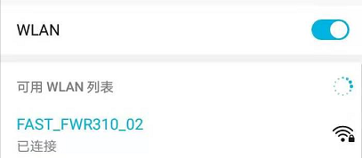

   Connection to the Router

2.Open the WeChat applet, you can see that the applet page has automatically displayed the ssid of the current router as "FAST_FWR310_02".

.. figure:: ../../_static/Web_server/web_wechat_get_router_info.png
   :align: center
   :alt: Getting Router Information
   :figclass: align-center

   Getting Router Information

Note: If the ssid of the connected router is not displayed on the current page, please click "Re-enter applet" in the following figure to refresh the current page:

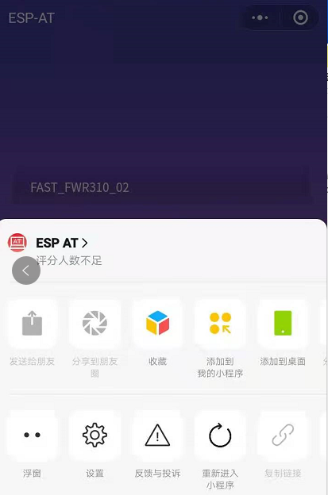

   Re-entering the Applet

3.After entering the password of the router, click "Connect".

.. figure:: ../../_static/Web_server/web_wechat_router_connecting.png
   :align: center
   :alt: Connection to the Router via the Applet
   :figclass: align-center

   Connection to the Router via the Applet

4.After the Wi-Fi connection is established successfully, the web page will be displayed as follows:

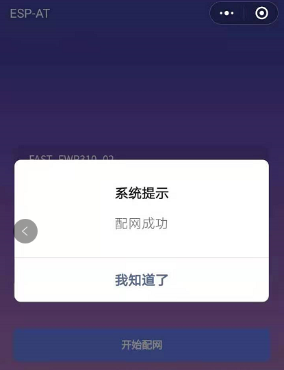

   Successfully connection to the Router via the Applet

At the same time, the following messages will be returned from the ESP-AT command port:

::

    +WEBSERVERRSP:1      // meaning that {IDF_TARGET_NAME} has received Wi-Fi connection information  
    WIFI CONNECTED       // meaning that {IDF_TARGET_NAME} is connecting 
    WIFI GOT IP          // meaning that {IDF_TARGET_NAME} connect successfully to the destination router
    +WEBSERVERRSP:2      // meaning that STA device has received Wi-Fi connection result, and web resources can be released  

5.If the {IDF_TARGET_NAME} fails to connect to the router, the page will display:

.. figure:: ../../_static/Web_server/web_wechat_router_connect_fail.png
   :align: center
   :alt: Failed Connection to the Router via the Applet
   :figclass: align-center

   Failed Connection to the Router via the Applet

At the same time, the following messages will be returned from the ESP-AT command port:

::

    +WEBSERVERRSP:1      // meaning that {IDF_TARGET_NAME} has received Wi-Fi connection information, but failed to connect to the router.

The target AP to be accessed is the hotspot provided by the mobile phone which loading the WeChat applet.
**************************************************************************************************************

If the target AP to be accessed is the hotspot provided by the mobile phone which loading the WeChat applet, it is not necessary to enter the ssid, but only needs to enter the password of the AP, and turn on the mobile AP in time according to the prompts.

.. note::

   To use this function, keep at least the first five bytes of the phone's Personal Hotspot MAC address the same as those of the WLAN MAC address.

1.Select the "Local phone hotspot" option box on the WeChat applet page, enter the password of the local hotspot, and click "Connect".

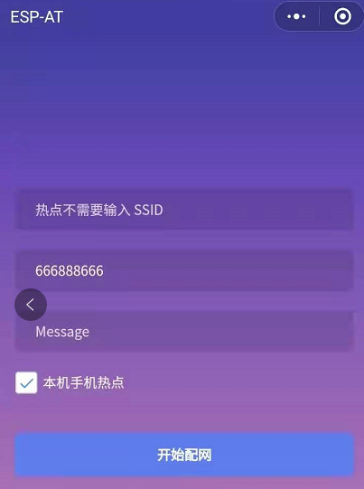

   Entering the Password of the AP

2.After receiving the prompt "Connecting to the mobile phone hotspot", please check that the local mobile phone hotspot is turned on. At this time, the {IDF_TARGET_NAME} will automatically scan the surrounding hotspots and initiate a connection.

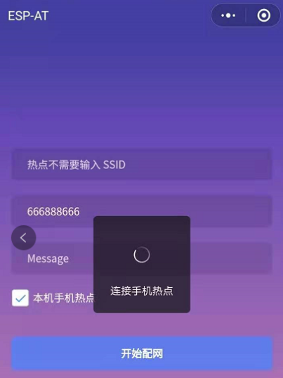

   Starting Connection to the AP

3.The display of the WiFi connection results on the applet page and the data output from the serial port are the same as the above-mentioned "The target AP to be accessed is not the hotspot provided by the mobile phone which loading the WeChat applet.", please refer to the above.

Troubleshooting
^^^^^^^^^^^^^^^^^^^
**Note** 1: The Wi-Fi provisioning page received a prompt "Data transmission failed". Please check whether the Wi-Fi AP of the {IDF_TARGET_NAME} is correctly turned on, and the relevant configuration of the AP, and confirm that the correct AT command has been entered to successfully enable the web server.

**Note** 2: The Wi-Fi provisioning page receives a prompt "Failed to connect to the AP". Please check whether the Wi-Fi connection function of the mobile phone is turned on, check whether the Wi-Fi AP of the {IDF_TARGET_NAME} is correctly turned on, and whether the ssid and password of the AP are configured according to the above steps.

**Note** 3: The Wi-Fi provisioning page receives a prompt "The Wi-Fi provisioning saved by the system expired". Please manually connect the {IDF_TARGET_NAME} AP with a mobile phone, and confirm that the ssid and password of the {IDF_TARGET_NAME} module have been configured according to the above steps.

OTA Firmware Upgrade Using a WeChat Applet
-------------------------------------------
The WeChat applet support online firmware upgrade , please refer to the above-described `Configure {IDF_TARGET_NAME} Device Parameters`_ specific steps performed {IDF_TARGET_NAME} configuration (if the configuration has been completed, do not repeat configuration). Once configured, the device performs OTA firmware upgrade processes is similar as `OTA Firmware Upgrade Using a Browser`_ .

.. _using-captive-portal:

{IDF_TARGET_NAME} Using Captive Portal
--------------------------------------------------------------

Introduction
^^^^^^^^^^^^^

Captive Portal is commonly used to present a specified page to newly connected devices of a Wi-Fi or wired network. For more information about Captive Portal, please refer to `Captive Portal Wiki <https://en.wikipedia.org/wiki/Captive_portal>`__ .

.. note::

   The default firmware does not support web server Captive Portal, you may enable it by ``./build.py menuconfig`` > ``Component config`` > ``AT`` > ``AT WEB Server command support`` > ``AT WEB captive portal support`` and build the project (see :doc:`../Compile_and_Develop/How_to_clone_project_and_compile_it`). In addition, enabling this feature may cause page skipping when using wechat applet for Wi-Fi provisioning or OTA firmware upgrade. It is recommended that this feature be enabled only when accessing at web using browser.

Introduction to Operation Steps
^^^^^^^^^^^^^^^^^^^^^^^^^^^^^^^^

After Enable Captive Portal support, please refer to `Use STA Device to Connect to {IDF_TARGET_NAME} Device`_ to complete the configuration of the {IDF_TARGET_NAME}, and then connect to the AP of the {IDF_TARGET_NAME}:

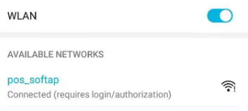

   Connection to the AP with Captive Portal Enabled

As shown in the figure above, after the Station device is connected to the AP of the {IDF_TARGET_NAME} with the Captive Portal function enabled, it will prompt "requires login/authentication", and then the browser will automatically open and jump to the main interface of AT Web. If it cannot be redirected automatically, please follow the instructions of the Station device, click "Authentication" or click the name of the "pos_softap" hotspot in the figure above to manually trigger the Captive Portal to automatically open the browser and enter the main interface of AT Web.

Troubleshooting
^^^^^^^^^^^^^^^^^^^

**Note** 1: Both Station device and AP device support the Captive Portal function to ensure the normal use of this function. Therefore, if the device is connected to the AP of the {IDF_TARGET_NAME}, but it does not prompt "Login/Authentication", it may be that the Station device does not support this function. In this case, please refer to the specific steps of `Use the Browser to Send Wi-Fi Connection Information`_ above to open the main interface of AT Web.
