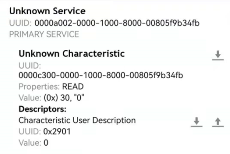
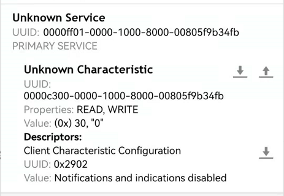

How to Customize Bluetooth® LE Services
========================================

:link_to_translation:`zh_CN:[中文]`

This document describes how to customize Bluetooth LE services on your {IDF_TARGET_NAME} with the Bluetooth LE service source file provided by ESP-AT.

.. contents::
   :local:
   :depth: 2

The Bluetooth LE services are defined as a multivariate array of GATT structures, and the array contains at least one primary service whose attribute type is defined as 0x2800. Each service always consists of a service definition and several characteristics. Each characteristic always consists of a value and optional descriptors. Please refer to Part Generic Attribute Profile (GATT) of `Bluetooth Core Specification <https://www.bluetooth.com/specifications/specs/core-specification-4-2>`_ for more information.

.. _factory-gatts-intro:

Bluetooth LE Service Source File
--------------------------------

The ESP-AT project creates Bluetooth LE services based on its Bluetooth LE service source file. It is located in :component_file:`customized_partitions/raw_data/ble_data/gatts_data.csv`. The table below shows the default source file.

.. list-table::
   :header-rows: 1

   * - index
     - uuid_len
     - uuid
     - perm
     - val_max_len
     - val_cur_len
     - value
   * - 0
     - 16
     - 0x2800
     - 0x01
     - 2
     - 2
     - A002
   * - 1
     - 16
     - 0x2803
     - 0x01
     - 1
     - 1
     - 2
   * - 2
     - 16
     - 0xC300
     - 0x01
     - 1
     - 1
     - 30
   * - 3
     - 16
     - 0x2901
     - 0x11
     - 1
     - 1
     - 30
   * - ...
     - ...
     - ...
     - ...
     - ...
     - ...
     - ...

Below are descriptions of the table above.

- ``perm`` field describes the permission. Its definition in the ESP-AT project is as follows:
  
  .. code-block:: c

    /* relate to BTA_GATT_PERM_xxx in bta/bta_gatt_api.h */
    /**
    * @brief Attribute permissions
    */
    #define    ESP_GATT_PERM_READ                  (1 << 0)   /* bit 0 -  0x0001 */    /* relate to BTA_GATT_PERM_READ in bta/bta_gatt_api.h */
    #define    ESP_GATT_PERM_READ_ENCRYPTED        (1 << 1)   /* bit 1 -  0x0002 */    /* relate to BTA_GATT_PERM_READ_ENCRYPTED in bta/bta_gatt_api.h */
    #define    ESP_GATT_PERM_READ_ENC_MITM         (1 << 2)   /* bit 2 -  0x0004 */    /* relate to BTA_GATT_PERM_READ_ENC_MITM in bta/bta_gatt_api.h */
    #define    ESP_GATT_PERM_WRITE                 (1 << 4)   /* bit 4 -  0x0010 */    /* relate to BTA_GATT_PERM_WRITE in bta/bta_gatt_api.h */
    #define    ESP_GATT_PERM_WRITE_ENCRYPTED       (1 << 5)   /* bit 5 -  0x0020 */    /* relate to BTA_GATT_PERM_WRITE_ENCRYPTED in bta/bta_gatt_api.h */
    #define    ESP_GATT_PERM_WRITE_ENC_MITM        (1 << 6)   /* bit 6 -  0x0040 */    /* relate to BTA_GATT_PERM_WRITE_ENC_MITM in bta/bta_gatt_api.h */
    #define    ESP_GATT_PERM_WRITE_SIGNED          (1 << 7)   /* bit 7 -  0x0080 */    /* relate to BTA_GATT_PERM_WRITE_SIGNED in bta/bta_gatt_api.h */
    #define    ESP_GATT_PERM_WRITE_SIGNED_MITM     (1 << 8)   /* bit 8 -  0x0100 */    /* relate to BTA_GATT_PERM_WRITE_SIGNED_MITM in bta/bta_gatt_api.h */
    #define    ESP_GATT_PERM_READ_AUTHORIZATION    (1 << 9)   /* bit 9 -  0x0200 */
    #define    ESP_GATT_PERM_WRITE_AUTHORIZATION   (1 << 10)  /* bit 10 - 0x0400 */

- The first line of table is the service definition with a UUID of ``0xA002``.
- The second line is the declaration of a characteristic. UUID ``0x2803`` means the characteristic declaration. The value ``2`` sets the permission. The length of permission is 8 bits, and each bit represents permission for an operation. ``1`` indicates that the operation is supported, and ``0`` indicates not supported.

  .. list-table::
     :header-rows: 1
     :widths: 20 100

     * - Bit
       - Permission
     * - 0
       - BROADCAST
     * - 1
       - READ
     * - 2
       - WRITE WITHOUT RESPONSE
     * - 3
       - WRITE
     * - 4
       - NOTIFY
     * - 5
       - INDICATE
     * - 6
       - AUTHENTICATION SIGNED WRITES
     * - 7
       - EXTENDED PROPERTIES
- The third line defines a characteristic of the service. UUID of this line is the characteristic's UUID, and value is the characteristic's value.
- The fourth line defines a descriptor of the characteristic (optional).

For more information about UUID, please refer to `Bluetooth Special Interest Group (SIG) Assigned Numbers <https://www.bluetooth.com/specifications/assigned-numbers/>`_.

If you use the default source file on your {IDF_TARGET_NAME} without any modification and establish a Bluetooth LE connection, you will get the following result after querying the server service on the client side.

Customize Bluetooth LE Services during Compilation
--------------------------------------------------

If you want to customize the Bluetooth LE services, follow the steps below.

.. contents::
   :local:
   :depth: 1

Modify the Bluetooth LE Service Source File
^^^^^^^^^^^^^^^^^^^^^^^^^^^^^^^^^^^^^^^^^^^

You can define more than one service. For example, if you want to define three services (``Server_A``, ``Server_B`` and ``Server_C``), these three services need to be arranged in order. Since the definition of each service is similar, here we define one service as an example, and then you can define others one by one accordingly.

1. Add the service definition.

   In this example, we define a primary service with a value of 0xFF01.

   .. list-table::
      :header-rows: 1
   
      * - index
        - uuid_len
        - uuid
        - perm
        - val_max_len
        - val_cur_len
        - value
      * - 31
        - 16
        - 0x2800
        - 0x01
        - 2
        - 2
        - FF01

2. Add the characteristic declaration and characteristic value.

   In this example, we define a readable and writable characteristic with UUID 0xC300, and set its value to 0x30.
   
   .. list-table::
      :header-rows: 1
   
      * - index
        - uuid_len
        - uuid
        - perm
        - val_max_len
        - val_cur_len
        - value
      * - 32
        - 16
        - 0x2803
        - 0x11
        - 1
        - 1
        - 0A
      * - 33
        - 16
        - 0xC300
        - 0x11
        - 1
        - 1
        - 30

3. Add the characteristic descriptor (optional).

   In this example, we add client characteristic configuration. Its value 0x0000 represents notifications and indications are disabled.

   .. list-table::
      :header-rows: 1
   
      * - index
        - uuid_len
        - uuid
        - perm
        - val_max_len
        - val_cur_len
        - value
      * - 34
        - 16
        - 0x2902
        - 0x11
        - 2
        - 2
        - 0000

After the above steps, the customized Bluetooth LE service has been defined as follows.

.. list-table::
   :header-rows: 1

   * - index
     - uuid_len
     - uuid
     - perm
     - val_max_len
     - val_cur_len
     - value
   * - 31
     - 16
     - 0x2800
     - 0x01
     - 2
     - 2
     - FF01
   * - 32
     - 16
     - 0x2803
     - 0x11
     - 1
     - 1
     - 0A
   * - 33
     - 16
     - 0xC300
     - 0x11
     - 1
     - 1
     - 30
   * - 34
     - 16
     - 0x2902
     - 0x11
     - 2
     - 2
     - 0000

Please modify the GATTS configurations according to your own needs and generate ``mfg_nvs.bin`` file.

Generate mfg_nvs.bin
^^^^^^^^^^^^^^^^^^^^^

Please refer to :ref:`mfg-nvs-generate` document to generate the ``mfg_nvs.bin`` file with the Low Energy Bluetooth services.

Download mfg_nvs.bin
^^^^^^^^^^^^^^^^^^^^^

Please refer to :ref:`mfg-nvs-download` document.

After the download is complete, re-establish the Bluetooth LE connection. Query the server service on the client side as follows:

