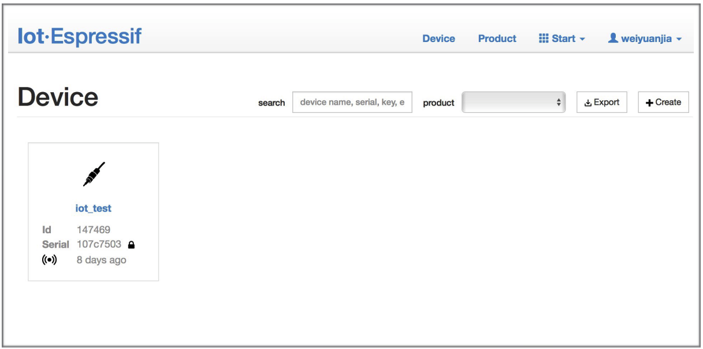
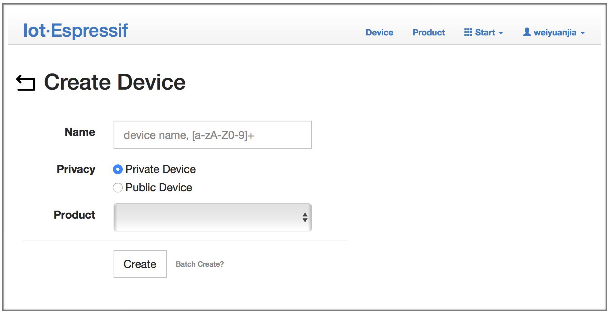
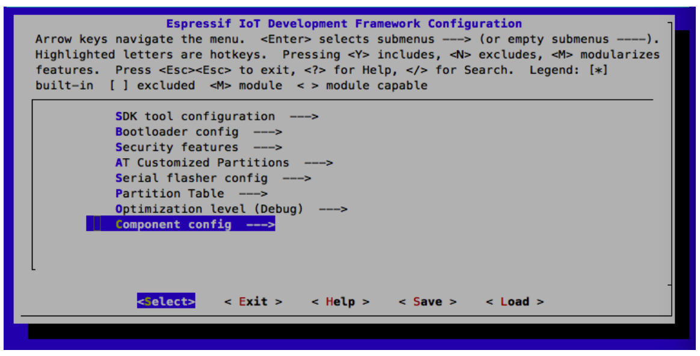
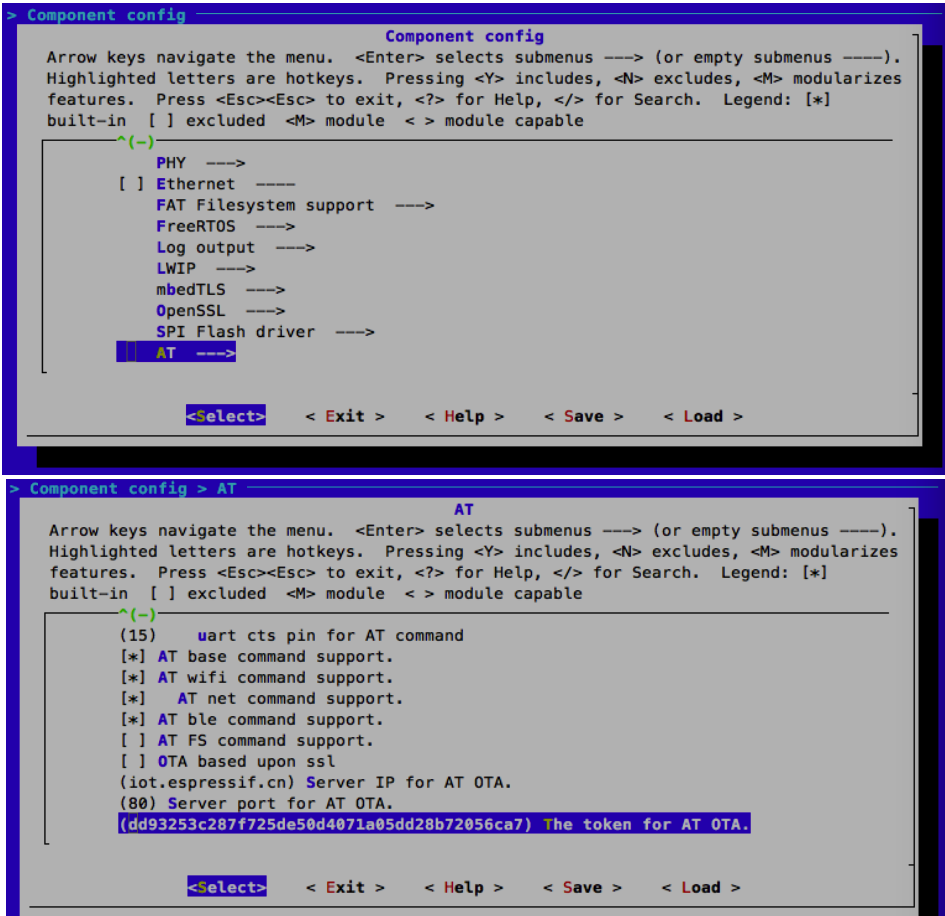
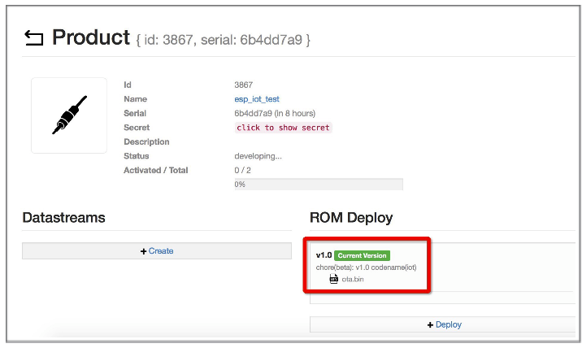

How to implement OTA update
===========================

The following steps guide the users in creating a device on iot.espressif.cn and updating the OTA BIN on it.   

1. Open the website iot.espressif.cn. If using SSL OTA, it should be https://iot.espressif.cn.

2. Click "Join" in the upper right corner of the webpage, and enter your name, email address, and password.  

3. Click on "Device" in the upper right corner of the webpage, and click on "Create" to create a device.
  
  
4. A key is generated when the device is successfully created, as the figure below shows.
   
5. Use the key to compile your own OTA BIN. The process of configuring the AT OTA token key is as follows:
   
 
**Notice:**
If using SSL OTA, the option "OTA based upon ssl" should be selected.
6. Click on "Product" to enter the webpage, as shown below. Click on the device created. Enter version and corename under "ROM Deploy". Rename the BIN compiled in Step 5 as "ota.bin" and save the configuration.
 
7. Click on the ota.bin to save it as the current version.
 
8. Run the command AT+CIUPDATE on the ESP device. If the network is connected, OTA update will be done.

