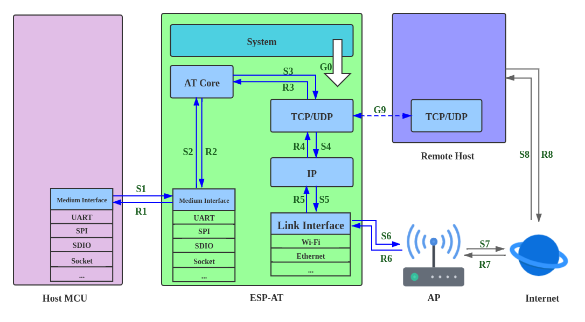

How to Improve ESP-AT Throughput Performance
============================================

:link_to_translation:`zh_CN:[中文]`

By default, UART is used for communication between ESP-AT and the host MCU, so the maximum throughput speed will not exceed its default configuration, that is, 115200 bps. If users want ESP-AT to achieve high throughput, it is necessary to understand this document and choose the appropriate configuration method. Taking {IDF_TARGET_NAME} as an example, this document introduces how to improve the throughput performance of ESP-AT.

.. note::

    This document describes general methods to improve TCP/UDP/SSL throughput performance when ESP-AT is in :term:`Passthrough Mode`.

Users could choose one of the following methods to improve throughput performance:

- `[Simple] Quick Configuration`_
- `[Recommended] Understand Data Stream and Make the Precise Configuration`_

[Simple] Quick Configuration
----------------------------

**1. Configure system, LWIP, Wi-Fi parameters**

  Copy the following code snippet and append to tail of :project_file:`module_config/module_{IDF_TARGET_PATH_NAME}_default/sdkconfig.defaults` file. For other {IDF_TARGET_NAME} series devices, please modify the sdkconfig.defaults file in the corresponding folder.

  .. only:: esp32

    ::

      # System
      CONFIG_ESP_SYSTEM_EVENT_TASK_STACK_SIZE=4096
      CONFIG_FREERTOS_UNICORE=n
      CONFIG_FREERTOS_HZ=1000
      CONFIG_ESP_DEFAULT_CPU_FREQ_240=y
      CONFIG_ESP_DEFAULT_CPU_FREQ_MHZ=240
      CONFIG_ESPTOOLPY_FLASHMODE_QIO=y
      CONFIG_ESPTOOLPY_FLASHFREQ_80M=y

      # LWIP
      CONFIG_LWIP_TCP_SND_BUF_DEFAULT=65534
      CONFIG_LWIP_TCP_WND_DEFAULT=65534
      CONFIG_LWIP_TCP_RECVMBOX_SIZE=12
      CONFIG_LWIP_UDP_RECVMBOX_SIZE=12
      CONFIG_LWIP_TCPIP_RECVMBOX_SIZE=64

      # Wi-Fi
      CONFIG_ESP32_WIFI_STATIC_RX_BUFFER_NUM=16
      CONFIG_ESP32_WIFI_DYNAMIC_RX_BUFFER_NUM=64
      CONFIG_ESP32_WIFI_DYNAMIC_TX_BUFFER_NUM=64
      CONFIG_ESP32_WIFI_TX_BA_WIN=32
      CONFIG_ESP32_WIFI_RX_BA_WIN=32
      CONFIG_ESP32_WIFI_AMPDU_TX_ENABLED=y
      CONFIG_ESP32_WIFI_AMPDU_RX_ENABLED=y

  .. only:: esp32c2

    ::

      # System
      CONFIG_ESP_SYSTEM_EVENT_TASK_STACK_SIZE=4096
      CONFIG_FREERTOS_UNICORE=n
      CONFIG_FREERTOS_HZ=1000
      CONFIG_ESP_DEFAULT_CPU_FREQ_MHZ_120=y
      CONFIG_ESP_DEFAULT_CPU_FREQ_MHZ=120
      CONFIG_ESPTOOLPY_FLASHMODE_QIO=y
      CONFIG_ESPTOOLPY_FLASHFREQ_60M=y

      # LWIP
      CONFIG_LWIP_TCP_SND_BUF_DEFAULT=65534
      CONFIG_LWIP_TCP_WND_DEFAULT=65534
      CONFIG_LWIP_TCP_RECVMBOX_SIZE=12
      CONFIG_LWIP_UDP_RECVMBOX_SIZE=12
      CONFIG_LWIP_TCPIP_RECVMBOX_SIZE=64

      # Wi-Fi
      CONFIG_ESP32_WIFI_STATIC_RX_BUFFER_NUM=16
      CONFIG_ESP32_WIFI_DYNAMIC_RX_BUFFER_NUM=64
      CONFIG_ESP32_WIFI_DYNAMIC_TX_BUFFER_NUM=64
      CONFIG_ESP32_WIFI_TX_BA_WIN=32
      CONFIG_ESP32_WIFI_RX_BA_WIN=32
      CONFIG_ESP32_WIFI_AMPDU_TX_ENABLED=y
      CONFIG_ESP32_WIFI_AMPDU_RX_ENABLED=y

  .. only:: esp32c3 or esp32s2

    ::

      # System
      CONFIG_ESP_SYSTEM_EVENT_TASK_STACK_SIZE=4096
      CONFIG_FREERTOS_UNICORE=n
      CONFIG_FREERTOS_HZ=1000
      CONFIG_ESP_DEFAULT_CPU_FREQ_160=y
      CONFIG_ESP_DEFAULT_CPU_FREQ_MHZ=160
      CONFIG_ESPTOOLPY_FLASHMODE_QIO=y
      CONFIG_ESPTOOLPY_FLASHFREQ_80M=y

      # LWIP
      CONFIG_LWIP_TCP_SND_BUF_DEFAULT=65534
      CONFIG_LWIP_TCP_WND_DEFAULT=65534
      CONFIG_LWIP_TCP_RECVMBOX_SIZE=12
      CONFIG_LWIP_UDP_RECVMBOX_SIZE=12
      CONFIG_LWIP_TCPIP_RECVMBOX_SIZE=64

      # Wi-Fi
      CONFIG_ESP32_WIFI_STATIC_RX_BUFFER_NUM=16
      CONFIG_ESP32_WIFI_DYNAMIC_RX_BUFFER_NUM=64
      CONFIG_ESP32_WIFI_DYNAMIC_TX_BUFFER_NUM=64
      CONFIG_ESP32_WIFI_TX_BA_WIN=32
      CONFIG_ESP32_WIFI_RX_BA_WIN=32
      CONFIG_ESP32_WIFI_AMPDU_TX_ENABLED=y
      CONFIG_ESP32_WIFI_AMPDU_RX_ENABLED=y

  .. only:: esp32c6

    ::

      # System
      CONFIG_ESP_SYSTEM_EVENT_TASK_STACK_SIZE=4096
      CONFIG_FREERTOS_UNICORE=n
      CONFIG_FREERTOS_HZ=1000
      CONFIG_ESP_DEFAULT_CPU_FREQ_160=y
      CONFIG_ESP_DEFAULT_CPU_FREQ_MHZ=160
      CONFIG_ESPTOOLPY_FLASHMODE_QIO=y
      CONFIG_ESPTOOLPY_FLASHFREQ_80M=y

      # LWIP
      CONFIG_LWIP_TCP_SND_BUF_DEFAULT=65534
      CONFIG_LWIP_TCP_WND_DEFAULT=65534
      CONFIG_LWIP_TCP_RECVMBOX_SIZE=12
      CONFIG_LWIP_UDP_RECVMBOX_SIZE=12
      CONFIG_LWIP_TCPIP_RECVMBOX_SIZE=64

      # Wi-Fi
      CONFIG_ESP_WIFI_STATIC_RX_BUFFER_NUM=16
      CONFIG_ESP_WIFI_DYNAMIC_RX_BUFFER_NUM=64
      CONFIG_ESP_WIFI_DYNAMIC_TX_BUFFER_NUM=64
      CONFIG_ESP_WIFI_TX_BA_WIN=32
      CONFIG_ESP_WIFI_RX_BA_WIN=32
      CONFIG_ESP_WIFI_AMPDU_TX_ENABLED=y
      CONFIG_ESP_WIFI_AMPDU_RX_ENABLED=y

**2. Enlarge UART buffer size**

  Copy the following code snippet and replace the `uart_driver_install()` line of :project_file:`at_uart_task.c <main/interface/uart/at_uart_task.c>` file.

  ::

    uart_driver_install(esp_at_uart_port, 1024 * 16, 1024 * 16, 100, &esp_at_uart_queue, 0);

**3. Delete, Build, Flash, Run**

  ::

    rm -rf build sdkconfig
    ./build.py build
    ./build.py flash monitor

**4. Increase UART baud rate before entering passthrough mode**

  A typical ESP-AT commands sequence is as follows:

  ::

    AT+CWMODE=1
    AT+CWJAP="ssid","password"
    AT+UART_CUR=3000000,8,1,0,3
    AT+CIPSTART="TCP","192.168.105.13",3344
    AT+CIPMODE=1
    AT+CIPSEND
    // data transmission

This simple and quick configuration method can improve the throughput to a certain extent, but sometimes it might not meet the expectations of users. In addition, some configurations may not hit the bottleneck of throughput. Higher configurations may sacrifice memory resources or power consumption. Therefore, users could also familiarize themselves with the following recommended method and make the precise configuration.

[Recommended] Understand Data Stream and Make the Precise Configuration
-----------------------------------------------------------------------

The factors that generally affect ESP-AT throughput are illustrated in the following figure:

   Data Stream in Throughput

As shown by the arrows in the figure:

- The Data stream sent by ESP-AT is (TX): S1 -> S2 -> S3 -> S4 -> S5 -> S6 -> S7 -> S8
- The Data stream received by ESP-AT is (RX): R8 -> R7 -> R6 -> R5 -> R4 -> R3 -> R2 -> R1

The data stream of throughput is similar to water flow. In order to improve throughput, it is necessary to consider optimizing between nodes with low data flow rate rather than making additional configuration between nodes with expected data flow rate, so as to avoid unnecessary waste of resources. In actual products, usually, users only need to improve the throughput of one data stream. So here, users need to configure it according to the following instructions.

.. note::

  The following configurations are based on sufficient available memory. Users can query the available memory through the AT command: :ref:`AT+SYSRAM <cmd-SYSRAM>`.

**1. G0 throughput optimization**

  G0 is a part of the system that can be optimized. The recommended configuration is as follows:

  .. only:: esp32

    ::
      
      CONFIG_ESP_SYSTEM_EVENT_TASK_STACK_SIZE=4096
      CONFIG_FREERTOS_UNICORE=n
      CONFIG_FREERTOS_HZ=1000
      CONFIG_ESP_DEFAULT_CPU_FREQ_240=y
      CONFIG_ESP_DEFAULT_CPU_FREQ_MHZ=240
      CONFIG_ESPTOOLPY_FLASHMODE_QIO=y
      CONFIG_ESPTOOLPY_FLASHFREQ_80M=y

  .. only:: esp32c2

    ::
      
      CONFIG_ESP_SYSTEM_EVENT_TASK_STACK_SIZE=4096
      CONFIG_FREERTOS_UNICORE=n
      CONFIG_FREERTOS_HZ=1000
      CONFIG_ESP_DEFAULT_CPU_FREQ_MHZ_120=y
      CONFIG_ESP_DEFAULT_CPU_FREQ_MHZ=120
      CONFIG_ESPTOOLPY_FLASHMODE_QIO=y
      CONFIG_ESPTOOLPY_FLASHFREQ_60M=y

  .. only:: esp32c3 or esp32c6

    ::
      
      CONFIG_ESP_SYSTEM_EVENT_TASK_STACK_SIZE=4096
      CONFIG_FREERTOS_UNICORE=n
      CONFIG_FREERTOS_HZ=1000
      CONFIG_ESP_DEFAULT_CPU_FREQ_160=y
      CONFIG_ESP_DEFAULT_CPU_FREQ_MHZ=160
      CONFIG_ESPTOOLPY_FLASHMODE_QIO=y
      CONFIG_ESPTOOLPY_FLASHFREQ_80M=y

**2. S1, R1 throughput optimization**

  Generally, S1 and R1 are the key to the throughput of ESP-AT. Because UART is used for communication between ESP-AT and the host MCU by default, and the baud rate is 115200. On the hardware, the baud rate upper limit is 5 Mbps. Therefore, if the throughput is expected to be less than 5 Mbps, the user can use the default UART as the communication medium with the host MCU, and the following optimization methods can be carried out.

2.1 Enlarge UART buffer size

  Copy the following code snippet and replace the `uart_driver_install()` line of :project_file:`at_uart_task.c <main/interface/uart/at_uart_task.c>` file.

  - Improve UART TX throughput

    ::

      uart_driver_install(esp_at_uart_port, 1024 * 16, 8192, 100, &esp_at_uart_queue, 0);

  - Improve UART RX throughput

    ::

        uart_driver_install(esp_at_uart_port, 2048, 1024 * 16, 100, &esp_at_uart_queue, 0);

  - Improve UART TX and RX throughput

    ::

      uart_driver_install(esp_at_uart_port, 1024 * 16, 1024 * 16, 100, &esp_at_uart_queue, 0);

2.2 Increase UART baud rate before entering passthrough mode

  A typical ESP-AT commands sequence is as follows:

  ::

    AT+CWMODE=1
    AT+CWJAP="ssid","password"
    AT+UART_CUR=3000000,8,1,0,3
    AT+CIPSTART="TCP","192.168.105.13",3344
    AT+CIPMODE=1
    AT+CIPSEND
    // data transmission

.. note::
  The user needs to ensure that the UART of the host MCU can support such a high rate, and the UART connection between the host MCU and ESP-AT is as short as possible.

.. note::

    If the user expects the throughput rate to be greater than or close to 5 Mbps, then SPI, SDIO, Socket or other methods can be considered. Please refer to:

    .. only:: esp32 or esp32c6

      - SDIO: :doc:`SDIO AT Guide </Compile_and_Develop/How_to_implement_SDIO_AT>`
      - Socket: :project_file:`Socket AT Guide <main/interface/socket/README.md>`

    .. only:: esp32c2 or esp32c3 or esp32c6

      - SPI: :doc:`SPI AT Guide </Compile_and_Develop/How_to_implement_SPI_AT>`
      - Socket: :project_file:`Socket AT Guide <main/interface/socket/README.md>`

**3. S2, R2, R3, S3 throughput optimization**

  Generally, S2, R2, R3, S3 are not the bottleneck of ESP-AT throughput. Because AT core transfers data between UART buffer and the transport layer of communication protocol, where has minimal and non-time-consuming application logic, there is no need to optimize them.

**4. S4, R4, S5, R5, S6, R6 throughput optimization**

  If UART is used for communication between ESP-AT and host MCU, S4, R4, S5, R5, S6, R6 need not be optimized. If other transmission media are used, S4, R4, S5, R5, S6, R6 should be a factor affecting throughput.

  S4, R4, S5, R5, S6, R6 is the data stream between the transport layer, network layer and data link layer of the communication protocol. Users need to read `How to improve Wi-Fi performance <https://docs.espressif.com/projects/esp-idf/en/latest/{IDF_TARGET_PATH_NAME}/api-guides/wifi.html#how-to-improve-wi-fi-performance>`_ in ESP-IDF to understand the principle and make reasonable configuration. These configurations can be configured in ``./build.py menuconfig``.

  - Improve throughput of S4 -> S5 -> S6: `TX direction <https://docs.espressif.com/projects/esp-idf/en/latest/{IDF_TARGET_PATH_NAME}/api-guides/wifi.html#parameters>`_
  - Improve throughput of R6 -> R5 -> R4: `RX direction <https://docs.espressif.com/projects/esp-idf/en/latest/{IDF_TARGET_PATH_NAME}/api-guides/wifi.html#parameters>`_

**5. S6, R6 throughput optimization**

  S6 and R6 are the data link layers of the communication protocol. {IDF_TARGET_NAME} can use Wi-Fi or ethernet as the transmission medium. In addition to the optimization methods described above, Wi-Fi throughput optimization may also need users' attention:

  - Improve RF Power

    The default RF power is usually not the bottleneck of throughput. Users could query and set RF power through AT command: :ref:`AT+RFPOWER <cmd-RFPOWER>`.

  - Set 802.11 b/g/n protocol

    The default Wi-Fi mode is 802.11 b/g/n protocol. Users could query and set 802.11 b/g/n protocol through AT command: :ref:`AT+CWSTAPROTO <cmd-STAPROTO>`. The configuration is bidirectional. Therefore, it is recommended that the Wi-Fi mode of AP is configured as 802.11 b/g/n protocol and the bandwidth mode of AP is configured as HT20/HT40 (20/40 MHz) mode.

**6. S7, R7, S8, R8 throughput optimization**

  Generally, S7, R7, S8, R8 are not the scope of ESP-AT throughput optimization because this is related to the actual network bandwidth, network routing, physical distance, etc.
