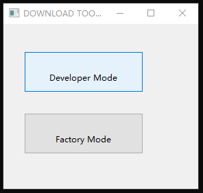
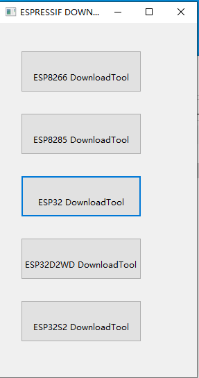
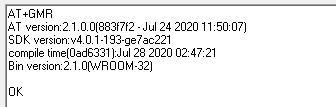

Downloading Guide
=================

:link_to_translation:`zh_CN:[中文]`

This Guide demonstrates how to download AT firmware and flash it into an ESP device by taking ESP32-WROOM-32 as an example. The Guide is also applicable to other ESP modules.

Before you start, please make sure you have already connected your hardware. For more details, see :doc:`Hardware_connection`.

For different series of modules, the commands supported by AT firmware are different. Please refer to :doc:`/Compile_and_Develop/How_to_understand_the_differences_of_each_type_of_module` for more details.

Download AT Firmware
---------------------

To download AT firmware to your computer, please do as follows:

- Navigate to :doc:`../AT_Binary_Lists/index`
- Find the firmware for your device
- Click the link to download it

Here, we download ``ESP32-WROOM-32_AT_Bin_V2.1`` for ESP32-WROOM-32. The list below describes the structure of this firmware and what each bin file contains. Other AT firmware has similar structure and bin files.

.. code-block:: none

   .
   ├── at_customize.bin                 // secondary partition table
   ├── bootloader                       // bootloader
   │   └── bootloader.bin
   ├── customized_partitions            // AT customized binaries
   │   ├── ble_data.bin
   │   ├── client_ca.bin
   │   ├── client_cert.bin
   │   ├── client_key.bin
   │   ├── factory_param.bin
   │   ├── factory_param_WROOM-32.bin
   │   ├── mqtt_ca.bin
   │   ├── mqtt_cert.bin
   │   ├── mqtt_key.bin
   │   ├── server_ca.bin
   │   ├── server_cert.bin
   │   └── server_key.bin
   ├── download.config                  // configuration of downloading
   ├── esp-at.bin                       // AT application binary
   ├── factory                          // A combined bin for factory downloading
   │   ├── factory_WROOM-32.bin
   │   └── factory_parameter.log
   ├── flasher_args.json                // flasher arguments
   ├── ota_data_initial.bin             // ota data parameters
   ├── partition_table                  // primary partition table
   │   └── partition-table.bin
   └── phy_init_data.bin                // phy parameters

The file ``download.config`` contains the configuration to flash the firmware into multiple addresses: 

.. code-block:: none

   --flash_mode dio --flash_freq 40m --flash_size 4MB
   0x8000 partition_table/partition-table.bin
   0x10000 ota_data_initial.bin
   0xf000 phy_init_data.bin
   0x1000 bootloader/bootloader.bin
   0x100000 esp-at.bin
   0x20000 at_customize.bin
   0x24000 customized_partitions/server_cert.bin
   0x39000 customized_partitions/mqtt_key.bin
   0x26000 customized_partitions/server_key.bin
   0x28000 customized_partitions/server_ca.bin
   0x2e000 customized_partitions/client_ca.bin
   0x30000 customized_partitions/factory_param.bin
   0x21000 customized_partitions/ble_data.bin
   0x3B000 customized_partitions/mqtt_ca.bin
   0x37000 customized_partitions/mqtt_cert.bin
   0x2a000 customized_partitions/client_cert.bin
   0x2c000 customized_partitions/client_key.bin

- ``--flash_mode dio`` means the firmware is compiled with flash DIO mode.
- ``--flash_freq 40m`` means the firmware’s flash frequency is 40 MHz.
- ``--flash_size 4MB`` means the firmware is using flash size 4 MB.
- ``0x10000 ota_data_initial.bin`` means downloading ``ota_data_initial.bin`` into the address ``0x10000``.

.. _flash-at-firmware-into-your-device:

Flash AT Firmware into Your Device
-----------------------------------

Follow the instructions below for your operating system.

Windows
^^^^^^^^

Before starting to flash, you need to download `Flash Download Tools for Windows <https://www.espressif.com/en/support/download/other-tools>`_. For more details about the tools, please see ``readme.pdf`` or the  ``doc`` folder in the zip folder.

- Open the ESP Flash Download Tool.
- Select a mode according to your need. (Here, we select ``Developer Mode``.)

   Flash Download Tools Modes

- Select your target chip. For example, choose "ESP8266 DownloadTool" for ESP8266 chip; choose “ESP32-S2 DownloadTool” for ESP32-S2 chip. (Here, we select ESP32 DownloadTool.)

   Flash Download Tools Target Chip

- Flash AT firmware into your device. You can select either of the two ways below.

   - To download one combined factory bin to address 0, select “DoNotChgBin” to use the default configuration of the factory bin.

     .. figure:: ../../_static/esp32_wroom32_download_one_bin.png
        :align: center
        :scale: 70%
        :alt: Download to One Address

        Download to One Address

   - To download multiple bins separately to different addresses, set up the configurations according to the file ``download.config`` and do NOT select “DoNotChgBin”.

     .. figure:: ../../_static/esp32_wroom32_download_multi_bin.png
        :align: center
        :scale: 60%
        :alt: Download to Multiple Addresses

        Download to Multiple Addresses

In case of flashing issues, please verify what the COM port number of download interface of the ESP board is and select it from "COM:" dropdown list. If you don't know the port number, you can refer to `Check port on Windows <https://docs.espressif.com/projects/esp-idf/en/latest/esp32/get-started/establish-serial-connection.html#check-port-on-windows>`_ for details.

When you finish flashing, please `Check Whether AT Works`_.

Linux or macOS
^^^^^^^^^^^^^^^

Before you start to flash, you need to install `esptool.py <https://github.com/espressif/esptool>`_.

You can select either of the two ways below to flash AT firmware into your device.

- To download the bins separately into multiple addresses, enter the following command and replace ``PORTNAME`` and ``download.config``:

  .. code-block:: none

       esptool.py --chip auto --port PORTNAME --baud 115200 --before default_reset --after hard_reset write_flash -z download.config

  Replace ``PORTNAME`` with your port name. If you don't know it, you can refer to `Check port on Linux and macOS <https://docs.espressif.com/projects/esp-idf/en/latest/esp32/get-started/establish-serial-connection.html#check-port-on-linux-and-macos>`_ for details.

  Replace ``download.config`` with the content inside the file.

  Below is the example command for ESP32-WROOM-32.

  .. code-block:: none

        esptool.py --chip auto --port /dev/tty.usbserial-0001 --baud 115200 --before default_reset --after hard_reset write_flash -z --flash_mode dio --flash_freq 40m --flash_size 4MB 0x8000 partition_table/partition-table.bin 0x10000 ota_data_initial.bin 0xf000 phy_init_data.bin 0x1000 bootloader/bootloader.bin 0x100000 esp-at.bin 0x20000 at_customize.bin 0x24000 customized_partitions/server_cert.bin 0x39000 customized_partitions/mqtt_key.bin 0x26000 customized_partitions/server_key.bin 0x28000 customized_partitions/server_ca.bin 0x2e000 customized_partitions/client_ca.bin 0x30000 customized_partitions/factory_param.bin 0x21000 customized_partitions/ble_data.bin 0x3B000 customized_partitions/mqtt_ca.bin 0x37000 customized_partitions/mqtt_cert.bin 0x2a000 customized_partitions/client_cert.bin 0x2c000 customized_partitions/client_key.bin

- To download the bins together to one address, enter the following command and replace ``PORTNAME`` and ``FILEDIRECTORY``:

  .. code-block:: none

        esptool.py --chip auto --port PORTNAME --baud 115200 --before default_reset --after hard_reset write_flash -z --flash_mode dio --flash_freq 40m --flash_size 4MB 0x0 FILEDIRECTORY

  Replace ``PORTNAME`` with your port name. If you don't know it, you can refer to `Check port on Linux and macOS <https://docs.espressif.com/projects/esp-idf/en/latest/esp32/get-started/establish-serial-connection.html#check-port-on-linux-and-macos>`_ for details.

  Replace ``FILEDIRECTORY`` with the file directory you would flash to the address ``0x0``. It is normally factory/XXX.bin.

  Below is the example command for ESP32-WROOM-32.

  .. code-block:: none

        esptool.py --chip auto --port /dev/tty.usbserial-0001 --baud 115200 --before default_reset --after hard_reset write_flash -z --flash_mode dio --flash_freq 40m --flash_size 4MB 0x0 factory/factory_WROOM-32.bin

When you finish flashing, please `Check Whether AT Works`_.

Check Whether AT Works
-----------------------
To check whether AT works, do as follows:

- Open a serial port tool, such as SecureCRT;
- Select the Port attached to "AT command/response" line (see :doc:`Hardware_connection` for details);
- Set Baudrate to 115200;
- Set Data Bits to 8;
- Set Parity to None;
- Set Stop Bits to 1;
- Set Flow Type to None;
- Enter the command “AT+GMR” with a new line (CR LF). 

If the response is OK as the picture below shows, it means that AT works.

   Response from AT

Otherwise, you need to check your ESP startup log, which is visible on PC over "Download/Log output connection". If it is like the log below, it means that ESP-AT firmware have been initalized correctly.

ESP32 startup log:

.. code-block:: none

    ets Jun  8 2016 00:22:57
    rst:0x1 (POWERON_RESET),boot:0x13 (SPI_FAST_FLASH_BOOT)
    configsip: 0, SPIWP:0xee
    clk_drv:0x00,q_drv:0x00,d_drv:0x00,cs0_drv:0x00,hd_drv:0x00,wp_drv:0x00
    mode:DIO, clock div:2
    load:0x3fff0030,len:4
    load:0x3fff0034,len:7184
    ho 0 tail 12 room 4
    load:0x40078000,len:13200
    load:0x40080400,len:4564
    entry 0x400806f4
    I (30) boot: ESP-IDF v4.2 2nd stage bootloader
    I (31) boot: compile time 11:23:19
    I (31) boot: chip revision: 0
    I (33) boot.esp32: SPI Speed      : 40MHz
    I (38) boot.esp32: SPI Mode       : DIO
    I (42) boot.esp32: SPI Flash Size : 4MB
    I (47) boot: Enabling RNG early entropy source...
    I (52) boot: Partition Table:
    I (56) boot: ## Label            Usage          Type ST Offset   Length
    I (63) boot:  0 phy_init         RF data          01 01 0000f000 00001000
    I (71) boot:  1 otadata          OTA data         01 00 00010000 00002000
    I (78) boot:  2 nvs              WiFi data        01 02 00012000 0000e000
    I (86) boot:  3 at_customize     unknown          40 00 00020000 000e0000
    I (93) boot:  4 ota_0            OTA app          00 10 00100000 00180000
    I (101) boot:  5 ota_1            OTA app          00 11 00280000 00180000
    I (108) boot: End of partition table
    I (112) esp_image: segment 0: paddr=0x00100020 vaddr=0x3f400020 size=0x2a300 (172800) map
    I (187) esp_image: segment 1: paddr=0x0012a328 vaddr=0x3ffbdb60 size=0x039e8 ( 14824) load
    I (194) esp_image: segment 2: paddr=0x0012dd18 vaddr=0x40080000 size=0x00404 (  1028) load
    I (194) esp_image: segment 3: paddr=0x0012e124 vaddr=0x40080404 size=0x01ef4 (  7924) load
    I (206) esp_image: segment 4: paddr=0x00130020 vaddr=0x400d0020 size=0x10a470 (1090672) map
    I (627) esp_image: segment 5: paddr=0x0023a498 vaddr=0x400822f8 size=0x1c3a0 (115616) load
    I (678) esp_image: segment 6: paddr=0x00256840 vaddr=0x400c0000 size=0x00064 (   100) load
    I (695) boot: Loaded app from partition at offset 0x100000
    I (695) boot: Disabling RNG early entropy source...
    max tx power=78,ret=0
    2.1.0

ESP32-S2 startup log:

.. code-block:: none

    ESP-ROM:esp32s2-rc4-20191025
    Build:Oct 25 2019
    rst:0x1 (POWERON),boot:0x8 (SPI_FAST_FLASH_BOOT)
    SPIWP:0xee
    mode:DIO, clock div:1
    load:0x3ffe6100,len:0x4
    load:0x3ffe6104,len:0x1a24
    load:0x4004c000,len:0x1a6c
    load:0x40050000,len:0x20fc
    entry 0x4004c35c
    I (46) boot: ESP-IDF v4.2 2nd stage bootloader
    I (46) boot: compile time 11:24:34
    I (46) boot: chip revision: 0
    I (47) qio_mode: Enabling default flash chip QIO
    I (53) boot.esp32s2: SPI Speed      : 80MHz
    I (57) boot.esp32s2: SPI Mode       : QIO
    I (62) boot.esp32s2: SPI Flash Size : 4MB
    I (67) boot: Enabling RNG early entropy source...
    I (72) boot: Partition Table:
    I (76) boot: ## Label            Usage          Type ST Offset   Length
    I (83) boot:  0 phy_init         RF data          01 01 0000f000 00001000
    I (91) boot:  1 otadata          OTA data         01 00 00010000 00002000
    I (98) boot:  2 nvs              WiFi data        01 02 00012000 0000e000
    I (106) boot:  3 at_customize     unknown          40 00 00020000 000e0000
    I (113) boot:  4 ota_0            OTA app          00 10 00100000 00180000
    I (121) boot:  5 ota_1            OTA app          00 11 00280000 00180000
    I (128) boot: End of partition table
    I (133) esp_image: segment 0: paddr=0x00100020 vaddr=0x3f000020 size=0x21bec (138220) map
    I (167) esp_image: segment 1: paddr=0x00121c14 vaddr=0x3ffc9330 size=0x02fe0 ( 12256) load
    I (169) esp_image: segment 2: paddr=0x00124bfc vaddr=0x40024000 size=0x00404 (  1028) load
    I (173) esp_image: segment 3: paddr=0x00125008 vaddr=0x40024404 size=0x0b010 ( 45072) load
    I (193) esp_image: segment 4: paddr=0x00130020 vaddr=0x40080020 size=0xb0784 (722820) map
    I (324) esp_image: segment 5: paddr=0x001e07ac vaddr=0x4002f414 size=0x09f18 ( 40728) load
    I (334) esp_image: segment 6: paddr=0x001ea6cc vaddr=0x40070000 size=0x0001c (    28) load
    I (346) boot: Loaded app from partition at offset 0x100000
    I (346) boot: Disabling RNG early entropy source...
    max tx power=78,ret=0
    2.1.0

ESP32-C3 startup log:

.. code-block:: none

    ESP-ROM:esp32c3-20200918
    Build:Sep 18 2020
    rst:0x1 (POWERON),boot:0xc (SPI_FAST_FLASH_BOOT)
    SPIWP:0xee
    mode:DIO, clock div:2
    load:0x3fcd6100,len:0x14
    load:0x3fcd6114,len:0x179c
    load:0x403ce000,len:0x894
    load:0x403d0000,len:0x2bf8
    entry 0x403ce000
    I (54) boot: ESP-IDF v4.3-beta1 2nd stage bootloader
    I (55) boot: compile time 12:09:42
    I (55) boot: chip revision: 1
    I (57) boot_comm: chip revision: 1, min. bootloader chip revision: 0
    I (64) boot.esp32c3: SPI Speed      : 40MHz
    I (68) boot.esp32c3: SPI Mode       : DIO
    I (73) boot.esp32c3: SPI Flash Size : 4MB
    I (78) boot: Enabling RNG early entropy source...
    I (83) boot: Partition Table:
    I (87) boot: ## Label            Usage          Type ST Offset   Length
    I (94) boot:  0 phy_init         RF data          01 01 0000f000 00001000
    I (102) boot:  1 otadata          OTA data         01 00 00010000 00002000
    I (109) boot:  2 nvs              WiFi data        01 02 00012000 0000e000
    I (117) boot:  3 at_customize     unknown          40 00 00020000 000e0000
    I (124) boot:  4 ota_0            OTA app          00 10 00100000 00180000
    I (132) boot:  5 ota_1            OTA app          00 11 00280000 00180000
    I (139) boot: End of partition table
    I (144) boot: No factory image, trying OTA 0
    I (149) boot_comm: chip revision: 1, min. application chip revision: 0
    I (156) esp_image: segment 0: paddr=00100020 vaddr=3c140020 size=29cc8h (171208) map
    I (201) esp_image: segment 1: paddr=00129cf0 vaddr=3fc8f000 size=03be8h ( 15336) load
    I (205) esp_image: segment 2: paddr=0012d8e0 vaddr=40380000 size=02738h ( 10040) load
    I (210) esp_image: segment 3: paddr=00130020 vaddr=42000020 size=135bf0h (1268720) map
    I (489) esp_image: segment 4: paddr=00265c18 vaddr=40382738 size=0c778h ( 51064) load
    I (502) esp_image: segment 5: paddr=00272398 vaddr=50000000 size=00004h (     4) load
    I (508) boot: Loaded app from partition at offset 0x100000
    I (544) boot: Set actual ota_seq=1 in otadata[0]
    I (544) boot: Disabling RNG early entropy source...
    max tx power=78,ret=0
    2.1.0

ESP8266 startup log:

.. code-block:: none

    ...
    boot: ESP-IDF v3.4-rc 2nd stage bootloader
    I (54) boot: compile time 11:18:21
    I (54) boot: SPI Speed      : 80MHz
    I (57) boot: SPI Mode       : DIO
    I (61) boot: SPI Flash Size : 2MB
    I (65) boot: Partition Table:
    I (68) boot: ## Label            Usage          Type ST Offset   Length
    I (75) boot:  0 otadata          OTA data         01 00 00009000 00002000
    I (83) boot:  1 phy_init         RF data          01 01 0000f000 00001000
    I (90) boot:  2 ota_0            OTA app          00 10 00010000 000e0000
    I (98) boot:  3 at_customize     unknown          40 00 000f0000 00020000
    I (105) boot:  4 ota_1            OTA app          00 11 00110000 000e0000
    I (112) boot:  5 nvs              WiFi data        01 02 001f0000 00010000
    I (120) boot: End of partition table
    I (124) boot: No factory image, trying OTA 0
    I (129) esp_image: segment 0: paddr=0x00010010 vaddr=0x40210010 size=0xac0d0 (704720) map
    I (138) esp_image: segment 1: paddr=0x000bc0e8 vaddr=0x402bc0e0 size=0x1aba8 (109480) map
    I (146) esp_image: segment 2: paddr=0x000d6c98 vaddr=0x3ffe8000 size=0x00788 (  1928) load
    I (155) esp_image: segment 3: paddr=0x000d7428 vaddr=0x40100000 size=0x00080 (   128) load
    I (164) esp_image: segment 4: paddr=0x000d74b0 vaddr=0x40100080 size=0x059c4 ( 22980) load
    I (173) boot: Loaded app from partition at offset 0x10000
    phy_version: 1163.0, 665d56c, Jun 24 2020, 10:00:08, RTOS new
    max tx power=78,ret=0
    2.0.0