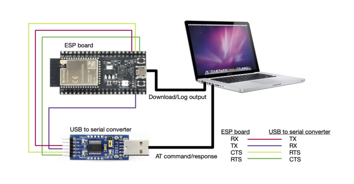
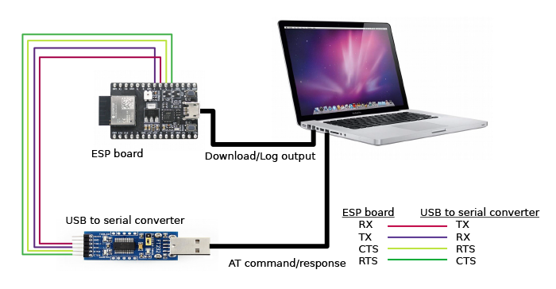
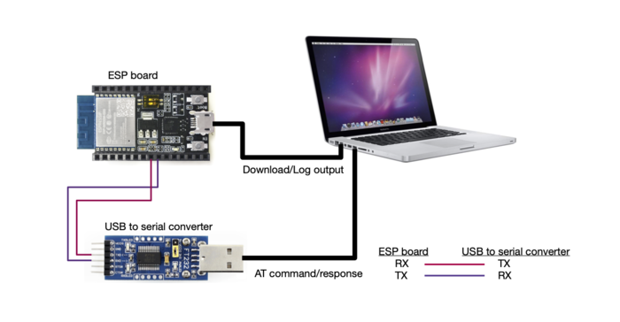

Hardware Connection
===================

:link_to_translation:`zh_CN:[中文]`

This document introduces what hardware you need to prepare and how to connect them in order to download AT firmware, send AT commands, and receive AT responses. It covers the following four ESP series of modules:

- `ESP32 Series`_
- `ESP32-S2 Series`_
- `ESP32-C3 Series`_
- `ESP8266 Series`_

For different series of modules, the commands supported by AT firmware are different. Please refer to :doc:`/Compile_and_Develop/How_to_understand_the_differences_of_each_type_of_module` for more details.

What You Need
--------------

.. list-table:: List of Components Required for ESP-AT Testing
   :header-rows: 1

   * - Component
     - Function
   * - ESP board
     - Slave MCU.
   * - USB cable (ESP borad to PC)
     - Download/Log output connection.
   * - PC
     - Act as Host MCU. Download firmware to Slave MCU.
   * - USB cable (PC to serial port converter)
     - AT command/response connection.
   * - USB to serial port converter
     - Convert between USB signals and TTL signals.
   * - Jumper wires (serial port converter to ESP board)
     - AT command/response connection.

.. figure:: ../../_static/hw-connection-what-you-need.png
   :align: center
   :alt: Connection of Components for ESP-AT Testing
   :figclass: align-center

   Connection of Components for ESP-AT Testing

Please note that in the above picture, four jump wires are used to connect the ESP board and USB to serial converter. If you don't use hardware flow control, two wires connecting TX/RX and a simpler converter will be enough.

ESP32 Series
-------------

ESP32 AT uses two UART ports: UART0 is used to download firmware and log output; UART1 is used to send AT commands and receive AT responses. 

All ESP32 modules use GPIO1 and GPIO3 as UART0, but they use different GPIOs as UART1. The following sections illustrate which GPIOs you should connect for each ESP32 series of modules.

For more details of ESP32 modules and boards, please refer to `ESP32 Modules and Boards <https://docs.espressif.com/projects/esp-idf/en/stable/hw-reference/modules-and-boards.html#wroom-solo-wrover-and-pico-modules>`_.

ESP32-WROOM-32 Series
^^^^^^^^^^^^^^^^^^^^^^

.. list-table:: ESP32-WROOM-32 Series Hardware Connection Pinout
   :header-rows: 1

   * - Function of Connection
     - ESP Board Pins
     - Other Device Pins
   * - Download/Log output :sup:`1`
     - UART0
         * GPIO3 (RX)
         * GPIO1 (TX)
     - PC
         * TX
         * RX
   * - AT command/response :sup:`2`
     - UART1
         * GPIO16 (RX)
         * GPIO17 (TX)
         * GPIO15 (CTS)
         * GPIO14 (RTS)
     - USB to serial converter
         * TX
         * RX
         * RTS
         * CTS

**Note** 1: Connection between individual pins of the ESP board and the PC is already established internally on the ESP board. You only need to provide USB cable between the board and PC.

**Note** 2: Connection between CTS/RTS is optional, depending on whether you want to use hardware flow control.

.. figure:: ../../_static/esp32-wroom-hw-connection.png
   :align: center
   :alt: ESP32-WROOM-32 Series Hardware Connection
   :figclass: align-center

   ESP32-WROOM-32 Series Hardware Connection

If you want to connect your device directly with ESP32-WROOM-32 rather than the ESP board that integrates it, please refer to `ESP32-WROOM-32 Datasheet <https://www.espressif.com/sites/default/files/documentation/esp32-wroom-32_datasheet_en.pdf>`_ for more details.

ESP32-WROVER Series
^^^^^^^^^^^^^^^^^^^^^^^^
.. list-table:: ESP32-WROVER Series Hardware Connection Pinout
   :header-rows: 1

   * - Function of Connection
     - ESP Board Pins
     - Other Device Pins
   * - Download/Log output :sup:`1`
     - UART0
         * GPIO3 (RX)
         * GPIO1 (TX)
     - PC
         * TX
         * RX
   * - AT command/response :sup:`2`
     - UART1
         * GPIO19 (RX)
         * GPIO22 (TX)
         * GPIO15 (CTS)
         * GPIO14 (RTS)
     - USB to serial converter
         * TX
         * RX
         * RTS
         * CTS

**Note** 1: Connection between individual pins of the ESP board and the PC is already established internally on the ESP board. You only need to provide USB cable between the board and PC.

**Note** 2: Connection between CTS/RTS is optional, depending on whether you want to use hardware flow control.

.. figure:: ../../_static/esp32-wrover-hw-connection.png
   :align: center
   :alt: ESP32-WROVER Series Hardware Connection
   :figclass: align-center

   ESP32-WROVER Series Hardware Connection

If you want to connect your device directly with ESP32-WROVER rather than the ESP board that integrates it, please refer to `ESP32-WROVER Datasheet <https://www.espressif.com/sites/default/files/documentation/esp32-wrover_datasheet_en.pdf>`_ for more details.

ESP32-PICO Series
^^^^^^^^^^^^^^^^^^

.. list-table:: ESP32-PICO Series Hardware Connection Pinout
   :header-rows: 1

   * - Function of Connection
     - ESP Board Pins
     - Other Device Pins
   * - Download/Log output :sup:`1`
     - UART0
         * GPIO3 (RX)
         * GPIO1 (TX)
     - PC
         * TX
         * RX
   * - AT command/response :sup:`2`
     - UART1
         * GPIO19 (RX)
         * GPIO22 (TX)
         * GPIO15 (CTS)
         * GPIO14 (RTS)
     - USB to serial converter
         * TX
         * RX
         * RTS
         * CTS

**Note** 1: Connection between individual pins of the ESP board and the PC is already established internally on the ESP board. You only need to provide USB cable between the board and PC.

**Note** 2: Connection between CTS/RTS is optional, depending on whether you want to use hardware flow control.

.. figure:: ../../_static/esp32-pico-hw-connection.png
   :align: center
   :alt: ESP32-PICO Series Hardware Connection
   :figclass: align-center

   ESP32-PICO Series Hardware Connection

If you want to connect your device directly with ESP32-PICO-D4 rather than the ESP board that integrates it, please refer to `ESP32-PICO-D4 Datasheet <https://www.espressif.com/sites/default/files/documentation/esp32-pico-d4_datasheet_en.pdf>`_ for more details.

ESP32-SOLO Series
^^^^^^^^^^^^^^^^^^

.. list-table:: ESP32-SOLO Series Hardware Connection Pinout
   :header-rows: 1

   * - Function of Connection
     - ESP Board Pins
     - Other Device Pins
   * - Download/Log output :sup:`1`
     - UART0
         * GPIO3 (RX)
         * GPIO1 (TX)
     - PC
         * TX
         * RX
   * - AT command/response :sup:`2`
     - UART1
         * GPIO16 (RX)
         * GPIO17 (TX)
         * GPIO15 (CTS)
         * GPIO14 (RTS)
     - USB to serial converter
         * TX
         * RX
         * RTS
         * CTS

**Note** 1: Connection between individual pins of the ESP board and the PC is already established internally on the ESP board. You only need to provide USB cable between the board and PC.

**Note** 2: Connection between CTS/RTS is optional, depending on whether you want to use hardware flow control.

.. figure:: ../../_static/esp32-solo-hw-connection.png
   :align: center
   :alt: ESP32-SOLO Series Hardware Connection
   :figclass: align-center

   ESP32-SOLO Series Hardware Connection

If you want to connect your device directly with ESP32-SOLO-1 rather than the ESP board that integrates it, please refer to `ESP32-SOLO-1 Datasheet <https://www.espressif.com/sites/default/files/documentation/esp32-solo-1_datasheet_en.pdf>`_ for more details.

ESP32-S2 Series
----------------

ESP32-S2 AT uses two UART ports: UART0 is used to download firmware and log output; UART1 is used to send AT commands and receive AT responses.

.. list-table:: ESP32-S2 Series Hardware Connection Pinout
   :header-rows: 1

   * - Function of Connection
     - ESP Board Pins
     - Other Device Pins
   * - Download/Log output :sup:`1`
     - UART0
         * GPIO44 (RX)
         * GPIO43 (TX)
     - PC
         * TX
         * RX
   * - AT command/response :sup:`2`
     - UART1
         * GPIO21 (RX)
         * GPIO17 (TX)
         * GPIO20 (CTS)
         * GPIO19 (RTS)
     - USB to serial converter
         * TX
         * RX
         * RTS
         * CTS

**Note** 1: Connection between individual pins of the ESP board and the PC is already established internally on the ESP board. You only need to provide USB cable between the board and PC.

**Note** 2: Connection between CTS/RTS is optional, depending on whether you want to use hardware flow control.

   ESP32-S2 Series Hardware Connection

If you want to connect your device directly with ESP32-S2-WROOM rather than the ESP board that integrates it, please refer to `ESP32-S2-WROOM & ESP32-S2-WROOM-I Datasheet <https://www.espressif.com/sites/default/files/documentation/esp32-s2-wroom_esp32-s2-wroom-i_datasheet_en.pdf>`_ for more details.

ESP32-C3 Series
----------------

ESP32-C3 AT uses two UART ports: UART0 is used to download firmware and log output; UART1 is used to send AT commands and receive AT responses.

.. list-table:: ESP32-C3 Series Hardware Connection Pinout
   :header-rows: 1

   * - Function of Connection
     - ESP Board Pins
     - Other Device Pins
   * - Download/Log output :sup:`1`
     - UART0
         * GPIO20 (RX)
         * GPIO21 (TX)
     - PC
         * TX
         * RX
   * - AT command/response :sup:`2`
     - UART1
         * GPIO6 (RX)
         * GPIO7 (TX)
         * GPIO5 (CTS)
         * GPIO4 (RTS)
     - USB to serial converter
         * TX
         * RX
         * RTS
         * CTS

**Note** 1: Connection between individual pins of the ESP board and the PC is already established internally on the ESP board. You only need to provide USB cable between the board and PC.

**Note** 2: Connection between CTS/RTS is optional, depending on whether you want to use hardware flow control.

   ESP32-C3 Series Hardware Connection

If you want to connect your device directly with ESP32­-C3-­MINI-­1 rather than the ESP board that integrates it, please refer to `ESP32­-C3-­MINI-­1 Datasheet <https://www.espressif.com/sites/default/files/documentation/esp32-c3-mini-1_datasheet_en.pdf>`_ for more details.

ESP8266 Series
---------------

ESP8266 AT uses two UART ports: UART0 is used to download firmware and send AT commands and receive AT responses; UART1 is used to log output. 

.. list-table:: ESP8266 Series Hardware Connection Pinout
   :header-rows: 1

   * - Function of Connection
     - ESP Board Pins
     - Other Device Pins
   * - Download
     - UART0
         * GPIO3 (RX)
         * GPIO1 (TX)
     - PC
         * TX
         * RX
   * - AT command/response :sup:`2`
     - UART0
         * GPIO13 (RX)
         * GPIO15 (TX)
         * GPIO3 (CTS)
         * GPIO1 (RTS)
     - USB to serial converter
         * TX
         * RX
         * RTS
         * CTS 
   * - Log output
     - UART1
         * GPIO2 (TX)
     - USB to serial converter
         * RX

**Note** 1: Connection between individual pins of the ESP board and the PC is already established internally on the ESP board. You only need to provide USB cable between the board and PC.

**Note** 2: Connection between CTS/RTS is optional, depending on whether you want to use hardware flow control.

    ESP8266 Series Hardware Connection

.. note::

    The default ESP8266 RTOS AT firmware for ESP-WROOM-02 swaps RX/TX with CTS/RTS. If you want to use hardware flow control, you need to disconnect UART1, desolder CP2102N chip from the ESP board, and connect the board with 3.3 V and GND of the converter to supply power.

If you want to connect your device directly with ESP-WROOM-02 or ESP-WROOM-02D/02U rather than the ESP board that integrates it, please refer to `ESP-WROOM-02 Datasheet <https://www.espressif.com/sites/default/files/documentation/0c-esp-wroom-02_datasheet_en.pdf>`_ or `ESP-WROOM-02D/02U Datasheet <https://www.espressif.com/sites/default/files/documentation/esp-wroom-02u_esp-wroom-02d_datasheet_en.pdf>`_ for more details.

For more details about ESP8266 modules, please refer to `ESP8266 documentation <https://www.espressif.com/en/products/socs/esp8266>`_.