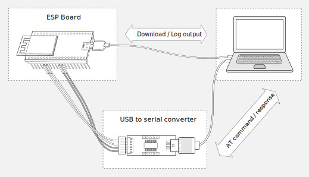

Hardware Connection
===================

This document introduces what hardware you need to prepare and how to connect them in order to download AT firmware, send AT commands, and receive AT responses. It covers the following three ESP series of modules:

- `ESP32 Series`_
- `ESP32-S2 Series`_
- `ESP8266 Series`_

What You Need
--------------

- PC
- ESP board
- USB to serial port converter
- USB cables to connect PC with ESP board and USB to serial port converter
- Jumper wires to connect ESP board with USB to serial port converter

   What You Need for ESP-AT Testing

ESP32 Series
-------------

ESP32 AT uses two UART ports: UART0 is used to download firmware and log output; UART1 is used to send AT commands and receive AT responses. 

All ESP32 modules use GPIO1 and GPIO3 as UART0, but they use different GPIOs as UART1. The following sections illustrate which GPIOs you should connect for each ESP32 series of modules. Please note that connection to CTS and RTS is optional, depending on whether you want to use hardware flow control.

For more details of ESP32 modules and boards, please refer to `ESP32 Modules and Boards <https://docs.espressif.com/projects/esp-idf/en/stable/hw-reference/modules-and-boards.html#wroom-solo-wrover-and-pico-modules>`_.

ESP32-WROOM-32 Series
^^^^^^^^^^^^^^^^^^^^^^
.. list-table:: ESP32-WROOM-32 Series Hardware Connection Pinout
   :widths: 35 20 25
   :header-rows: 1

   * - Function of Connection
     - Interface
     - Pins
   * - Download/Log output
     - UART0
     -
       * TX:  GPIO1
       * RX:  GPIO3
   * - AT command/response
     - UART1
     -
       * TX:  GPIO17
       * RX:  GPIO16
       * CTS: GPIO15
       * RTS: GPIO14

.. figure:: ../../_static/esp32-wroom-hw-connection.png
   :align: center
   :alt: ESP32-WROOM-32 Series Hardware Connection
   :figclass: align-center

   ESP32-WROOM-32 Series Hardware Connection

If you want to connect your device directly with ESP32-WROOM-32 rather than the ESP board that integrates it, please refer to `ESP32-WROOM-32 Datasheet <https://www.espressif.com/sites/default/files/documentation/esp32-wroom-32_datasheet_en.pdf>`_ for more details.

ESP32-WROVER Series
^^^^^^^^^^^^^^^^^^^^^^^^
.. list-table:: ESP32-WROVER Series Hardware Connection Pinout
   :widths: 35 20 25
   :header-rows: 1

   * - Function of Connection
     - Interface
     - Pins
   * - Download/Log output
     - UART0
     -
       * TX:  GPIO1
       * RX:  GPIO3
   * - AT command/response
     - UART1
     -
       * TX:  GPIO22
       * RX:  GPIO19
       * CTS: GPIO15
       * RTS: GPIO14

.. figure:: ../../_static/esp32-wrover-hw-connection.png
   :align: center
   :alt: ESP32-WROVER Series Hardware Connection
   :figclass: align-center

   ESP32-WROVER Series Hardware Connection

If you want to connect your device directly with ESP32-WROVER rather than the ESP board that integrates it, please refer to `ESP32-WROVER Datasheet <https://www.espressif.com/sites/default/files/documentation/esp32-wrover_datasheet_en.pdf>`_ for more details.

ESP32-PICO Series
^^^^^^^^^^^^^^^^^^

.. list-table:: ESP32-PICO Series Hardware Connection Pinout
   :widths: 35 20 25
   :header-rows: 1

   * - Function of Connection
     - Interface
     - Pins
   * - Download/Log output
     - UART0
     -
       * TX:  GPIO1
       * RX:  GPIO3
   * - AT command/response
     - UART1
     -
       * TX:  GPIO22
       * RX:  GPIO19
       * CTS: GPIO15
       * RTS: GPIO14

.. figure:: ../../_static/esp32-pico-hw-connection.png
   :align: center
   :alt: ESP32-PICO Series Hardware Connection
   :figclass: align-center

   ESP32-PICO Series Hardware Connection

If you want to connect your device directly with ESP32-PICO-D4 rather than the ESP board that integrates it, please refer to `ESP32-PICO-D4 Datasheet <https://www.espressif.com/sites/default/files/documentation/esp32-pico-d4_datasheet_en.pdf>`_ for more details.

ESP32-SOLO Series
^^^^^^^^^^^^^^^^^^

.. list-table:: ESP32-SOLO Series Hardware Connection Pinout
   :widths: 35 20 25
   :header-rows: 1

   * - Function of Connection
     - Interface
     - Pins
   * - Download/Log output
     - UART0
     -
       * TX:  GPIO1
       * RX:  GPIO3
   * - AT command/response
     - UART1
     -
       * TX:  GPIO17
       * RX:  GPIO16
       * CTS: GPIO15
       * RTS: GPIO14

.. figure:: ../../_static/esp32-solo-hw-connection.png
   :align: center
   :alt: ESP32-SOLO Series Hardware Connection
   :figclass: align-center

   ESP32-SOLO Series Hardware Connection

If you want to connect your device directly with ESP32-SOLO-1 rather than the ESP board that integrates it, please refer to `ESP32-SOLO-1 Datasheet <https://www.espressif.com/sites/default/files/documentation/esp32-solo-1_datasheet_en.pdf>`_ for more details.

ESP32-S2 Series
----------------

ESP32-S2 AT uses two UART ports: UART0 is used to download firmware and log output; UART1 is used to send AT commands and receive AT responses. Please note that connection to CTS and RTS is optional, depending on whether you want to use hardware flow control.

.. list-table:: ESP32-S2 Series Hardware Connection Pinout
   :widths: 35 20 25
   :header-rows: 1

   * - Function of Connection
     - Interface
     - Pins
   * - Download/Log output
     - UART0
     -
       * TX:  GPIO43
       * RX:  GPIO44
   * - AT command/response
     - UART1
     -
       * TX:  GPIO17
       * RX:  GPIO21
       * CTS: GPIO20
       * RTS: GPIO19

.. figure:: ../../_static/esp32-s2-hw-connection.png
   :align: center
   :alt: ESP32-S2 Series Hardware Connection
   :figclass: align-center

   ESP32-S2 Series Hardware Connection

If you want to connect your device directly with ESP32-S2-WROOM rather than the ESP board that integrates it, please refer to `ESP32-S2-WROOM & ESP32-S2-WROOM-I Datasheet <https://www.espressif.com/sites/default/files/documentation/esp32-s2-wroom_esp32-s2-wroom-i_datasheet_en.pdf>`_ for more details.

ESP8266 Series
---------------

ESP8266 AT uses two UART ports: UART0 is used to download firmware and send AT commands and receive AT responses; UART1 is used to log output. 

.. list-table:: ESP8266 Series Hardware Connection Pinout
   :widths: 35 20 25
   :header-rows: 1

   * - Function of Connection
     - Interface
     - Pins
   * - Download/AT command and response
     - UART0
     -
       * TX:  GPIO1
       * RX:  GPIO3
   * - Log output
     - UART1
     - 
       * TX:  GPIO15
       * RX:  GPIO13
       * CTS: GPIO3
       * RTS: GPIO1

.. figure:: ../../_static/esp8266-hw-connection.png
    :align: center
    :alt: ESP8266 Series Hardware Connection
    :figclass: align-center

    ESP8266 Series Hardware Connection

.. note::

    The default ESP8266 RTOS AT firmware for ESP-WROOM-02 swaps RX/TX with CTS/RTS. If you want to use hardware flow control, you need to disconnect UART1, desolder CP2102N chip from the ESP board, and connect the board with 3.3 V and GND of the converter to supply power.

For more details about ESP8266 modules, please refer to `ESP8266 documentation <https://www.espressif.com/en/products/socs/esp8266>`_.

If you want to connect your device directly with ESP-WROOM-02 or ESP-WROOM-02D/02U rather than the ESP board that integrates it, please refer to `ESP-WROOM-02
Datasheet <https://www.espressif.com/sites/default/files/documentation/0c-esp-wroom-02_datasheet_en.pdf>`_ or `ESP-WROOM-02D/02U Datasheet <https://www.espressif.com/sites/default/files/documentation/esp-wroom-02u_esp-wroom-02d_datasheet_en.pdf>`_ for more details.
