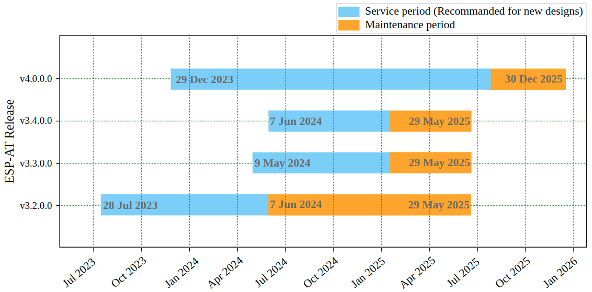

ESP-AT Versions
===============

:link_to_translation:`zh_CN:[中文]`

This document mainly introduces ESP-AT versions, how to select a version, versioning scheme, support periods, viewing versions, and subscribing to AT releases.

Releases
--------

The full history of ESP-AT releases can be found on the GitHub repository `Release page <https://github.com/espressif/esp-at/releases>`_. There you can find the AT firmwares, release notes, links to each version of the documentation, and instructions for obtaining each version.

Which Version Should I Start With?
----------------------------------

Please read :ref:`AT software solution selection <at-solution-selection>`.

.. _versioning-scheme:

Versioning Scheme
-----------------

ESP-AT Firmware Release Management
^^^^^^^^^^^^^^^^^^^^^^^^^^^^^^^^^^

ESP-AT release is specific to a chip and usually refers to the release of one or more AT firmwares for that chip. The AT command set supported by the released AT firmware is usually backward compatible. This means that you can update the new version of the AT firmware to devices with older versions.

The firmware released by ESP-AT follows a similar version management method as `Semantic Versioning <https://semver.org/>`_. You can understand the differences of each version from the literal meaning. For example, ``v3.3.0.0``, ``v`` represents version, followed by the version number in the following format:

::

    <major>.<minor>.<patch>.<custom>

Where:

- <major> is the major version. For example, ``v4.0.0.0`` represents a major update, usually including the introduction of new chip support, new features, and bug fixes.
- <minor> is the minor version. For example, ``v3.3.0.0`` represents an important update, usually including new features, ESP-IDF version upgrade, and bug fixes.
- <patch> is the patch version, also known as the bugfix version. For example, ``v2.4.2.0`` represents only bug fixes without adding any new features.
- <custom> is the custom version. It is usually used for downstream distributors or customized project versions.

ESP-AT Branch Release Management
^^^^^^^^^^^^^^^^^^^^^^^^^^^^^^^^

When ESP-AT releases AT firmware, if there are major or minor version updates, a new `release branch <https://github.com/espressif/esp-at/branches/all?query=release>`_ will be created.

The release branches of ESP-AT follow a similar version management method as `Semantic Versioning <https://semver.org/>`_. You can understand the differences of each version from the literal meaning. For example, ``release/v3.3.0.0``, ``release`` represents the release branch, ``v`` represents the version of the release branch, followed by the version number in the following format:

::

    <major>.<minor>.0.0

Where:

- <major> is the major version. For example, ``release/v4.0.0.0`` represents a major update, usually including the introduction of new chip support, new features, and bug fixes.
- <minor> is the minor version. For example, ``release/v3.3.0.0`` represents an important update, usually including new features, ESP-IDF version upgrade, and bug fixes.

In general, the AT firmware to be released will undergo multiple rounds of testing on the release branch until there are no major issues. Then, the AT firmware will be released, and the release branch will be synchronized to GitHub.

- New feature development usually takes place on the master branch and is not merged into the release branch.
- Bug fixes usually take place on the master branch and, if the issue is severe, will be merged into the release branch.

Support Periods
---------------

Each ESP-IDF major and minor release version has an associated support period. After this period, the release is End of Life and no longer supported. Since ESP-AT is a project based on ESP-IDF, the support period of ESP-AT is limited by the support period of ESP-IDF. The current information of each version of ESP-AT is as follows:

.. list-table::
   :header-rows: 1
   :width: 100%

   * - AT Version (Release Date)
     - Supported Chips
     - IDF Version
     - IDF EOL Date
     - AT New Version Plan
   * - **v4.0.0.0** (2023.12.29)
     - ESP32-C6
     - `v5.1.2 <https://github.com/espressif/esp-idf/releases/tag/v5.1.2>`_
     - 2025.12.30
     - 2025.7.30 - 2025.9.30
   * - **v3.4.0.0** (2024.6.7)
     -
       * ESP32
       * ESP32-S2
     - `v5.0.6 <https://github.com/espressif/esp-idf/releases/tag/v5.0.6>`_
     - 2025.5.29
     - 2024.12.29 - 2025.2.28
   * - **v3.3.0.0** (2024.5.9)
     -
       * ESP32-C2
       * ESP32-C3
     - `v5.0.6 <https://github.com/espressif/esp-idf/releases/tag/v5.0.6>`_
     - 2025.5.29
     - 2024.12.29 - 2025.2.28
   * - **v3.2.0.0** (2023.7.28)
     -
       * ESP32
       * ESP32-C3
     - ~v5.0.3 (`24b9d38 <https://github.com/espressif/esp-idf/commit/24b9d38>`_)
     - 2025.5.29
     -
        * New version v3.4.0.0 released for ESP32
        * New version v3.3.0.0 released for ESP32-C3

**Support periods for each released version of ESP-AT are as follows:**

   ESP-AT Version Support Periods

- Service Period of Support Period

    Usually, it starts from the release of the AT firmware for the chip and lasts until the planned release of the next AT version for that chip. The release time of the next AT version is usually a few months before the end of the corresponding `ESP-IDF support period <https://github.com/espressif/esp-idf/blob/master/README.md#esp-idf-release-support-schedule>`_ (the AT release notes provide information about the ESP-IDF version corresponding to the chip).

- Maintenance Period of Support Period

    Usually, it starts after the service period ends and lasts until the end of the corresponding `ESP-IDF support period <https://github.com/espressif/esp-idf/blob/master/README.md#esp-idf-release-support-schedule>`_ for the chip (the AT release notes provide information about the ESP-IDF version corresponding to the chip). For example, if the support period of ESP-IDF v5.0 is until May 29, 2025, then the maintenance period for ESP-AT v3.0 ~ v3.3 will also be until May 29, 2025.

In general:

- Once a new version of AT is released, the service period of the support period for the old version ends and enters the maintenance period of the support period.

    For example, when AT releases version v3.3.0.0 (for ESP32-C2 and ESP32-C3 chips), the service period of the support period for version v3.2.0.0 of ESP32-C3 ends and enters the maintenance period of the support period; the service period of the support period for version v3.1.0.0 of ESP32-C2 ends and enters the maintenance period of the support period.

- If you have a GitHub account, please :ref:`Subscribe to AT releases <sub-at-release>`. GitHub will notify you when a new version is released. When a bugfix version of the AT firmware you are using is released, please plan to upgrade to that bugfix version.
- Please make sure to plan the upgrade to a new version before the version you are using stops receiving updates and support.
- Being within the support period means that the ESP-AT team will continue to perform important bug fixes, security fixes, etc. on the release branch on GitHub, and periodically release new bugfix versions as needed.

Check the Current AT Firmware Version
-------------------------------------

Please send the :ref:`AT+GMR <cmd-GMR>` command to check the AT firmware version information. Refer to the parameter description under the :ref:`AT+GMR <cmd-GMR>` command for more information.

.. _sub-at-release:

Subscribe to AT Releases
------------------------

* :ref:`at-sr-github-login`
* :ref:`at-sr-watch-custom`
* :ref:`at-sr-release-apply`

.. _at-sr-github-login:

Step 1: Log in to Your GitHub Account
^^^^^^^^^^^^^^^^^^^^^^^^^^^^^^^^^^^^^

Before you start, please `sign in your GitHub account <https://github.com/login>`_, as you need login permission to subscribe to AT releases.

.. _at-sr-watch-custom:

Step 2: Choose Customized Notifications
^^^^^^^^^^^^^^^^^^^^^^^^^^^^^^^^^^^^^^^

Visit the `ESP-AT repository <https://github.com/espressif/esp-at>`_, click on ``Watch`` in the upper right corner of the page, and then click on ``Custom``.

  .. figure:: ../_static/at-sub-release-custom.png
    :align: center
    :alt:
    :figclass: align-center
    :scale: 70%

    Customized Notifications (click to enlarge)

.. _at-sr-release-apply:

Step 3: Apply for Release Notifications
^^^^^^^^^^^^^^^^^^^^^^^^^^^^^^^^^^^^^^^

Check ``Releases`` and click on ``Apply``.

  .. figure:: ../_static/at-sub-release-apply.png
    :align: center
    :alt:
    :figclass: align-center
    :scale: 70%

    Apply for Release Notifications (click to enlarge)

This completes the process of subscribing to AT releases. You will receive notifications from GitHub when a new AT version is released.
