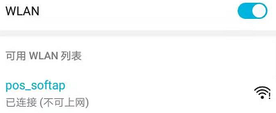
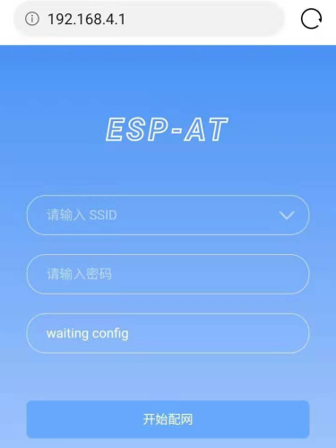
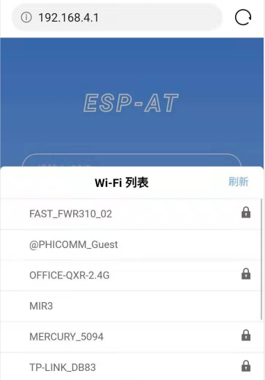
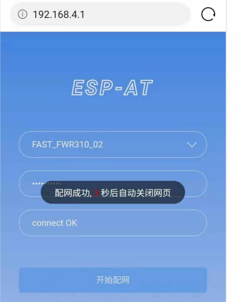
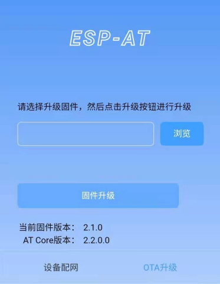
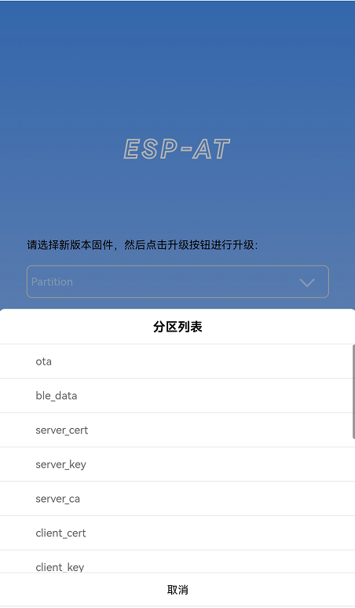
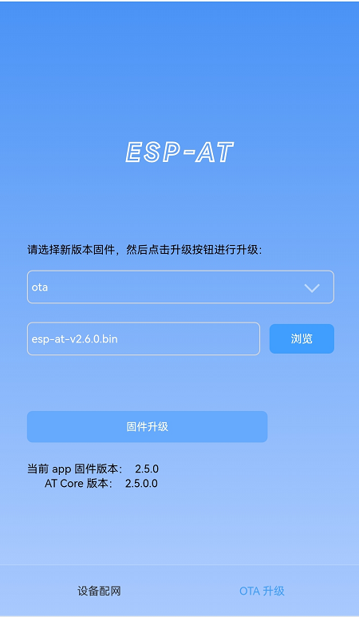
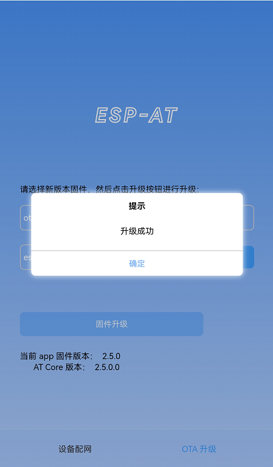
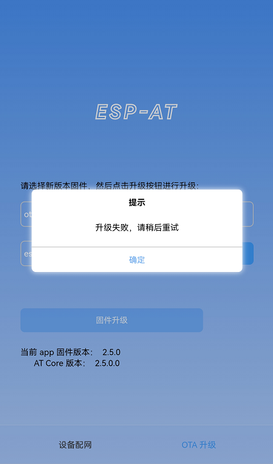
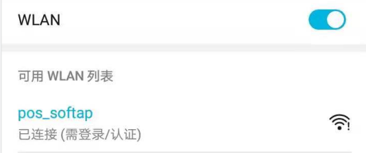

Web Server AT 示例
==================

:link_to_translation:`en:[English]`

本文档主要介绍 AT web server 的使用，主要涉及以下几个方面的应用：

.. contents::
   :local:
   :depth: 1

.. 注解::

   默认的 AT 固件并不支持 AT web server 的功能，请参考 :doc:`../AT_Command_Set/Web_server_AT_Commands` 启用该功能。
   
使用浏览器进行 Wi-Fi 配网
--------------------------

简介
^^^^

通过 web server，手机或 PC 可以设置 {IDF_TARGET_NAME} 设备的 Wi-Fi 连接信息。您可以使用手机或电脑连接到 {IDF_TARGET_NAME} 设备的 AP，通过浏览器打开配网网页，并将 Wi-Fi 配置信息发送给 {IDF_TARGET_NAME} 设备，然后 {IDF_TARGET_NAME} 设备将根据该配置信息连接到指定的路由器。

流程
^^^^

整个配网流程可以分为以下三步：  

.. contents::
   :local:
   :depth: 1

配网设备连接 {IDF_TARGET_NAME} 设备
""""""""""""""""""""""""""""""""""""

首先，为了让配网设备连接 {IDF_TARGET_NAME} 设备，{IDF_TARGET_NAME} 设备需要配置成 AP + STA 模式， 并创建一个 WEB 服务器等待配网信息，对应的 AT 命令如下：

#. 清除之前的配网信息，如果不清除配网信息，可能因为依然保留之前的配置信息从而导致 WEB 服务器无法创建。

   - Command
   
     ::
 
       AT+RESTORE

#. 配置 {IDF_TARGET_NAME} 设备为 Station + SoftAP 模式。

   - Command
   
     ::
 
       AT+CWMODE=3

#. 设置 SoftAP 的 ssid 和 password（如设置默认连接 ssid 为 `pos_softap`，无密码的 Wi-Fi）。

   - Command
   
     ::
 
       AT+CWSAP="pos_softap","",11,0,3

#. 使能多连接。

   - Command
   
     ::
 
       AT+CIPMUX=1

#. 创建 web server，端口：80，最大连接时间：25 s（默认最大为 60 s）。

   - Command
   
     ::
 
       AT+WEBSERVER=1,80,25

然后，使用上述命令启动 web server 后，打开配网设备的 Wi-Fi 连接功能，连接 {IDF_TARGET_NAME} 设备的 AP：

   连接 {IDF_TARGET_NAME} AP

使用浏览器发送配网信息
""""""""""""""""""""""""

在配网设备连接到 {IDF_TARGET_NAME} 设备后，即可发送 HTTP 请求，配置待接入的路由器的信息：（注意，浏览器配网不支持配网设备作为待接入 AP，例如，如果使用手机连接到 {IDF_TARGET_NAME} 的 AP，则该手机不建议作为 {IDF_TARGET_NAME} 设备待接入的热点。）
在浏览器中输入 web server 默认的 IP 地址（如果未设置 {IDF_TARGET_NAME} 设备的 SoftAP IP 地址，默认为 192.168.4.1，您可以通过 AT+CIPAP? 命令查询当前的 SoftAP IP 地址)，打开配网界面，输入拟连接的路由器的 ssid、password，点击“开始配网”即可开始配网：

   打开配网界面

用户也可以点击配网页面中 SSID 输入框右方的下拉框，查看 {IDF_TARGET_NAME} 模块附近的 AP 列表，选择目标 AP 并输入 password 后，点击“开始配网”即可启动配网：

   浏览器获取 Wi-Fi AP 列表示意图

通知配网结果
""""""""""""""""

配网成功后网页显示如下：

   配网成功

**说明** 1：配网成功后，网页将自动关闭，若想继续访问网页，请重新输入 {IDF_TARGET_NAME} 设备的 IP 地址，重新打开网页。

同时，在串口端将收到如下信息：

::

    +WEBSERVERRSP:1      // 代表启动配网  
    WIFI CONNECTED       // 代表正在连接  
    WIFI GOT IP          // 连接成功并获取到 IP  
    +WEBSERVERRSP:2      // 代表网页端收到配网成功结果，此时可以释放 WEB 资源  

如果配网失败，网页将显示：

.. figure:: ../../_static/Web_server/web_brower_wifi_connect_fail.png
   :align: center
   :alt: 配网失败
   :figclass: align-center

   配网失败

同时，在串口端将收到如下信息：

::

    +WEBSERVERRSP:1      // 代表启动配网，没有后续发起连接以及获取 IP 的信息，MCU 可以在收到该条消息后建立计时，若计时超时，则配网失败。

常见故障排除
^^^^^^^^^^^^

**说明** 1：配网页面收到提示“数据发送失败”。请检查 {IDF_TARGET_NAME} 模块的 Wi-Fi AP 是否正确开启，以及 AP 的相关配置，并确认已经输入正确的 AT 命令成功启用 web server。

使用浏览器进行 OTA 固件升级
------------------------------

简介
^^^^

浏览器打开 web server 的网页后，可以选择进入 OTA 升级页面，通过网页升级应用分区中的固件或者其它分区中的证书二进制固件（请参考文档 :doc:`../Compile_and_Develop/How_to_update_pki_config` 了解更多证书信息）。

流程
^^^^

.. contents::
   :local:
   :depth: 1

打开 OTA 配置页面
""""""""""""""""""""

如图，点击网页右下角“OTA 升级”选项，打开 OTA 配置页面后，可以查看当前固件版本、AT Core 版本：

   OTA 配置页面

**说明** 1：仅当浏览器连接 {IDF_TARGET_NAME} 模块的AP，或者访问 OTA 配置页面的设备与 {IDF_TARGET_NAME} 模块连接在同一个子网中时，才可以打开该配置界面。

**说明** 2：网页上显示的“当前固件版本”为当前用户编译的应用程序版本号，用户可通过 ``./build.py menuconfig`` --> ``Component config`` --> ``AT`` --> ``AT firmware version`` (参考 :doc:`../Compile_and_Develop/How_to_clone_project_and_compile_it`)更改该版本号，建立固件版本与应用程序的同步关系，以便于管理应用程序固件版本。

选择要更新的分区
"""""""""""""""""""""

如图，点击 "Partition" 下拉框来获取所有可以升级的分区：

   获取所有可以升级的分区

发送新版固件
"""""""""""""""""""""

如图，点击页面中的“浏览”按钮，选择待发送的新版固件：

   选择待发送的新版固件

之后点击 “固件升级” 按钮发送新版固件。

**说明** 1：对于 ``ota`` 分区，网页会对选择的固件进行检查。固件命名的后缀必须为 ``.bin``。请确保固件的大小不要超过 ``partitions_at.csv`` 文件中定义的 ``ota`` 分区大小。有关此文件的详细信息，请参考文档 :doc:`../Compile_and_Develop/How_to_add_support_for_a_module`。

**说明** 2：对于其它分区，网页会对选择的固件进行检查。固件命名的后缀必须为 ``.bin``。请确保固件的大小不要超过 ``at_customize.csv`` 文件中定义的分区大小。有关此文件的详细信息，请参考文档 :doc:`../Compile_and_Develop/How_to_customize_partitions`。

获取 OTA 结果
""""""""""""""""

如图，固件发送成功，将提示“升级成功”：

   新版固件发送成功

同时，在串口端将收到如下信息：

::

    +WEBSERVERRSP:3      // 代表开始接收 OTA 固件数据
    +WEBSERVERRSP:4      // 代表成功接收 OTA 固件数据

若接收的 OTA 固件数据失败，将提示“升级失败，请稍后重试”：

   新版固件发送失败

同时，在串口端将收到如下信息：

::

    +WEBSERVERRSP:3      // 代表开始接收 OTA 固件数据
    +WEBSERVERRSP:5      // 代表接收的 OTA 固件数据失败，用户可以选择重新打开 OTA 配置界面，按照上述步骤进行 OTA 固件升级

**说明** 1：对于 ``ota`` 分区，需要执行 :ref:`AT+RST <cmd-RST>` 重启 {IDF_TARGET_NAME} 以应用新版固件。

**说明** 2：{IDF_TARGET_NAME} 会校验接收到的 ``ota`` 固件内容。但不会校验接收到的其它分区固件内容，所以请确保其它分区固件内容的正确性。

使用微信小程序进行 Wi-Fi 配网
-------------------------------

简介
^^^^

微信小程序配网是通过微信小程序连接 {IDF_TARGET_NAME} 设备创建的 AP，并通过微信小程序将需要连接的 AP 信息传输给 {IDF_TARGET_NAME} 设备，{IDF_TARGET_NAME} 设备通过这些信息连接到对应的 AP，并通知微信小程序配网结果的解决方案。

.. important::
  ESP-AT 微信小程序将于 2024 年 12 月 31 日下架。在此期间，请做好产品功能的过渡。如您此后仍有相关需求，敬请联系 `乐鑫商务 <https://www.espressif.com/zh-hans/contact-us/sales-questions>`_，我们将竭诚为您提供支持和解决方案，感谢您的理解和支持。

流程
^^^^

整个配网流程可以分为以下四步：

.. contents::
   :local:
   :depth: 1

配置 {IDF_TARGET_NAME} 设备参数
""""""""""""""""""""""""""""""""""

为了让小程序连接 {IDF_TARGET_NAME} 设备，{IDF_TARGET_NAME} 设备需要配置成 AP + STA 模式， 并创建一个 WEB 服务器等待小程序连接，对应的 AT 命令如下：

#. 清除之前的配网信息，如果不清除配网信息，可能因为依然保留之前的配置信息从而导致 WEB 服务器无法创建。

   - Command
   
     ::
 
       AT+RESTORE

#. 配置 {IDF_TARGET_NAME} 设备为 Station + SoftAP 模式。

   - Command
   
     ::
 
       AT+CWMODE=3

#. 设置 SoftAP 的 ssid 和 password（如设置默认连接 ssid 为 `pos_softap`，password 为 `espressif`）。

   - Command
   
     ::
 
       AT+CWSAP="pos_softap","espressif",11,3,3

  .. 注解::

      微信小程序默认向 ssid 为 `pos_softap`，password 为 `espressif` 的 SoftAP 发起连接，请确保将 {IDF_TARGET_NAME} 设备的参数按照上述配置进行设置。

#. 使能多连接。

   - Command
   
     ::
 
       AT+CIPMUX=1

#. 创建 web server，端口：80，最大连接时间：40 s（默认最大为 60 s）。

   - Command
   
     ::
 
       AT+WEBSERVER=1,80,40

加载微信小程序
""""""""""""""""

打开手机微信，扫描下面的二维码：

.. figure:: ../../_static/Web_server/web_wechat_applet_qr.png
   :align: center
   :alt: 获取小程序的二维码
   :figclass: align-center

   获取小程序的二维码

打开微信小程序，进入配网界面：

.. figure:: ../../_static/Web_server/web_wechat_open_applet.png
   :align: center
   :alt: 小程序配网界面
   :figclass: align-center

   小程序配网界面

目标 AP 选择
""""""""""""""""

加载微信小程序后，根据待连接的目标 AP，可将配网情况分为两种情况：  

1.待接入的目标 AP 为本机配网手机提供的热点。此时请选中微信小程序页面的“本机手机热点”选项框。

2.待接入的目标 AP 不是本机配网手机提供的热点，如路由器等 AP。此时请确保“本机手机热点”选项框未被选中。

执行配网
""""""""""""""""

待接入的目标 AP 不是本机配网手机
**************************************

这里以待接入的热点为路由器为例，介绍配网的过程：

1.打开手机 Wi-Fi，连接路由器：

.. figure:: ../../_static/Web_server/web_wechat_connect_router.png
   :align: center
   :alt: 连接到路由器
   :figclass: align-center

   连接到路由器

2.打开微信小程序，可以看到小程序页面已经自动显示当前路由器的 ssid 为"FAST_FWR310_02"。

.. figure:: ../../_static/Web_server/web_wechat_get_router_info.png
   :align: center
   :alt: 获取路由器信息
   :figclass: align-center

   获取路由器信息

注意：如果当前页面未显示已经连接的路由器的 ssid，请点击下图中的“重新进入小程序”，刷新当前页面：

.. figure:: ../../_static/Web_server/web_wechat_update_router_info.png
   :align: center
   :alt: 重新进入小程序
   :figclass: align-center

   重新进入小程序

3.输入路由器的 password 后，点击“开始配网”。

.. figure:: ../../_static/Web_server/web_wechat_router_connecting.png
   :align: center
   :alt: 通过小程序连接到路由器
   :figclass: align-center

   通过小程序连接到路由器

4.配网成功，小程序页面显示：

.. figure:: ../../_static/Web_server/web_wechat_router_connect_success.png
   :align: center
   :alt: 通过小程序成功连接到路由器
   :figclass: align-center

   通过小程序成功连接到路由器

同时，在串口端将收到如下信息：

::

    +WEBSERVERRSP:1      // 代表启动配网  
    WIFI CONNECTED       // 代表正在连接  
    WIFI GOT IP          // 连接成功并获取到 IP  
    +WEBSERVERRSP:2      // 代表小程序收到配网成功结果，此时可以释放 WEB 资源  

5.若配网失败，则小程序页面显示：

.. figure:: ../../_static/Web_server/web_wechat_router_connect_fail.png
   :align: center
   :alt: 通过小程序连接到路由器失败
   :figclass: align-center

   通过小程序连接到路由器失败

同时，在串口端将收到如下信息：

::

    +WEBSERVERRSP:1      // 代表启动配网，没有后续发起连接以及获取 IP 的信息，MCU 可以在收到该条消息后建立计时，若计时超时，则配网失败。

待接入的目标 AP 为本机配网手机
*********************************

如果正在配网的手机作为待接入 AP，则用户不需要输入 ssid，只需要输入本机的 AP 的 password，并根据提示及时打开手机 AP 即可（如果手机支持同时打开 Wi-Fi 和分享热点，也可提前打开手机 AP）。

.. note::

   要使用该功能，手机的个人热点 MAC 地址和无线局域网 MAC 地址必须确保至少前五个字节相同。

1.选中微信小程序页面的“本机手机热点”选项框，输入本机热点的 password 后，点击“开始配网”。

.. figure:: ../../_static/Web_server/web_wechat_enter_local_password.png
   :align: center
   :alt: 输入 AP 的密码
   :figclass: align-center

   输入 AP 的密码

2.启动配网后，在收到提示“连接手机热点中”的提示后，请检查本机手机热点已经开启，此时 {IDF_TARGET_NAME} 设备将自动扫描周围热点并发起连接。

.. figure:: ../../_static/Web_server/web_wechat_start_connect.png
   :align: center
   :alt: 开始连接到 AP
   :figclass: align-center

   开始连接到 AP

3.配网结果在小程序页面的显示以及串口端输出的数据与上述“待接入的目标 AP 不是本机配网手机”时的情况一样，请参考上文。

常见故障排除
^^^^^^^^^^^^
**说明** 1：配网页面收到提示“数据发送失败”。请检查 {IDF_TARGET_NAME} 模块的 Wi-Fi AP 是否正确开启，以及 AP 的相关配置，并确认已经输入正确的 AT 命令成功启用 web server。

**说明** 2：配网页面收到提示“连接 AP 失败”。请检查配网设备的 Wi-Fi 连接功能是否打开，检查 {IDF_TARGET_NAME} 模块的 Wi-Fi AP 是否正确开启，以及 AP 的 ssid、password 是否按上述步骤进行配置。

**说明** 3：配网页面收到提示“系统保存的 Wi-Fi 配置过期”。请手动使用手机连接 {IDF_TARGET_NAME} 模块 AP，确认 {IDF_TARGET_NAME} 模块的 ssid、password 已经按照上述步骤进行配置。

使用微信小程序进行 OTA 固件升级
---------------------------------
微信小程序支持在线完成 {IDF_TARGET_NAME} 设备的固件升级，请参考上述 `配置 {IDF_TARGET_NAME} 设备参数`_  的具体步骤完成 {IDF_TARGET_NAME} 模块的配置（如果已经在配网时完成配置，不用重复配置）。完成配置后，设备执行 OTA 固件升级的流程与使用浏览器进行 OTA 固件升级类似，请参考 `使用浏览器进行 OTA 固件升级`_。

.. _using-captive-portal:

{IDF_TARGET_NAME} 使用 Captive Portal 功能
----------------------------------------------------------------

简介
^^^^

Captive Portal，是一种“强制认证主页”技术，当使用支持 Captive Portal 的 station 设备连接到提供 Captive Portal 服务的 AP 设备时，将触发 station 设备的浏览器跳转到指定的网页。更多关于 Captive Portal 的介绍，请参考 `Captive Portal Wiki <https://en.wikipedia.org/wiki/Captive_portal>`__。

.. 注解::

   默认情况下 AT web 并未启用该功能，可以通过 ``./build.py menuconfig`` > ``Component config`` > ``AT`` > ``AT WEB Server command support`` > ``AT WEB captive portal support`` 启用该功能，然后编译工程（请参考 :doc:`../Compile_and_Develop/How_to_clone_project_and_compile_it`）。此外，启用该功能，可能导致使用微信小程序进行配网或 OTA 固件升级时发生页面跳转，建议仅在使用浏览器访问 AT web 时启用该功能。

流程
^^^^

启用 Captive Portal 功能后，请参考上述 `配网设备连接 {IDF_TARGET_NAME} 设备`_ 的具体步骤完成 {IDF_TARGET_NAME} 模块的配置，然后连接 {IDF_TARGET_NAME} 设备的 AP：

   连接打开 Captive Portal 功能的 AP

如上图，station 设备连接打开 Captive Portal 功能的 {IDF_TARGET_NAME} 设备的 AP 后，提示“需登录/认证”，然后将自动打开浏览器，并跳转到 AT web 的主界面。若不能自动跳转，请根据 station 设备的提示，点击“认证”或点击上图中的“pos_softap”热点的名称，手动触发 Captive Portal 自动打开浏览器，进入到 AT web 的主界面。

常见故障排除
^^^^^^^^^^^^

**说明** 1：通信双方（station 设备、AP 设备）都支持 Captive Portal 功能才能保证该功能正常使用，因此，若设备连接 {IDF_TARGET_NAME} 设备的 AP 后未提示“需登录/认证”，并且没有自动进入到 AT web 的主界面，可能是 station 设备不支持该功能，此时，请参考上述 `使用浏览器发送配网信息`_ 的具体步骤手动打开 AT web 的主界面。
