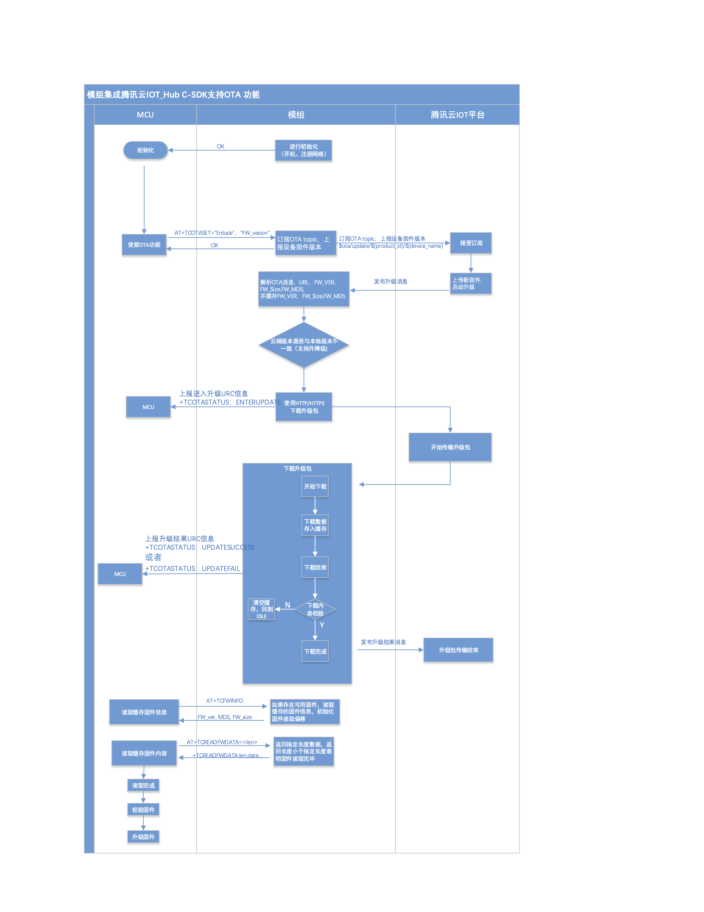

腾讯云 IoT AT 命令集
====================

本文档主要介绍腾讯云 IoT AT 命令、错误码及应用说明，仅针对 ESP8266 设备，下表为本文档的目录。

.. contents::
   :local:
   :depth: 2

说明
----

术语解释
^^^^^^^^

.. list-table::
   :header-rows: 1
   :widths: 10 50

   * - 术语
     - 含义
   * - MQTT
     - 一种基于轻量级代理的 Pub/Sub 模型的消息传输协议
   * - MCU
     - 微控制单元，一般为通讯模组的上位机
   * - Topic
     - 主题，Pub/Sub 模型中消息的通信媒介，Pub/Sub 必须要有主题，只有当订阅了某个主题后，才能收到相应主题数据信息，才能进行通信
   * - Pub
     - 设备端的发布协议，意思是往 Topic 中发布消息
   * - Sub
     - 设备端的订阅协议，意思是从 Topic 中订阅消息
   * - URC
     - 全称 Unsolicited Result Code，非请求结果码，一般为模组给 MCU 的串口返回

更多信息请参考 `腾讯物联网通信词汇表 <https://cloud.tencent.com/document/product/634/31015>`_ 及其它相关文档。

符号说明
^^^^^^^^

1. 本文档所有语法声明中（包括测试命令、读取命令、设置命令），所有形如 ``"xxx"`` 的双引号引注信息，都是确定内容的信息，例：

- 命令

  ::

    AT+TCDEVINFOSET=?

- 响应

  ::

    +TCDEVINFOSET: "TLSMODE (0/1/2)","PRODUCTID","DEVICENAME"[,"DEVICESECRET"]

    OK

  ``"ProductId"``、``"DeviceName"`` 等指确定的字符串 "ProductId"、"DeviceName"

2. 本文档所有语法声明中（包括测试命令、读取命令、设置命令），所有形如 <xxx> 的尖角括号引注信息，都是指变量信息，例：

- 命令

  ::

    AT+TCDEVINFOSET?

- 响应

  ::

    +TCDEVINFOSET: <tlsmode>,<productId>,<devicename>,[,<devicesecret>]

    OK

  ``<productId>``、``<devicename>`` 等参数指实际的产品 ID 和设备名称，如 ``CTQS08Y5LG``、``"Dev01"``

3. 在表示具体的数据时，字符串类型和枚举类型的数据需要由双引号 ``"xx"`` 引注，数值型数据直接以数据表示。例：

- 命令

  ::

    AT+TCCERTADD="cdev_cert.crt",1428

- 响应

  ::

    OK
    >
    +TCCERTADD: OK

  ``1428`` 表示数值型数据，``"cdev_cert.crt"`` 表示字符串型，建议用户参照示例编写程序。

4. 关于空格，只有回码的冒号和信息之间有一个空格，其他都没有空格。

5. 校验和 (BCC) 生成方法，返回十进制校验和：

   ::

      int CalcCheck(BYTE* Bytes, int len){
	    int i, result;
	    for (result = Bytes[0], i = 1; i < len ; i++){
		    result ^= Bytes[i];
	    }
	    return result;
      }
 

ESP-AT 命令说明
^^^^^^^^^^^^^^^^

ESP8266 的 AT 命令集及使用说明请参考乐鑫官方 `ESP-AT 用户指南 <https://docs.espressif.com/projects/esp-at/zh_CN/latest/>`_ 及 `GitHub ESP-AT 项目 <https://github.com/espressif/esp32-at>`_。

对于 ESP-AT 机制，有如下注意事项：

1. 每条 AT 命令总字符长度不可超过 256 字节，否则会报错。

2. 每条 AT 命令都应以 ``/r/n`` 为结束符。

3. 如果AT命令的参数内容包含了特殊字符如双引号 ``"`` 、逗号 ``,`` 等，需要加 ``\`` 进行转义，比如 PUB 消息的 payload 采用的 JSON 数据格式为 ``{"action": "publish_test", "count":"0"}``，则应该转义为 ``{\"action\":\"publish_test\"\,\"count\":\"0\"}`` 再传入，否则会报错。

4. 如果上一个 AT 命令还没处理完成，再发送新的命令会返回如下错误：

   ::

     ERR CODE:0x010b0000

     busy p...

TC 设备信息设置命令
--------------------------

.. _cmd-TCDEVINFOSET:

AT+TCDEVINFOSET：平台设备信息设置
^^^^^^^^^^^^^^^^^^^^^^^^^^^^^^^^^^^^^^^^^^^^^^^^^

功能
""""
设置腾讯云物联网平台创建的产品及设备信息

测试命令
""""""""

**命令：**

::

    AT+TCDEVINFOSET=?

**响应：**

::

    +TCDEVINFO:"TLS_MODE (1)","PRODUCT_ID","DEVICE_NAME","DEVICE_SECRET_BCC","PRODUCT_REGION" 

    OK

读取命令
""""""""

**命令：**

::

    AT+TCDEVINFOSET?

**响应：**

::

    +TCDEVINFOSET:<tls_mode>,<product_id>,<device_name>,<devicesecret_checksum>,<product_region>

    OK

或

::

    +CME ERROR: <err>

**说明：**

- ESP8266 模组仅返回 ``<tls_mode>`` 为 1，且不返回 devicesecret 的字符串内容，只返回 devicesecret 字符串的校验和 (BCC)

设置命令
""""""""

**命令：**

::

    AT+TCDEVINFOSET=<tls_mode>,<product_id>,<device_name>,<device_secret>[,<product_region>]

**响应：**

::

    OK

或

::

    +CME ERROR: <err>

**说明：**

- 如果模组已经连接腾讯云 MQTT 服务器，则返回错误，用户需要先发送断开连接命令 (:ref:`AT+TCMQTTDISCONN <cmd-TCMQTTDISCONN>`) 才能执行该命令
- 如果输入合法，首先返回OK，接下来返回设备信息设置成功与否:
  
  - ``+TCDEVINFOSET:OK``：设置成功
  - ``TCDEVINFOSET:FAIL<err_code>``：设置失败

参数
""""
- **<tls_mode>**：接入方式，必填项，ESP8266 模组仅支持模式 1

  - 0：直连模式
  - 1：TLS 密钥方式 
  - 2：TLS 证书方式，数值类型

- **<product_id>**：产品 id，必填项，字符串类型，最大长度 10 字节
- **<device_name>**：设备名称，必填项，字符串类型，最大长度 48 字节
- **<device_secret>**：设备密钥，必填项，字符串类型，最大长度 44 字节
- **<product_region>**：产品区域，选填项，字符串类型，最大长度 24 字节，如果不提供，默认为中国大陆公有云 "ap-guangzhou"

示例
""""
::

    // 设置成功
    AT+TCDEVINFOSET=1,"CTQS08Y5LG","Dev01","ZHNkIGRzZCA="
    OK
    +TCDEVINFOSET:OK

.. _cmd-TCPRDINFOSET:

AT+TCPRDINFOSET：平台产品信息设置
^^^^^^^^^^^^^^^^^^^^^^^^^^^^^^^^^^^^^^^^^^

功能
""""
设置腾讯云物联网平台创建的产品信息，适用于产品级密钥场景

测试命令
""""""""

**命令：**

::

    AT+TCPRDINFOSET=?

**响应：**

::

    +TCPRDINFOSET:"TLS_MODE(1)","PRODUCT_ID","PRODUCT_SECRET_BCC","DEVICE_NAME","PRODUCT_REGION" 

    OK

读取命令
""""""""

**命令：**

::

    AT+TCPRDINFOSET?

**响应：**

::

    +TCPRDINFOSET:<tls_mode>,<product_ID>,<product_secret_checksum>,<device_name>,<product_region>

    OK

设置命令
""""""""

**命令：**

::

    AT+TCPRDINFOSET=<tls_mode>,<product_ID>,<product_secret>,<device_name>,<product_region>

**响应：**

::

    OK

或

::

    +CME ERROR: <err>

**说明：**

- 如果模组已经连接腾讯云 MQTT 服务器，则返回错误，用户需要先发送断开连接命令 (:ref:`AT+TCMQTTDISCONN <cmd-TCMQTTDISCONN>`) 才能执行该命令
- 如果输入合法，首先返回 ``OK``，接下来返回设备信息设置成功与否

  - ``+TCPRDINFOSET:OK``：设置成功，产品数据会保存到 flash，掉电不丢失
  - ``+TCPRDINFOSET:FAIL,<err_code>``：设置失败

参数
""""
- **<tls_mode>**：接入方式，必填项

  - 0：直连模式，
  - 1：TLS 密钥方式 
  - 2：TLS 证书方式，数值类型

- **<product_ID>**：产品 ID，必填项，字符串类型，最大长度 10
- **<product_secret>**：产品密钥，必填项，字符串类型，最大长度 32
- **<device_name>**：设备名称，必填项，字符串类型，最大长度 48
- **<product_region>**：产品区域，选填项，字符串类型，最大长度 24 字节，如果不提供，默认为中国大陆公有云 "ap-guangzhou"

示例
""""
::

    AT+TCPRDINFOSET=1,"CTQS08Y5LG","ZHNkIGRzZCA=","Dev01"

    OK
    +TCPRDINFOSET:OK

.. _cmd-TCDEVREG:

AT+TCDEVREG：执行设备动态注册
^^^^^^^^^^^^^^^^^^^^^^^^^^^^^^^^^^^^

功能
""""
采用产品级密钥场景下，执行设备动态注册并获取设备信息

测试命令
""""""""

**命令：**

::

    AT+TCDEVREG=?

**响应：**

::

    OK

执行命令
""""""""

**命令：**

::

    AT+TCDEVREG

**响应：**

::

    OK

或

::

    +CME ERROR: <err>

说明
""""
使用产品级密钥场景下执行动态注册的逻辑说明：

1. 如果模组上面没有完整的设备信息，即设备未注册未激活，则正常注册，返回成功/失败。
2. 模组上已存在一个设备 A，且是已注册未激活状态，如果用户使用 :ref:`AT+TCPRDINFOSET <cmd-TCPRDINFOSET>` 提供的设备信息也是 A，则正常注册，云端会重新分配 PSK 或证书，返回成功/失败。
3. 模组上已存在一个设备 A，且是已注册已激活状态，如果用户使用 :ref:`AT+TCPRDINFOSET <cmd-TCPRDINFOSET>` 提供的设备信息也是 A，则会注册失败，AT 命令返回错误，用户需要更换设备信息或在云端将设备重置。
4. 模组已存在一个设备 A 的信息，如果用户使用 :ref:`AT+TCPRDINFOSET <cmd-TCPRDINFOSET>` 提供了一个新的设备 B 的信息，则会使用新的设备 B 的信息去注册，注册成功则覆盖原来设备 A 的信息，注册失败则原有的设备 A 信息不变。
5. 正常情况下，设备动态注册仅需执行一次，执行成功后，设备密钥信息已经保存在模组 flash 中，后续上电初始化时可通过命令 :ref:`AT+TCDEVINFOSET? <cmd-TCDEVINFOSET>`? 查询是否存在正确的设备信息并正常连接腾讯云 MQTT 服务。

示例
""""
::

    AT+TCDEVREG

    OK
    +TCDEVREG:OK

.. _cmd-TCMODULE:

AT+TCMODULE：模组信息读取
^^^^^^^^^^^^^^^^^^^^^^^^^^^^^^^^

功能
""""
获取模组相关的硬件及软件信息

执行命令
""""""""

**命令：**

::

    AT+TCMODULE

**响应：**

::

    Module HW name: 模组硬件信息
    Module FW version: 模组固件信息
    Module Mac addr: ESP8266 Wi-Fi 模组 mac 地址
    Module FW compiled time: 模组固件编译生成时间
    Module Flash size: 模组 flash 大小
    OK

示例
""""
::

    AT+TCMODULE
    Module HW name: ESP-WROOM-02D
    Module FW version: QCloud_AT_ESP8266_v2.0.0
    Module Mac addr: 3c:71:bf:33:b0:2e
    Module FW compiled time: Jun 17 2020 16:25:27
    Module Flash size: 2MB
    OK

.. _cmd-TCRESTORE:

AT+TCRESTORE：清除模组设备信息
^^^^^^^^^^^^^^^^^^^^^^^^^^^^^^^^^^^^

功能
""""

清除模组 flash 上保存的腾讯云设备信息

测试命令
""""""""

**命令：**

::

    AT+TCRESTORE=?

**响应：**

::

    OK

执行命令
""""""""

**命令：**

::

    AT+TCRESTORE

**响应：**

::

    OK

或

::

    +CME ERROR: <err>

**说明：**

- 如果模组已经连接腾讯云 MQTT 服务器，则返回错误，用户需要先发送断开连接命令 (:ref:`AT+TCMQTTDISCONN <cmd-TCMQTTDISCONN>`) 才能执行该命令。
- 如果状态允许，则返回 OK，然后清除模组上面存储的腾讯云相关设备及产品信息，以及缓存的 OTA 固件信息，并重启模组。
- 该命令不会清除模组信息（即通过 :ref:`AT+TCMODULE <cmd-TCMODULE>` 可以读取的信息）以及 ESP8266 的 NVS 数据包括 Wi-Fi 配置，如果需要清除 Wi-Fi 配置信息需要执行 AT+RESTORE。

示例
""""
::

    AT+TCRESTORE

    OK

TC MQTT 命令
---------------

.. _cmd-TCMQTTCONN:

AT+TCMQTTCONN：配置 MQTT 连接参数
^^^^^^^^^^^^^^^^^^^^^^^^^^^^^^^^^^^^^

功能
""""

配置 MQTT 连接参数，包括客户端和服务器的心跳间隔、会话控制、并连接腾讯云端服务器

测试命令
""""""""

**命令：**

::

    AT+TCMQTTCONN=?

**响应：**

::

    +TCMQTTCONN:<TLSMODE_SELECTED>,<CMDTIMEOUT_VALUE>,<KEEPALIVE>(max 690s),<CLEAN_SESSION>(0/1),<RECONNECT>(0/1)

    OK

读取命令
""""""""

**命令：**

::

    AT+TCMQTTCONN?

**响应：**

::

    +TCMQTTCONN:<tlsmode>,<cmdtimeout>,<keepalive>,<clean_session>,<reconnect>

    OK

**说明：**

- KEEPALIVE 的默认值为 240，CLEAN_SESSION 的默认值为 1

设置命令
""""""""

**命令：**

::

    AT+TCMQTTCONN=<tlsmode>,<cmdtimeout>,<keepalive>,<clean_session>,<reconnect>

**响应：**

::

    OK

或

::

    +CME ERR: <err>

参数
""""
- **<tlsmode>**：接入方式，必填项，ESP8266 模组仅支持  ``<tlsmode>`` 为 1 的模式
  
  - 0：直连模式
  - 1：TLS密钥方式 
  - 2：TLS证书方式，整型
 

- **<cmdtimeout>**：命令超时时间，必填项，整型，MQTT 连接、发布、订阅的超时时间，单位毫秒，建议设置为 5000，可以根据网络环境调整该值。范围为 1000 ~ 10000 毫秒
- **<keepalive>**：心跳间隔，必填项，整型，范围 60 ~ 690 秒，默认值为 240
- **<clean_session>**：是否清除会话，必填项，整型
  
  - 0：不清除
  - 1：清除（默认）

- **<reconnect>**：MQTT 断连后是否重连，必填项，整型

  - 0：不自动重连
  - 1：自动重连

- 该命令前置依赖 :ref:`AT+TCDEVINFOSET <cmd-TCDEVINFOSET>` 命令

示例
""""
::

    AT+TCMQTTCONN=1,5000,240,1,1

    OK
    +TCMQTTCONN:OK 

.. _cmd-TCMQTTDISCONN:

AT+TCMQTTDISCONN：断开 MQTT 连接
^^^^^^^^^^^^^^^^^^^^^^^^^^^^^^^^^^^^^^^

功能
""""

断开与腾讯云的 MQTT 连接

测试命令
""""""""

**命令：**

::

    AT+TCMQTTDISCONN=?

**响应：**

::

    OK

执行命令
""""""""

**命令：**

::

    AT+TCMQTTDISCONN

**响应：**

::

    OK

或

::

    +CME ERROR: <err>

**说明：**

- 如果模组处于 OTA 状态中，执行该命令会先取消 OTA 后台任务再断开 MQTT 连接
- 未连接状态下返回 ``+CME ERROR: <err>``

示例
""""
::

    AT+TCMQTTDISCONN

    OK

.. _cmd-TCMQTTPUB:

AT+TCMQTTPUB：向某个 Topic 发布消息
^^^^^^^^^^^^^^^^^^^^^^^^^^^^^^^^^^^^^^^

功能
""""

向某个 Topic 发布消息

测试命令
""""""""

**命令：**

::

    AT+TCMQTTPUB=?

**响应：**

::

    +TCMQTTPUB: "TOPIC_NAME(maxlen 128)", "QOS(0/1)","PAYLOAD" 

    OK

设置命令
""""""""

**命令：**

::

    AT+TCMQTTPUB=<topic>,<qos>,<message>

**响应：**

::

    OK

或

::

    +CME ERR: <err>

**说明：**

- 如果模组尚未连接腾讯云 MQTT 服务器，则返回错误，用户需要先发送连接命令 (:ref:`AT+TCMQTTCONN <cmd-TCMQTTCONN>`) 才能发布消息。
- 如果模组处于 OTA 下载状态中，由于 ESP8266 平台资源限制，执行该命令可能会出现超时错误。如非必要，不建议在 OTA 下载过程中执行该命令。
- 如果输入合法，首先返回 OK，接下来返回消息发布成功与否。如果是 QoS1 消息，会等到收到 PUBACK 或超时失败再返回。

  - ``+TCMQTTPUB: OK``：发布成功
  - ``+TCMQTTPUB: FAIL,<err_code>``：发布失败

参数
""""
- **<topic>**：发布消息的 Topic name，字符串最大长度 128
- **<qos>**：QoS 值，暂只支持 0 和 1
- **<message>**：发布的消息体的内容

说明
""""
- 注意每条 AT 命令总字符长度不可超过 256 字节，否则会报错，关于消息体内容格式及长度请参考 `ESP-AT 命令说明`_ 章节。

示例
""""
::

    // 消息发布成功
    AT+TCMQTTPUB="iot-ee54phlu/device1/get",1,"hello world"

    OK
    +TCMQTTPUB: OK

.. _cmd-TCMQTTPUBL:

AT+TCMQTTPUBL：向某个 Topic 发布长消息
^^^^^^^^^^^^^^^^^^^^^^^^^^^^^^^^^^^^^^^

功能
""""

向某 Topic 发布长消息，用于 :ref:`AT+TCMQTTPUB <cmd-TCMQTTPUB>` 消息体长度较大场景

测试命令
""""""""

**命令：**

::

    AT+TCMQTTPUBL=?

**响应：**

::

    +TCMQTTPUBL: "TOPIC_NAME(maxlen 128)", "QOS(0/1)","LEN(1-2048)" 

    OK

设置命令
""""""""

**命令：**

::

    AT+TCMQTTPUBL=<topic>,<qos>,<msg_length>

**响应：**

::

    OK
    >

或

::

    +CME ERR:<err>

**说明：**

- 如果模组尚未连接腾讯云 MQTT 服务器，则返回错误，用户需要先发送连接命令 (:ref:`AT+TCMQTTCONN <cmd-TCMQTTCONN>`) 才能发布消息。
- 如果模组处于 OTA 下载状态中，由于内存资源限制，不支持该发布消息命令，会返回错误。
- 如果输入合法，首先返回 ``OK``，接下来返回 ``>``，进入接收消息 payload 状态，读到 <msg_length>长度的数据后，结束接收并返回发送 MQTT 消息结果：

  - ``+TCMQTTPUBL:OK``：发布成功
  - ``+TCMQTTPUBL:FAIL,<err_code>``：发布失败

- 进入接收消息 payload 状态后，有 20 秒钟左右的超时时间，如果超时后收到的数据长度小于 ``<msg_length>``，或者收到 ``+++\r\n``，则退出接收消息 payload 状态，返回错误 ``+CME ERR:<err>``，并且不会发送该 MQTT 消息。
- 消息 payload 不会回显。

参数
""""
- **<topic>**：发布消息的 Topic name，最大字符串长度 128
- **<qos>**：QoS 值，暂只支持 0 和 1
- **<msg_length>**：发布的消息体的长度，最大长度 2048。该长度不包括结尾的 ``/r/n``，关于消息体内容格式请参考本文档 `ESP-AT 命令说明`_ 章节

示例
""""
::

    // 消息发布成功
    AT+TCMQTTPUBL="iot-ee54phlu/device1/get",1,11
    >

    Hello,world
    OK

    +TCMQTTPUBL: OK

.. _cmd-TCMQTTPUBRAW:

AT+TCMQTTPUBRAW：向某个 Topic 发布二进制数据消息
^^^^^^^^^^^^^^^^^^^^^^^^^^^^^^^^^^^^^^^^^^^^^^^^^^^^^^^^^

功能
""""

向某 Topic 发布二进制数据消息，可以发布自定义的任意数据而非文本或者 JSON 数据，模组透传不做任何转义处理。

测试命令
""""""""

**命令：**

::

    AT+TCMQTTPUBRAW=?

**响应：**

::

    +TCMQTTPUBRAW: "TOPIC_NAME(maxlen128)", "QOS(0/1)","LEN(1-2048)" 

    OK

设置命令
""""""""

**命令：**

::

    AT+TCMQTTPUBRAW=<topic>,<qos>,<msg_length>

**响应：**

::

    OK
    >

或

::

    +CME ERR:<err>

**说明：**

- 如果模组尚未连接腾讯云 MQTT 服务器，则返回错误，用户需要先发送连接命令 (:ref:`AT+TCMQTTCONN <cmd-TCMQTTCONN>`) 才能发布消息。
- 如果模组处于 OTA 下载状态中，由于内存资源限制，不支持该发布消息命令，会返回错误。
- 如果输入合法，首先返回 ``OK``，接下来返回 ``>``，进入接收消息 ``payload`` 状态，读到 ``<msg_length>`` 长度的数据后，结束接收并返回发送 MQTT 消息结果：

  - ``+TCMQTTPUBRAW:OK``：发布成功
  - ``+TCMQTTPUBRAW:FAIL,<err_code>``：发布失败

- 进入接收消息 payload 状态后，有 20 秒钟左右的超时时间，如果超时后收到的数据长度小于 ``<msg_length>``，或者收到 ``+++\r\n``，则退出接收消息 payload 状态，返回错误 ``+CME ERR:<err>``，并且不会发送该 MQTT 消息。
- 消息 payload 不会回显。

参数
""""
- **<topic>**：发布消息的 Topic name，最大字符串长度 128
- **<qos>**：QoS 值，暂只支持 0 和 1
- **<msg_length>**：发布的消息体的长度，最大长度 2048，该长度不包括结尾的 ``/r/n``

示例
""""
::

    // 消息发布成功
    AT+TCMQTTPUBRAW="$thing/up/raw/iot-ee54phlu/device1",1,10
    >

     0x0102030405060708090A
     OK

     +TCMQTTPUBRAW: OK

.. _cmd-TCMQTTSUB:

AT+TCMQTTSUB：订阅 MQTT 某个 Topic
^^^^^^^^^^^^^^^^^^^^^^^^^^^^^^^^^^^^^^^

功能
""""

订阅 MQTT 某个 Topic，Wi-Fi 模组最多支持订阅 10 个 Topic

测试命令
""""""""

**命令：**

::

    AT+TCMQTTSUB=? 

**响应：**

::

    +TCMQTTSUB:"TOPIC_NAME(maxlen 128)","QOS(0/1)"

    OK

读取命令
""""""""

**命令：**

::

    AT+TCMQTTSUB?

**响应：**

::

    OK

或

::

    +TCMQTTSUB: <topic>,<qos>
    :
    :list of sub topic
    +TCMQTTSUB: <topic_n>,<qos>

    OK

**说明：**

- 如果有已经订阅的消息，返回已订阅的 Topic 列表

设置命令
""""""""

**命令：**

::

    AT+TCMQTTSUB=<topic>,<qos>

**响应：**

::

    OK

或

::

    +CME ERROR:<err>

**说明：**

- 如果模组尚未连接腾讯云 MQTT 服务器，则返回错误，用户需要先发送连接命令 (:ref:`AT+TCMQTTCONN <cmd-TCMQTTCONN>`) 才能订阅消息。
- 如果模组处于 OTA 下载状态中，不支持该命令，会返回错误。
- 如果模组尚未连接腾讯云 MQTT 服务器，则返回错误，用户需要先发送连接命令 (:ref:`AT+TCMQTTCONN <cmd-TCMQTTCONN>`) 才能订阅消息。
- 如果模组处于 OTA 下载状态中，不支持该命令，会返回错误。
- 如果输入合法，首先返回 ``OK``，然后返回订阅成功与否，该命令会等到收到 SUBACK 或超时失败再返回。
  
  - ``+TCMQTTSUB:OK``：订阅成功
  - ``+TCMQTTSUB:FAIL,<err_code>``：订阅失败

参数
""""
- **<topic>**：订阅的 Topic name，最大长度 128
- **<qos>**：QoS 值，暂只支持 0 和 1

示例
""""
::

    AT+TCMQTTSUB="iot-ee54phlu/device1/control",0

    OK
    +TCMQTTSUB: OK

.. _cmd-TCMQTTUNSUB:

AT+TCMQTTUNSUB：取消已经订阅的 Topic
^^^^^^^^^^^^^^^^^^^^^^^^^^^^^^^^^^^^^^^^^^^^^^

功能
""""

取消已订阅的 Topic

测试命令
""""""""

**命令：**

::

    AT+TCMQTTUNSUB=?

**响应：**

::

    +TCMQTTUNSUB: "TOPIC_NAME"

    OK

读取命令
""""""""

**命令：**

::

    AT+TCMQTTUNSUB?

**响应：**

::

    OK

设置命令
""""""""

**命令：**

::

    AT+TCMQTTUNSUB=<topic>

**响应：**

::

    OK

或

::

    +CME ERROR:<err>

**说明：**

- 如果模组尚未连接腾讯云 MQTT 服务器，则返回错误，用户需要先发送连接命令 (:ref:`AT+TCMQTTCONN <cmd-TCMQTTCONN>`) 才能订阅消息。
- 如果模组处于 OTA 下载状态中，不支持该命令，会返回错误。
- 如果输入合法，首先返回 ``OK``，然后返回取消订阅成功与否：

  - ``+TCMQTTUNSUB:OK``：取消订阅成功；
  - ``+TCMQTTUNSUB:FAIL,<err_code>``：取消订阅失败。

参数
""""
- **<topic>**：取消订阅的 Topic

.. _cmd-TCMQTTSTATE:

AT+TCMQTTSTATE：查询 MQTT 连接状态
^^^^^^^^^^^^^^^^^^^^^^^^^^^^^^^^^^^^^^^^^^^^

功能
""""

查询 MQTT 连接状态

测试命令
""""""""

**命令：**

::

    AT+TCMQTTSTATE=?

**响应：**

::

    OK

读取命令
""""""""

**命令：**

::

    AT+TCMQTTSTATE？

**响应：**

::

    +TCMQTTSTATE: <state>

    OK

参数
""""
- **<state>**：MQTT 连接状态

  - 0：MQTT 已断开
  - 1：MQTT 已连接

示例
""""
::

    AT+TCMQTTSTATE?

    +TCMQTTSTATE: 1
    OK

TC OTA 命令
-----------------

.. _cmd-TCOTASET:

AT+TCOTASET：OTA 功能使能控制及版本设置
^^^^^^^^^^^^^^^^^^^^^^^^^^^^^^^^^^^^^^^^^^^^^^^^^

功能
""""

OTA 功能使能控制及版本设置

测试命令
""""""""

**命令：**

::

    AT+TCOTASET=?

**响应：**

::

    +TCOTASET: 1(ENABLE)/0(DISABLE),"FW_version"

    OK

读取命令
""""""""

**命令：**

::

    AT+TCOTASET?

**响应：**

::

    OK
    +TCOTASET: <ctlstate>,<fw_ver>

或

::

    +CME ERROR:<err>

设置命令
""""""""

**命令：**

::

    AT+TCOTASET=<ctlstate>,<fw_ver>

**响应：**

::

    OK

或

::

    +CME ERROR:<err>

**说明：**

- 如果输入合法，模组会先返回 ``OK``，然后订阅 OTA 的 Topic（用户无须手动订阅 Topic) ，启动 OTA 后台任务，并上报本地版本，返回执行结果。如果后台任务已经启动并且不处于下载状态，则执行该命令会再次上报本地固件版本。如果已经在 OTA 下载状态中，执行该命令则会返回错误。
- 该命令执行成功之后，模组会处于监听升级命令状态，这个时候如果用户通过控制台下发升级固件的命令，模组解析命令成功之后会进入 OTA 下载状态并上报 ``+TCOTASTATUS:ENTERUPDATE`` 的 URC 给 MCU。进入 OTA 下载状态之后，会禁用部分 AT 命令，直到固件下载结束。
- 当固件下载结束，成功会上报 ``+TCOTASTATUS:UPDATESUCCESS``，失败会上报 ``+TCOTASTATUS:UPDATEFAIL``，并退出后台任务。这个时候需要再次执行该命令，才会重新启动后台下载任务。
- 固件下载支持断点续传，异常失败重新启动后，已下载部分无需重新下载。
- 通过该命令启动固件升级任务，会支持 MCU 测固件下载以及模组自身的固件升级。对于模组自身的固件升级，在固件下载成功之后会上报 ``+TCOTASTATUS:UPDATERESET``，并在 2 秒后自动重启进入新固件。

  - ``+TCOTASET:OK``: OTA 功能设置 OK
  - ``+TCOTASET:FAIL,<err_code>``：OTA 功能设置失败

参数
""""
- **<ctlstate>**：OTA 使能控制，布尔型，0 关闭，1 使能。enable 上报本地版本并启动后台下载任务；disable 则取消后台下载任务
- **<fw_ver>**：系统当前固件版本信息，字符型，版本格式：V.R.C，譬如 1.0.0. 长度 1 ~ 32 字节

示例
""""
::

    AT+TCOTASET=1,"1.0.1"
    OK
    +TCOTASET:OK

.. _cmd-TCFWINFO:

AT+TCFWINFO：读取模组缓存的固件信息
^^^^^^^^^^^^^^^^^^^^^^^^^^^^^^^^^^^^^^^^^^^^

功能
""""

读取模组缓存的固件信息

测试命令
""""""""

**命令：**

::

    AT+TCFWINFO=?

**响应：**

::

    +TCFWINFO: "FW_VERSION","FW_SIZE","FW_MD5","FW_MAX_SIZE_OF_MODULE"

    OK

**说明：**

- ``FW_MAX_SIZE_OF_MODULE`` 是用户待升级的 OTA 固件的最大字节数，模组根据自身资源情况返回，最小必须是 128 KB

读取命令
""""""""

**命令：**

::

    AT+TCFWINFO?

**响应：**

::

    OK
    +TCFWINFO:<fw_verion>,<fw_size>,<fw_md5>,<module_buffer_size>

或

::

    +CME ERROR:<err>

**说明：**

- 每执行一次固件信息读取，已读取的固件数据偏移位置初始化为 0
- 如果已经在 OTA 下载状态中，则返回错误

示例
""""
::

    AT+TCFWINFO？

    OK
    +TCFWINFO:"2.0.0",516360,"93412d9ab8f3039caed9667a1d151e86"

.. _cmd-TCREADFWDATA:

AT+TCREADFWDATA：读取模组缓存的固件数据
^^^^^^^^^^^^^^^^^^^^^^^^^^^^^^^^^^^^^^^^^^^^^^^^^^^^^^

功能
""""

读取模组缓存的固件数据

测试命令
""""""""

**命令：**

::

    AT+TCREADFWDATA=?

**响应：**

::

    +TCREADFWDATA: "LEN_FOR_READ" 
    OK

设置命令
""""""""

**命令：**

::

    AT+TCREADFWDATA=<len>

**响应：**

::

    +CME ERROR:<err>

或

::

    +TCREADFWDATA:len,hexdata…

**说明：**

- 每读一次，模组实现偏移累加，用户需要根据固件大小判断是否读取完毕。如果 AT 返回成功，但返回的长度小于要读取的长度，则表示固件已经读取到尽头。用户再次读取会返回错误，需要发起 :ref:`AT+TCFWINFO <cmd-TCFWINFO>` 命令将偏移量清零，才可以重新开始读取固件。
- 如果正在 OTA 下载状态中，则返回错误。

参数
""""
- **<len>**：读取的固件长度，整型

示例
""""
::

    AT+TCREADFWDATA=512
    OK
    +TCREADFWDATA:512,01020AF5…..

模组配合腾讯云 IoT 平台进行 OTA 功能流程框图
^^^^^^^^^^^^^^^^^^^^^^^^^^^^^^^^^^^^^^^^^^^^^^^^^^^^^^

   模组配合腾讯云 IoT 平台进行 OTA 功能流程框图

URC 模组主动上报 MCU 消息
----------------------------------

+TCMQTTRCVPUB（收到订阅的 Topic 时上报的消息）
^^^^^^^^^^^^^^^^^^^^^^^^^^^^^^^^^^^^^^^^^^^^^^^^^^^^^^^^^^

功能
""""

收到订阅的 Topic 的消息时上报给 MCU 的信息

消息格式
""""""""

::

    +TCMQTTRCVPUB: <topic>,<message_len>,<message>

参数
""""
- **<topic>**：收到消息的 Topic
- **<message_len>**：数值型，收到消息体的长度（不含 ``""``）
- **<message>**：收到消息体的内容

说明
""""

- 模组不区分下行数据是二进制数据还是字符串数据，所以 message 内容统一加 ``""``，如果订阅的 Topic 下行的数据是二进制（Topic 下行的数据是字符串还是二进制，开发者自己需要清楚），需要注意去掉首部和尾部的 ``"``。譬如下示例，Topic $thing/down/raw/CTQS08Y5LG/Dev01 下行二进制数据 1234 为 0x1234，两个字节，是非可见字符，串口工具看到是乱码。

示例
""""
::

    +TCMQTTRCVPUB:"CTQS08Y5LG/Dev01/get",11,"hello world"

+TCMQTTDISCON（MQTT 断开时上报的信息）
^^^^^^^^^^^^^^^^^^^^^^^^^^^^^^^^^^^^^^^^^^^^^^^^^^^^^^^^^^

功能
""""

MQTT 连接与服务器断开时上报的 URC 及断开的错误码

说明
""""

- Code 错误码详情可以查询 `服务端相关 err code`_

示例
""""
::

    +TCMQTTDISCON,<err_code>

+TCMQTTRECONNECTING（MQTT 正在重连时上报的信息）
^^^^^^^^^^^^^^^^^^^^^^^^^^^^^^^^^^^^^^^^^^^^^^^^^^^^^^^^^^

功能
""""

MQTT 连接与服务器断开并正在进行自动重连时候上报的 URC 

示例
""""
::

    +TCMQTTRECONNECTING

+TCMQTTRECONNECTED（MQTT 重连成功时上报的信息）
^^^^^^^^^^^^^^^^^^^^^^^^^^^^^^^^^^^^^^^^^^^^^^^^^^^^^^^^^^

功能
""""

MQTT 连接与服务器断开后自动重连成功时上报的 URC

示例
""""""""

::

    +TCMQTTRECONNECTED 

+TCOTASTATUS（上报 OTA 状态）
^^^^^^^^^^^^^^^^^^^^^^^^^^^^^^^^^^^^^^^^^^^^^^^^^^^^^^^^^^

功能
""""

OTA 状态发生变化时上报的 URC

消息格式
""""""""

::

    +TCOTASTATUS: <state> 

参数
""""

- **<state>**：OTA 状态

  - ENTERUPDATE：模组进入 OTA 固件下载状态
  - UPDATESUCCESS：固件下载成功（包括固件校验和缓存成功）
  - UPDATEFAIL,<err_code>：固件下载失败
  - UPDATERESET: 模组自身固件升级成功，在 2 秒后会自动重启

示例
""""
::

    +TCOTASTATUS: UPDATESUCCESS

Wi-Fi 配网及 AT 辅助命令
----------------------------

.. _cmd-TCSTARTSMART:

AT+TCSTARTSMART：以 SmartConfig 方式进行 Wi-Fi 配网及设备绑定
^^^^^^^^^^^^^^^^^^^^^^^^^^^^^^^^^^^^^^^^^^^^^^^^^^^^^^^^^^^^^^^^^^^^

功能
""""

以 SmartConfig 方式进行 Wi-Fi 配网及腾讯云设备绑定，需要与腾讯连连小程序配合完成。目前仅支持乐鑫 ESP-TOUCH 方式。具体配网协议请参考腾讯云物联网开发平台官网文档。

测试命令
""""""""

**命令：**

::

    AT+TCSTARTSMART=?

**响应：**

::

    AT+TCSTARTSMART: CMD FOR START SMARTCONFIG
    OK

执行命令
""""""""

**命令：**

::

    AT+TCSTARTSMART

**响应：**

首先返回

::

    OK

或

::

    +CME ERROR: <err>

然后启动配网及绑定后台任务，并返回

::

    +TCSTARTSMART:OK     // 进入配网状态成功

或

::

    +TCSTARTSMART:FAIL,<err_code>    // 进入配网状态失败

在配网及绑定操作成功之后返回

::

    +TCSTARTSMART:WIFI_CONNECT_SUCCESS

或

::

    +TCSTARTSMART:WIFI_CONNECT_FAILED, <err_code,sub_code>

**说明：**

- 如果模组处于 MQTT 已连接状态中，则不支持该设置命令，会返回错误。需要先断开 MQTT 连接。
- 该命令执行成功后，蓝色 Wi-Fi 指示灯会进入 500 ms 为周期的闪烁状态，这个时候执行腾讯连连小程序上面的添加设备操作并按照指示进行。
- 如果在 5 分钟内没有执行操作，模组自动退出配网状态，并返回超时错误：``+TCSTARTSMART:FAIL,202``。

示例
""""
::

    AT+TCSTARTSMART

    OK
    +TCSTARTSMART:WIFI_CONNECT_SUCCESS

.. _cmd-TCSTOPSMART:

AT+TCSTOPSMART：退出 SmartConfig 方式 Wi-Fi 配网状态
^^^^^^^^^^^^^^^^^^^^^^^^^^^^^^^^^^^^^^^^^^^^^^^^^^^^^^^^^^^

功能
""""

退出 SmartConfig 方式配网状态

测试命令
""""""""

**命令：**

::

    AT+TCSTOPSMART=?

**响应：**

::

    AT+TCSTOPSMART: CMD TO STOP SMARTCONFIG
    OK

执行命令
""""""""

**命令：**

::

    AT+TCSTOPSMART

**响应：**

::

    OK

或

::

    +CME ERROR: <err>

**说明：**

- 如果模组处于 MQTT 已连接状态中，则不支持该设置命令，会返回错误。需要先断开 MQTT 连接。

示例
""""
::

    AT+TCSTOPSMART

    OK

.. _cmd-TCSAP:

AT+TCSAP：以 softAP 方式进行 Wi-Fi 配网及设备绑定
^^^^^^^^^^^^^^^^^^^^^^^^^^^^^^^^^^^^^^^^^^^^^^^^^^^^^^

功能
""""

以 softAP 方式进行 Wi-Fi 配网及腾讯云设备绑定，需要与腾讯连连小程序配合完成。具体配网协议请参考腾讯云物联网开发平台官网文档。

测试命令
""""""""

**命令：**

::

    AT+TCSAP=?

**响应：**

::

    +TCSAP=<ssid>[,<pwd>,<ch>] 

    OK

读取命令
""""""""

**命令：**

::

    AT+TCSAP?

**响应：**

::

    OK

设置命令
""""""""

**命令：**

::

    AT+TCSAP=<ssid>[,<pwd>,<ch>]

**响应：**

首先返回

::

    OK

或

::

    +CME ERROR: <err>

然后启动配网及绑定后台任务，并返回

::

    +TCSAP:OK    // 进入配网状态成功

或

::

    +TCSAP:FAIL<err_code>    // 进入配网状态失败

在配网及绑定操作成功之后返回

::

    +TCSAP:WIFI_CONNECT_SUCCESS

否则返回

::

    +TCSAP:WIFI_CONNECT_FAILED,<err_code,sub_code>

**说明：**

- 如果模组处于 MQTT 已连接状态中，则不支持该设置命令，会返回错误。需要先断开 MQTT 连接。
- 该命令执行成功后，蓝色 Wi-Fi 指示灯会进入 200 ms 为周期的闪烁状态，这个时候执行腾讯连连小程序上面的添加设备操作并按照指示进行。
- 如果在 5 分钟内没有执行操作，模组自动退出配网状态，并返回超时错误：``+TCSAP:FAIL,202``。

参数
""""
- **<ssid>**：热点 ssid，设备作为 softAP 时 ssid，最大长度 32 字节
- **<pwd>**：热点密码，设备作为 softAP 时 psw，最大长度 32 字节，可选参数
- **<ch>**：热点信道，设备作为 softAP 时的信道，可选参数

说明
""""

- 下发此命令后，可以搜索到所配置的 ssid 的热点，手机可以按配置的密码选择连接此热点，模组同时会起一个 UDP server，serverip:192.168.4.1。
- APP 和模组的配网可进行交互数据流。
- 如果只提供 ssid，则会启动无加密的 Wi-Fi 热点。

示例
""""
::

    AT+TCSAP="Test-SoftAP","12345678"

    OK
    +TCSAP:WIFI_CONNECT_SUCCESS

.. _cmd-TCSTOPSAP:

AT+TCSTOPSAP：退出 softAP 方式 Wi-Fi 配网状态
^^^^^^^^^^^^^^^^^^^^^^^^^^^^^^^^^^^^^^^^^^^^^^^^^^^^^^

功能
""""

退出 softAP 方式配网状态

测试命令
""""""""

**命令：**

::

    AT+TCSTOPSAP=?

**响应：**

::

    AT+TCSTOPSAP: CMD TO STOP SOFTAP
    OK

执行命令
""""""""

**命令：**

::

    AT+TCSTOPSAP

**响应：**

::

    OK

或

::

    +CME ERROR: <err>

**说明：**

- 如果模组处于 MQTT 已连接状态中，则不支持该设置命令，会返回错误。需要先断开 MQTT 连接。

示例
""""
::

    AT+TCSTOPSAP

    OK

.. _cmd-TCMODINFOSET:

AT+TCMODINFOSET：ESP 模组信息设置
^^^^^^^^^^^^^^^^^^^^^^^^^^^^^^^^^^^^^^^^^^^^^^^^^^^^^^

功能
""""

设置 ESP8266 模组相关的信息，如模组名称，flash 大小等

测试命令
""""""""

**命令：**

::

    AT+TCMODINFOSET?

**响应：**

::

    +TCMODINFOSET:"MODULE NAME","FLASH_SIZE (2/4)","WIFI LED GPIO","FW BASE ADDR","FW MAX SIZE","FIXED CONNID" 

    OK

读取命令
""""""""

**命令：**

::

    AT+TCMODINFOSET?

**响应：**

::

    +TCMODINFOSET:<module_name>,<flash_size>,<WiFi_LED_GPIO>,<fw_base_addr>,<fw_max_size>,<fixed_conn_id>

    OK

设置命令
""""""""

**命令：**

::

    AT+TCMODINFOSET=<module_name>,<flash_size>,<WiFi_LED_GPIO>,<fw_base_addr>,<fw_max_size>,<fixed_conn_id>

**响应：**

::

    OK

或

::

    +CME ERROR: <err>

**说明：**

- 如果模组已经连接腾讯云 MQTT 服务器，则返回错误，用户需要先发送断开连接命令 (:ref:`AT+TCMQTTDISCONN <cmd-TCMQTTDISCONN>`) 才能执行该命令。
- 如果输入合法，首先返回 ``OK``，接下来返回设备信息设置成功与否

  - ``+TCMODINFOSET:OK``：设置成功，模组数据会保存到 flash，掉电不丢失
  - ``+TCMODINFOSET:FAIL,<err_code>``：设置失败

参数
""""

- **<module_name>**：模组名称，字符串类型，最大长度 30
- **<flash_size>**：模组 flash 大小（单位 MB），2 或者 4，数值类型
- **<WiFi_LED_GPIO>**：模组使用哪个 GPIO 口来控制 Wi-Fi 状态灯，数值类型，有效范围为 ESP8266 GPIO (0-16) 
- **<fw_base_addr>**：模组提供给上位机 OTA 升级的固件数据保存地址，数值类型，该值需为 0x1000 的整数倍并且不小于 0x111000
- **<fw_max_size>**：模组提供给上位机 OTA 升级的固件最大空间，数值类型，该值不大于 716800 (700 KB) 
- **<fixed_conn_id>**：保留选项，默认为 1

说明
""""

- ESP Wi-Fi 模组固件和模组信息存储于不同 flash 分区，模组固件在启动时候会读取模组信息并做相应配置，这样可以使得同一版本模组固件可以适配不同的模组硬件

示例
""""
::

    // 设置成功
    AT+TCMODINFOSET="ESP-WROOM-02D",2,0,1118208,716800,1

    OK
    +TCMODINFOSET:OK

.. _cmd-TCMQTTSRV:

AT+TCMQTTSRV：设置腾讯云 MQTT 服务器地址
^^^^^^^^^^^^^^^^^^^^^^^^^^^^^^^^^^^^^^^^^^^^^^^^^^^^^^

功能
""""

设置腾讯云 MQTT 服务器 host 地址，适用于私有化部署或者边缘计算场景

测试命令
""""""""

**命令：**

::

    AT+TCMQTTSRV=?

**响应：**

::

    +TCMQTTSRV: "MQTT SERVER IP"

    OK

读取命令
""""""""

**命令：**

::

    AT+TCMQTTSRV?

**响应：**

::

    +TCMQTTSRV:192.168.10.118
    OK

设置命令
""""""""

**命令：**

::

    AT+TCMQTTSRV=<Host addr>

**响应：**

::

    OK

或

::

    +CME ERROR:<err>

**说明：**

- 如果输入合法，首先返回 ``OK``，然后返回设置成功与否

  - ``+TCMQTTSRV:OK``：设置 IP 成功
  - ``+TCMQTTSRV:FAIL``：设置 IP 失败

- 如果模组处于 MQTT 已连接状态中，则不支持该设置命令，会返回错误。需要先断开 MQTT 连接。

参数
""""
- **<Host addr>**：腾讯云 MQTT 服务器 IP 或域名地址

.. _cmd-TCVER:

AT+TCVER：读取模组固件 IoT SDK 版本信息
^^^^^^^^^^^^^^^^^^^^^^^^^^^^^^^^^^^^^^^^^^^^^^^^^^^^^^

功能
""""

读取模组固件 IoT SDK 版本信息

执行命令
""""""""

**命令：**

::

    AT+TCVER

示例
""""
::

    AT+TCVER
    Tencent Cloud IoT AT  version: QCloud_AT_ESP8266_v2.0.0
    Tencent Cloud IoT SDK version: 3.2.0
    Firmware compile time: Jun 17 2020 16:25:27
    Tencent Technology Co. Ltd.

    OK

TC 网关子设备命令
-------------------------

.. _cmd-TCGWBIND:

AT+TCGWBIND：网关绑定子设备命令
^^^^^^^^^^^^^^^^^^^^^^^^^^^^^^^^^^^^^^^^^^^^^^^^^^^^^^

功能
""""

当 AT 模组用于网关设备上时，可以通过该命令对其下的子设备进行绑定与解绑操作。仅支持密钥方式的子设备。

测试命令
""""""""

**命令：**

::

    AT+TCGWBIND=?

**响应：**

::

    +TCGWBIND:"MODE","PRODUCT_ID","DEVICE_NAME","DEVICE_SECRET" 

    OK

读取命令
""""""""

**命令：**

::

    AT+TCGWBIND?

**响应：**

::

    OK

或

::

    +TCGWBIND: <product_id>,<device_name>
    :
    :list of all bind sub-devices
    +TCGWBIND: <product_id>,<device_name>

    OK

**说明：**

- 读取命令会通过 MQTT 消息去物联网后台查询已经绑定在当前网关的所有子设备信息，并返回子设备列表。

设置命令
""""""""

**命令：**

::

    AT+TCGWBIND=<mode>,<productId>,<deviceName>[,<deviceSecret>]

**响应：**

::

    OK

或

::

    +CME ERROR: <err>

**说明：**

- 如果模组尚未连接腾讯云 MQTT 服务器，则返回错误，用户需要先发送连接命令 (:ref:`AT+TCMQTTCONN <cmd-TCMQTTCONN>`) 才能发布消息。
- 该命令为基于 MQTT 消息的同步操作，会阻塞直至绑定或解绑操作完成或超时退出。如果模组处于 OTA 下载状态中，由于 ESP8266 平台资源限制，执行该命令可能会出现超时错误。如非必要，不建议在 OTA 下载过程中执行该命令。
- 如果输入合法，首先返回 ``OK``，接下来返回绑定或解绑子设备操作成功与否

  - ``+TCGWBIND:OK``：操作成功。对于绑定操作，重复绑定也返回成功。对于解绑操作，解绑未绑定的设备也返回成功。
  - ``+ TCGWBIND:FAIL,<err_code>``：操作失败

参数
""""
- **<mode>**：模式参数，必填项

  - 0：绑定操作
  - 1：解绑操作 

- **<productId>**：子设备产品 id，必填项，字符串类型，最大长度 10 字节。
- **<deviceName>**：子设备名称，必填项，字符串类型，最大长度 48 字节。
- **<deviceSecret>**：子设备密钥，可选项，字符串类型，最大长度 44 字节。在解绑操作时候，不需要提供子设备密钥。在绑定操作时候，如果不提供子设备密钥，则网关模组从已经存储的子设备三元组中读取密钥信息（该信息由子设备信息设置命令提供或者子设备动态注册命令获取）。

示例
""""
::

    // 绑定子设备成功
    AT+TCGWBIND=0,"CTQS08Y5LG","Dev01","ZHNkIGRzZCA="

    OK
    +TCGWBIND:OK

.. _cmd-TCGWONLINE:

AT+TCGWONLINE：网关代理子设备上下线命令
^^^^^^^^^^^^^^^^^^^^^^^^^^^^^^^^^^^^^^^^^^^^^^^^^^^^^^

功能
""""

当 AT 模组用于网关设备上时，可以通过该命令代理其下的子设备上线和下线操作，仅支持密钥方式的子设备

测试命令
""""""""

**命令：**

::

    AT+TCGWONLINE=?

**响应：**

::

    +TCGWONLINE:"MODE","PRODUCT_ID","DEVICE_NAME" 

    OK

读取命令
""""""""

**命令：**

::

    AT+TCGWONLINE?

**响应：**

::

    OK

或

::

    +TCGWONLINE: <product_id>,<device_name>
    :
    :list of online sub-device
    +TCGWONLINE: <product_id>,<device_name>

    OK

**说明：**

- 如果有已经在线的子设备，返回已在线的子设备信息列表

设置命令
""""""""

**命令：**

::

    AT+TCGWONLINE=<mode>,<productId>,<deviceName>

**响应：**

::

    OK

或

::

    +CME ERROR: <err>

**说明：**

- 如果模组尚未连接腾讯云 MQTT 服务器，则返回错误，用户需要先发送连接命令 (:ref:`AT+TCMQTTCONN <cmd-TCMQTTCONN>`) 才能发布消息。
- 该命令为基于 MQTT 消息的同步操作，会阻塞直至上下线操作完成或超时退出。如果模组处于 OTA 下载状态中，由于 ESP8266 平台资源限制，执行该命令可能会出现超时错误。如非必要，不建议在 OTA 下载过程中执行该命令。
- 如果输入合法，首先返回 OK，接下来返回绑定或解绑子设备操作成功与否

  - ``+TCGWONLINE:OK``：操作成功
  - ``+ TCGWONLINE:FAIL,<err_code>``：操作失败

参数
""""
- **<mode>**：模式参数，必填项

  - 0：上线操作
  - 1：下线操作

- **<productId>**：子设备产品 id，必填项，字符串类型，最大长度 10 字节
- **<deviceName>**：子设备名称，必填项，字符串类型，最大长度 48 字节

示例
""""
::

    // 子设备上线成功
    AT+TCGWONLINE=0,"CTQS08Y5LG","Dev01"

    OK
    +TCGWONLINE:OK

    // 子设备上线成功后，网关可以代理子设备上线
    AT+TCMQTTPUB="CTQS08Y5LG/Dev01/data",0,"hello world"

    OK
    +TCMQTTPUB: OK

.. _cmd-TCSUBDEVINFOSET:

AT+TCSUBDEVINFOSET：子设备信息设置
^^^^^^^^^^^^^^^^^^^^^^^^^^^^^^^^^^^^^^^^^^^^^^^^^^^^^^

功能
""""

设置腾讯云物联网平台创建的子设备信息，用于网关代理子设备通讯场景

测试命令
""""""""

**命令：**

::

    AT+TCSUBDEVINFOSET=?

**响应：**

::

    +TCSUBDEVINFOSET:"MODE","PRODUCT_ID","DEVICE_NAME","DEVICE_SECRET_BCC","PRODUCT_REGION" 

    OK

读取命令
""""""""

**命令：**

::

    AT+TCSUBDEVINFOSET?

**响应：**

::

    +TCSUBDEVINFOSET: <product_id>,<device_name>,<devicesecret_checksum>,<product_region>

    OK

或

::

    +CME ERROR: <err>

**说明：**

- 不返回 devicesecret 的字符串内容，只返回 devicesecret 字符串的校验和 (BCC)

设置命令
""""""""

**命令：**

::

    AT+TCSUBDEVINFOSET=<mode>,<product_id>,<device_name>,<device_secret>[,<product_region>]

**响应：**

::

    OK

或

::

    +CME ERROR: <err>

**说明：**

- 该命令不会影响当前网关的 MQTT 连接
- 如果输入合法，首先返回 OK，接下来返回设备信息设置成功与否

  - ``+TCSUBDEVINFOSET:OK``：设置成功
  - ``+ TCSUBDEVINFOSET:FAIL<err_code>``：设置失败

参数
""""
- **<mode>**：模式参数，必填项

  - 0：设置操作
  - 1：删除操作

- **<product_id>**：产品 id，必填项，字符串类型，最大长度 10 字节
- **<device_name>**：设备名称，必填项，字符串类型，最大长度 48 字节
- **<device_secret>**：设备密钥，必填项，字符串类型，最大长度 44 字节
- **<product_region>**：产品区域，选填项，字符串类型，最大长度 24 字节，如果不提供，默认为中国大陆公有云 "ap-guangzhou"

示例
""""
::

    // 设置成功
    AT+TCSUBDEVINFOSET=0,"CTQS08Y5LG","Dev01","ZHNkIGRzZCA="

    OK
    +TCSUBDEVINFOSET:OK

.. _cmd-TCSUBDEVPRDSET:

AT+TCSUBDEVPRDSET：子设备产品信息设置
^^^^^^^^^^^^^^^^^^^^^^^^^^^^^^^^^^^^^^^^^^^^^^^^^^^^^^

功能
""""

设置腾讯云物联网平台创建的子设备产品信息，适用于网关代理子设备进行动态注册场景

测试命令
""""""""

**命令：**

::

    AT+TCSUBDEVPRDSET=?

**响应：**

::

    +TCSUBDEVPRDSET:"MODE","PRODUCT_ID","PRODUCT_SECRET_BCC","DEVICE_NAME","PRODUCT_REGION" 

    OK

读取命令
""""""""

**命令：**

::

    AT+TCSUBDEVPRDSET?

**响应：**

::

    OK

或

::

    +TCSUBDEVPRDSET:<product_ID>,<product_secret_checksum>,<device_name>,<product_region>
    :
    :list of all sub-device 
    +TCSUBDEVPRDSET:<product_ID>,<product_secret_checksum>,<device_name>,<product_region>

    OK

**说明：**

- 如果有已经设置的子设备，返回已设置的子设备信息列表

设置命令
""""""""

**命令：**

::

    AT+TCSUBDEVPRDSET=<mode>,<product_ID>,<product_secret>,<device_name>[,<product_region>]

**响应：**

::

    OK

或

::

    +CME ERROR: <err>

**说明：**

- 该命令不会影响当前网关的 MQTT 连接
- 如果输入合法，首先返回 ``OK``，接下来返回子设备信息设置成功与否

  - ``+TCSUBDEVPRDSET:OK``：设置成功，产品数据会保存到 flash，掉电不丢失
  - ``+TCSUBDEVPRDSET:FAIL,<err_code>``：设置失败

参数
""""
- **<mode>**：模式参数，必填项

  - 0：设置操作
  - 1：删除操作
- **<product_ID>**：产品 ID，必填项，字符串类型，最大长度 10。
- **<product_secret>**：产品密钥，必填项，字符串类型，最大长度 32。
- **<device_name>**：设备名称，必填项，字符串类型，最大长度 48。
- **<product_region>**：产品区域，选填项，字符串类型，最大长度 24 字节，如果不提供，默认为中国大陆公有云 "ap-guangzhou"。

示例
""""
::

    // 设置成功
    AT+TCSUBDEVPRDSET=0,"CTQS08Y5LG","ZHNkIGRzZCA=","Dev01"

    OK
    +TCSUBDEVPRDSET:OK

.. _cmd-TCSUBDEVREG:

AT+TCSUBDEVREG：执行子设备动态注册
^^^^^^^^^^^^^^^^^^^^^^^^^^^^^^^^^^^^^^^^^^^^^^^^^^^^^^

功能
""""

设置了子设备产品级密钥场景下，网关代理子设备进行动态注册并存储设备信息

测试命令
""""""""

**命令：**

::

    AT+TCSUBDEVREG=?

**响应：**

::

    +TCSUBDEVREG:"PRODUCT_ID","DEVICE_NAME" 

    OK

读取命令
""""""""

**命令：**

::

    AT+TCSUBDEVREG?

**响应：**

::

    OK

或

::

    +TCSUBDEVREG: <product_id>,<device_name>
    :
    :list of registered sub-device
    +TCSUBDEVREG: <product_id>,<device_name>

    OK

**说明：**

- 如果有已经注册成功的子设备，返回已注册的子设备信息列表

执行命令
""""""""

**命令：**

::

    AT+TCSUBDEVREG=<productId>,<deviceName>

**响应：**

::

    OK

或

::

    +CME ERROR: <err>

**说明：**

- 由于 ESP8266 平台资源限制，执行该命令时需先断开网关的 MQTT 连接，否则可能会出现 ``+CME ERROR:208`` 错误。
- 如果执行状态合法，首先返回 ``OK``，接下来返回子设备注册成功与否

 - ``+TCSUBDEVREG:OK``：动态注册成功，子设备密钥信息会保存到 flash
 - ``+TCSUBDEVREG:FAIL,<err_code>``：动态注册失败，返回错误码，具体参见本文档错误码章节

参数
""""
- **<productId>**：子设备产品 id，必填项，字符串类型，最大长度 10 字节
- **<deviceName>**：子设备名称，必填项，字符串类型，最大长度 48 字节

说明
""""
使用子设备动态注册的逻辑说明：

1. 如果模组上面没有完整的子设备信息，即子设备未注册未激活，则正常注册，返回成功/失败。
2. 模组上已存在一个子设备 A，且是已注册未激活状态，如果用户使用 :ref:`AT+TCSUBDEVPRDSET <cmd-TCSUBDEVPRDSET>` 提供的子设备信息也是 A，则正常注册，云端会重新分配 PSK，返回成功/失败。
3. 模组上已存在一个子设备 A，且是已注册已激活状态，如果用户使用 :ref:`AT+TCSUBDEVPRDSET <cmd-TCSUBDEVPRDSET>` 提供的子设备信息也是 A，则会注册失败，AT 命令返回错误，用户需要更换子设备信息或在云端将子设备重置。
4. 模组已存在子设备 A 的信息，如果用户使用 :ref:`AT+TCSUBDEVPRDSET <cmd-TCSUBDEVPRDSET>` 提供了一个新的设备 B 的信息，则会使用新的设备 B 的信息去注册，注册成功则会增加设备 B 的信息，即模组存在 A 和 B 的设备信息。
5. 正常情况下，设备动态注册仅需执行一次，执行成功后，设备密钥信息已经保存在模组 flash 中，后续上电初始化时可通过命令 AT+TCSUBDEVINFOSET? 查询是否存在正确的子设备信息。
6. 子设备动态注册成功后必须先通过网关绑定命令 :ref:`AT+TCGWBIND <cmd-TCGWBIND>` 进行绑定，再通过 :ref:`AT+TCGWONLINE <cmd-TCGWONLINE>` 上线后，才能进行 MQTT 通讯。

示例
""""
::

    AT+TCSUBDEVREG="CTQS08Y5LG","Dev01"

    OK
    +TCSUBDEVREG:OK

错误码
-------

服务端相关 err code
^^^^^^^^^^^^^^^^^^^^^^^^^^^^^

.. list-table:: <err> 代码
   :header-rows: 1
   :widths: 10 50 50

   * - <err> 代码
     - 中文含义
     - 内部字段
   * - 101
     - 设备连接失败
     - device connect fail
   * - 110
     - 设备订阅失败：无 Topic 权限
     - device subscribe fail: unauthorized operation
   * - 111
     - 设备订阅失败：系统错误
     - device subscribe fail: system error
   * - 120
     - 设备退订失败：系统错误
     - device unsubscribe fail: system error
   * - 130
     - 设备发布消息失败：无 Topic 发布权限
     - device publish message to topic fail：unauthorized operation
   * - 131
     - 设备发布消息失败：publish 超过频率限制 
     - device publish message to topic fail：reach max limit
   * - 132
     - 设备发布消息失败：payload 超过长度限制
     - device publish message to topic fail：payload too long

.. list-table:: 执行错误码
   :header-rows: 1
   :widths: 10 50 50

   * - 执行错误码
     - 中文含义
     - 内部字段
   * - -1001
     - 表示失败返回
     - QCLOUD_ERR_FAILURE
   * - -1002
     - 表示参数无效错误，比如空指针
     - QCLOUD_ERR_INVAL
   * - 
     - 
     - 
   * - -3, 
     - 远程主机关闭连接
     - QCLOUD_ERR_HTTP_CLOSED
   * - -4, 
     - HTTP 未知错误
     - QCLOUD_ERR_HTTP
   * - -5, 
     - 协议错误
     - QCLOUD_ERR_HTTP_PRTCL
   * - -6, 
     - 域名解析失败
     - QCLOUD_ERR_HTTP_UNRESOLVED_DNS
   * - -7, 
     - URL 解析失败
     - QCLOUD_ERR_HTTP_PARSE
   * - -8, 
     - HTTP 连接失败
     - QCLOUD_ERR_HTTP_CONN
   * - -9, 
     - HTTP 鉴权问题
     - QCLOUD_ERR_HTTP_AUTH
   * - -10,
     - HTTP 404
     - QCLOUD_ERR_HTTP_NOT_FOUND
   * - -11,
     - HTTP 超时
     - QCLOUD_ERR_HTTP_TIMEOUT
   * - 
     - 
     - 
   * - -102
     - 表示往等待 ACK 列表中添加元素失败
     - QCLOUD_ERR_MQTT_PUSH_TO_LIST_FAILED
   * - -103
     - 表示未与 MQTT 服务器建立连接或已经断开连接
     - QCLOUD_ERR_MQTT_NO_CONN
   * - -104
     - 表示 MQTT 相关的未知错误
     - QCLOUD_ERR_MQTT_UNKNOWN
   * - -105
     - 表示正在与 MQTT 服务重新建立连接
     - QCLOUD_ERR_MQTT_ATTEMPTING_RECONNECT
   * - -106
     - 表示重连已经超时
     - QCLOUD_ERR_MQTT_RECONNECT_TIMEOUT
   * - -107
     - 表示超过可订阅的主题数
     - QCLOUD_ERR_MQTT_MAX_SUBSCRIPTIONS
   * - -108
     - 表示订阅主题失败, 即服务器拒绝
     - QCLOUD_ERR_MQTT_SUB
   * - -109
     - 表示无 MQTT 相关报文可以读取
     - QCLOUD_ERR_MQTT_NOTHING_TO_READ
   * - -110
     - 表示读取的 MQTT 报文有问题
     - QCLOUD_ERR_MQTT_PACKET_READ
   * - -111
     - 表示 MQTT 相关操作请求超时
     - QCLOUD_ERR_MQTT_REQUEST_TIMEOUT
   * - -112
     - 表示客户端 MQTT 连接未知错误
     - QCLOUD_ERR_MQTT_CONNACK_UNKNOWN
   * - -113
     - 表示客户端 MQTT 版本错误
     - QCLOUD_ERR_MQTT_CONANCK_UNACCEPTABLE_PROTOCOL_VERSION
   * - -114
     - 表示客户端标识符错误
     - QCLOUD_ERR_MQTT_CONNACK_IDENTIFIER_REJECTED
   * - -115
     - 表示服务器不可用
     - QCLOUD_ERR_MQTT_CONNACK_SERVER_UNAVAILABLE
   * - -116
     - 表示客户端连接参数中的 username 或 password 错误
     - QCLOUD_ERR_MQTT_CONNACK_BAD_USERDATA
   * - -117
     - 表示客户端连接认证失败
     - QCLOUD_ERR_MQTT_CONNACK_NOT_AUTHORIZED
   * - -118
     - 表示收到的消息无效
     - QCLOUD_ERR_RX_MESSAGE_INVAL
   * - -119
     - 表示消息接收缓冲区的长度小于消息的长度
     - QCLOUD_ERR_BUF_TOO_SHORT
   * - -120
     - 表示该 QoS 级别不支持
     - QCLOUD_ERR_MQTT_QOS_NOT_SUPPORT
   * - -121
     - 表示取消订阅主题失败,比如该主题不存在
     - QCLOUD_ERR_MQTT_UNSUB_FAIL
   * - 
     - 
     - 
   * - -132
     - 表示 JSON 解析错误
     - QCLOUD_ERR_JSON_PARSE
   * - -133
     - 表示 JSON 文档会被截断
     - QCLOUD_ERR_JSON_BUFFER_TRUNCATED
   * - -134
     - 表示存储 JSON 文档的缓冲区太小
     - QCLOUD_ERR_JSON_BUFFER_TOO_SMALL
   * - -135
     - 表示 JSON 文档生成错误
     - QCLOUD_ERR_JSON
   * - -136
     - 表示超过 JSON 文档中的最大 Token 数
     - QCLOUD_ERR_MAX_JSON_TOKEN
   * - -137
     - 表示超过同时最大的文档请求
     - QCLOUD_ERR_MAX_APPENDING_REQUEST
   * - -138
     - 表示超过规定最大的 Topic 长度
     - QCLOUD_ERR_MAX_TOPIC_LENGTH
   * - 
     - 
     - 
   * - -601
     - 表示 TCP 连接建立套接字失败
     - QCLOUD_ERR_TCP_SOCKET_FAILED
   * - -602
     - 表示无法通过主机名获取 IP 地址
     - QCLOUD_ERR_TCP_UNKNOWN_HOST
   * - -603
     - 表示建立 TCP 连接失败
     - QCLOUD_ERR_TCP_CONNECT
   * - -604
     - 表示 TCP 读超时
     - QCLOUD_ERR_TCP_READ_TIMEOUT
   * - -605
     - 表示 TCP 写超时
     - QCLOUD_ERR_TCP_WRITE_TIMEOUT
   * - -606
     - 表示 TCP 读错误
     - QCLOUD_ERR_TCP_READ_FAIL
   * - -607
     - 表示 TCP 写错误
     - QCLOUD_ERR_TCP_WRITE_FAIL
   * - -608
     - 表示 TCP 对端关闭了连接
     - QCLOUD_ERR_TCP_PEER_SHUTDOWN
   * - -609
     - 表示底层没有数据可以读取
     - QCLOUD_ERR_TCP_NOTHING_TO_READ
   * - 
     - 
     - 
   * - -701
     - 表示 SSL 初始化失败
     - QCLOUD_ERR_SSL_INIT
   * - -702
     - 表示 SSL 证书相关问题
     - QCLOUD_ERR_SSL_CERT
   * - -703
     - 表示 SSL 连接失败
     - QCLOUD_ERR_SSL_CONNECT
   * - -704
     - 表示 SSL 连接超时
     - QCLOUD_ERR_SSL_CONNECT_TIMEOUT
   * - -705
     - 表示 SSL 写超时
     - QCLOUD_ERR_SSL_WRITE_TIMEOUT
   * - -706
     - 表示 SSL 写错误
     - QCLOUD_ERR_SSL_WRITE
   * - -707
     - 表示 SSL 读超时
     - QCLOUD_ERR_SSL_READ_TIMEOUT
   * - -708
     - 表示 SSL 读错误
     - QCLOUD_ERR_SSL_READ
   * - -709
     - 表示底层没有数据可以读取
     - QCLOUD_ERR_SSL_NOTHING_TO_READ

CME ERROR 列表扩展
^^^^^^^^^^^^^^^^^^^^^^^^^^^^^^^

.. list-table::
   :header-rows: 1
   :widths: 10 50

   * - <err> 代码
     - 含义
   * - 200
     - Previous command is not complete
   * - 201
     - msg packet over size
   * - 202
     - command timeout
   * - 203
     - check failed
   * - 204
     - Parameter invalid
   * - 205
     - No valid firmware
   * - 206
     - Memory allocation error
   * - 207
     - Flash access error
   * - 208
     - State error or not ready. eg: pub msg when MQTT not connected
   * - 209
     - Command execution error
   * - 210
     - Unknown error
   * - 211
     - Module self-OTA error
   * - 212
     - FLASH ERASE is going on
   * - 213
     - HTTP error

设备动态注册错误码
^^^^^^^^^^^^^^^^^^^^^^^^^^^^^

.. list-table::
   :header-rows: 1
   :widths: 10 50 50

   * - 错误码
     - 内部字段
     - 说明
   * - 1000
     - ErrorCode_SDK_InternalError
     - 内部错误
   * - 1004
     - ErrorCode_SDK_ProductNotExists
     - 产品不存在
   * - 1006
     - ErrorCode_SDK_InvalidParam
     - 参数错误
   * - 1010
     - ErrorCode_SDK_CheckSecretError
     - 验签失败
   * - 1011
     - ErrorCode_SDK_NotSupportRegister
     - 产品不支持动态注册
   * - 1012
     - ErrorCode_SDK_ExceedRegisterTimes
     - 超过设备最大注册次数
   * - 1020
     - ErrorCode_SDK_NoSuchDevice
     - 预创建注册模式未定义设备
   * - 1021
     - ErrorCode_SDK_DeviceHasRegisted
     - 设备已注册
   * - 1031
     - ErrorCode_SDK_ExceedRegisterLimits
     - 设备超过设定最大自动创建注册数量

模组配网及设备绑定错误类型
^^^^^^^^^^^^^^^^^^^^^^^^^^^^^^^^^^
.. list-table::
   :header-rows: 1
   :widths: 10 30

   * - <err>代码
     - 含义
   * - 1
     - MQTT connect error
   * - 2
     - APP command error
   * - 3
     - WIFI boarding stop
   * - 4
     - RTOS task error
   * - 5
     - RTOS queue error
   * - 6
     - WIFI STA init error
   * - 7
     - WIFI AP init error
   * - 8
     - WIFI start error
   * - 9
     - WIFI config error
   * - 10
     - WIFI connect error
   * - 11
     - WIFI disconnect error
   * - 12
     - WIFI AP STA error
   * - 13
     - Smartconfig start error
   * - 14
     - Smartconfig data error
   * - 15-22
     - TCP/UDP socket error

网关子设备命令相关错误类型
^^^^^^^^^^^^^^^^^^^^^^^^^^^^^^^^^^^^^^^^^^^^^^^
.. list-table::
   :header-rows: 1
   :widths: 10 30

   * - 错误码
     - 描述
   * - 0
     - 成功
   * - -1
     - 网关设备未绑定该子设备
   * - -2
     - 系统错误，子设备上线或者下线失败
   * - 801
     - 请求参数错误
   * - 802
     - 设备名非法，或者设备不存在
   * - 803
     - 签名校验失败
   * - 804
     - 签名方法不支持
   * - 805
     - 签名请求已过期
   * - 806
     - 该设备已被绑定
   * - 807
     - 非普通设备不能被绑定
   * - 808
     - 不允许的操作
   * - 809
     - 重复绑定
   * - 810
     - 不支持的子设备

应用说明
--------

密钥认证方式连接腾讯云 MQTT 服务器
^^^^^^^^^^^^^^^^^^^^^^^^^^^^^^^^^^^

#. 设置设备信息

   - 命令
   
     ::
 
       AT+TCDEVINFOSET="1","CTQS08Y5LG","device1","ZHNkIGRzZCA="

   - 响应

     ::
       
       OK
       +TCDEVINFOSET: OK

#. TLS 密钥方式，超时时间设置为 5000 ms，心跳间隔为 240 s，clean session 为 1，使能自动重连，并连接 MQTT 服务器

   - 命令
   
     ::
 
       AT+TCMQTTCONN=1,5000,240,1,1

   - 响应

     ::
       
       OK
       +TCMQTTCONN:OK

订阅消息
^^^^^^^^
- 命令

::

  AT+TCMQTTSUB="CTQS08Y5LG/device1/control"

- 响应

::

  OK
  +TCMQTTSUB: OK

发布消息
^^^^^^^^
发布消息，如果已经成功订阅过该主题并在云端配置了消息转发引擎，则设备会收到自己发布的消息，并通过 URC 自动上报

- 命令

::

  AT+TCMQTTPUB="CTQS08Y5LG/device1/data",0," {\"action\":\"test\"\,\"time\":1565075992}"

- 响应

::

  OK
  +TCMQTTPUB: OK

  +TCMQTTRCVPUB:"CTQS08Y5LG/device1/data",35,"{"action":"test","time":1565075992}"

数据通讯应用协议
^^^^^^^^^^^^^^^^^

设备通过 MQTT 协议与腾讯云物联网进行数据交互时，可使用下面几种应用协议：

1. 物联网开发平台 – 数据模板协议
   
   平台基于物模型和数据模板协议，可实现高效的物联网应用开发，并可让设备与腾讯连连小程序交互，具体请参考文档 `数据模板协议 <https://cloud.tencent.com/document/product/1081/34916>`_。

2. 物联网通信 – 设备影子协议
   
   设备影子文档是服务器端为设备缓存的一份状态和配置数据，设备可通过影子数据流进行状态同步，具体请参考文档 `设备影子详情 <https://cloud.tencent.com/document/product/634/11918>`_。

3. 自定义
   
   用户可使用自定义的 MQTT 主题和应用协议。

使用建议
^^^^^^^^^

上位机或 MCU 使用 ESP8266 定制 AT 固件与腾讯云交互，可按下面不同阶段的使用建议进行相关命令的操作。

1. 检查及配置腾讯云物联网设备信息

   上电之后，MCU 应先检查模组是否配置了物联网设备信息，如果不存在或者设备信息有误，应通过命令配置设备三元组信息。如果使用动态注册，则应查询并设置产品级信息。

   相关命令

   - :ref:`AT+TCDEVINFOSET <cmd-TCDEVINFOSET>`
   - :ref:`AT+TCPRDINFOSET <cmd-TCPRDINFOSET>`

2. 查询 Wi-Fi 连接状态及配网操作

   在配置设备信息之后，MCU 可先查询 Wi-Fi 模组是否已经成功连接 Wi-Fi，如果没有联网，则可以通过配网命令使模组进入配网状态并可通过腾讯连连小程序进行配网及设备绑定操作。

   注意如果模组没有设备密钥，并已经配置好产品级密钥及设备名，则在配网成功之后会自动进行动态注册。

   相关命令

    - :ref:`AT+CWJAP <cmd-JAP>`
    - :ref:`AT+CIPSTA <cmd-IPSTA>`
    - :ref:`AT+TCSTARTSMART <cmd-TCSTARTSMART>`
    - :ref:`AT+TCSAP <cmd-TCSAP>`

3. MQTT 连接及订阅

   在设备信息正确配置及 Wi-Fi 连接成功之后，MCU 可通过 MQTT 连接物联网服务，根据自身应用情况配置连接参数（超时时间/心跳间隔等）以及订阅相应的消息 Topic，并在 MCU 配置相关 MQTT 消息上报及连接状态 URC 的回调处理机制。

   相关命令

   - :ref:`AT+TCMQTTCONN <cmd-TCMQTTCONN>`
   - :ref:`AT+TCMQTTSUB <cmd-TCMQTTSUB>`
   - :ref:`AT+TCMQTTSTATE <cmd-TCMQTTSTATE>`

4. MQTT收发消息

   MCU 在发送消息时，根据消息长度选择使用 PUB 或者 PUBL 命令。注意如果是 JSON 数据需要进行转义处理再发送给模组。

   相关命令

   - :ref:`AT+TCMQTTPUB <cmd-TCMQTTPUB>`
   - :ref:`AT+TCMQTTPUBL <cmd-TCMQTTPUBL>`

5. OTA 使能及监听

   建议在 MQTT 连接成功之后，使能 OTA 功能，模组会启动后台 OTA 任务监听云端的升级命令，接收到升级命令后会自动下载固件到模组 flash，并通过 URC 通知 MCU，MCU 需要处理 OTA 相关 URC 消息，在下载成功之后可以通过相关命令读取 MCU 的新版本固件。

   相关命令

   - :ref:`AT+TCOTASET <cmd-TCOTASET>`
   - :ref:`AT+TCFWINFO <cmd-TCFWINFO>`
   - :ref:`AT+TCREADFWDATA <cmd-TCREADFWDATA>`

6. 断开 MQTT

   设备主动断开 MQTT 需要执行断开命令，否则云端不会马上感知到设备离线，需要等待心跳超时。

   执行断开命令会取消所有订阅的 Topic，如重新上线需要再次订阅

   相关命令

   - :ref:`AT+TCMQTTDISCONN <cmd-TCMQTTDISCONN>`