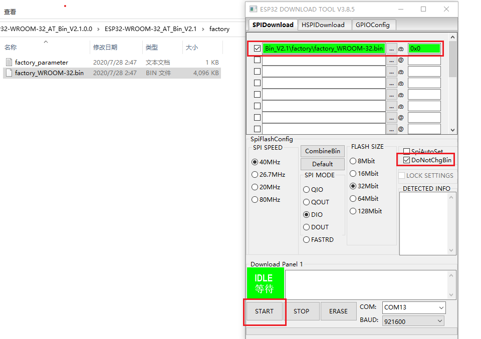
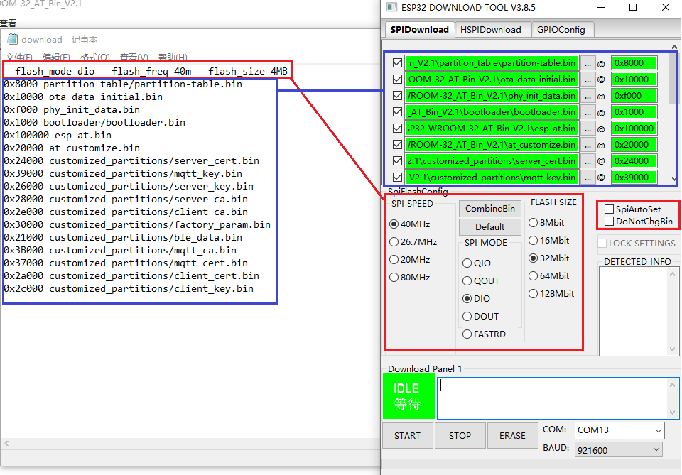

如何烧录 ESP-AT 固件
=================

本文档将针对 windows、linux 和 macos 平台，分别介绍如何使用烧录 AT 固件, 其中, AT 固件可从[https://docs.espressif.com/projects/esp-at/en/latest/AT_Binary_Lists/index.html](https://docs.espressif.com/projects/esp-at/en/latest/AT_Binary_Lists/index.html) 获取，以 `ESP32-WROOM-32_AT_Bin_V2.1` 为例，介绍各个 bin 文件的用途以及参数含义。目录结构如下：

```
.
├── at_customize.bin                 // 二级分区表
├── bootloader                       // bootloader
│   └── bootloader.bin
├── customized_partitions            // AT 自定义 bin 文件
│   ├── ble_data.bin
│   ├── client_ca.bin
│   ├── client_cert.bin
│   ├── client_key.bin
│   ├── factory_param.bin
│   ├── factory_param_WROOM-32.bin
│   ├── mqtt_ca.bin
│   ├── mqtt_cert.bin
│   ├── mqtt_key.bin
│   ├── server_ca.bin
│   ├── server_cert.bin
│   └── server_key.bin
├── download.config                  // 下载参数信息
├── esp-at.bin                       // AT 应用固件
├── factory                          // 量产所需打包好的文件
│   ├── factory_WROOM-32.bin
│   └── factory_parameter.log
├── flasher_args.json                // 下载参数信息新的格式
├── ota_data_initial.bin             // ota data 区初始值
├── partition_table                  // 一级分区表
│   └── partition-table.bin
└── phy_init_data.bin                // phy 初始值信息
```

下载所需参数保存在 `download.config` 中，如下：

```
--flash_mode dio --flash_freq 40m --flash_size 4MB
0x8000 partition_table/partition-table.bin
0x10000 ota_data_initial.bin
0xf000 phy_init_data.bin
0x1000 bootloader/bootloader.bin
0x100000 esp-at.bin
0x20000 at_customize.bin
0x24000 customized_partitions/server_cert.bin
0x39000 customized_partitions/mqtt_key.bin
0x26000 customized_partitions/server_key.bin
0x28000 customized_partitions/server_ca.bin
0x2e000 customized_partitions/client_ca.bin
0x30000 customized_partitions/factory_param.bin
0x21000 customized_partitions/ble_data.bin
0x3B000 customized_partitions/mqtt_ca.bin
0x37000 customized_partitions/mqtt_cert.bin
0x2a000 customized_partitions/client_cert.bin
0x2c000 customized_partitions/client_key.bin
```
参数含义：  

- `--flash_mode dio`: 代表此固件采用的 flash dio 模式进行编译
- `--flash_freq 40m`: 代表此固件采用的 flash 通讯频率为 40MHz
- `--flash_size 2MB`: 代表此固件适用的 flash 最小为 2MB 
- `0x10000 ota_data_initial.bin`: 代表在 `0x10000 ` 位置烧录 `ota_data_initial.bin` 文件，后面参数与此类似。

## Windows 平台

windows 平台下载工具下载地址：[https://www.espressif.com/zh-hans/support/download/other-tools](https://www.espressif.com/zh-hans/support/download/other-tools)，打开工具，如下界面，在此以 ESP-WROOM-32 模组 “Developer Mode” 下载方式为例，如果采用采用量产方式，可以选择 “Factory Mode”，更详细的用法请参见下载工具中的 readme.pdf。

- 打开下载工具


- 选择对应的芯片类型，如果是 ESP8266 芯片，请选择 “ESP8266 DownloadTool”；如果是 ESP32S2 芯片，请选择 “ESP32S2 DownloadTool”


- 可采用采用量产固件下载或者多个 bin 下载，此处选择其中一个方式即可

  - 打包好的量产固件直接下载



  - 多个 bin 文件分开下载



- 通过 AT UART 发送 “AT+GMR\r\n” 命令进行验证，切记：“\r\n” 为工具上的回车换行字符。


## Linux 或 macos 平台

Linux 平台下载工具安装方法请参考 [https://github.com/espressif/esptool](https://github.com/espressif/esptool)

在此以 ESP-WROOM-32 模组为例，打开 shell 界面，根据自己的 UART port 端口，输入

```
esptool.py --chip auto --port /dev/tty.usbserial-0001 --baud 115200 --before default_reset --after hard_reset write_flash -z 
```

和 `download.config` 文件中的内容

```
--flash_mode dio --flash_freq 40m --flash_size 4MB 0x8000 partition_table/partition-table.bin 0x10000 ota_data_initial.bin 0xf000 phy_init_data.bin 0x1000 bootloader/bootloader.bin 0x100000 esp-at.bin 0x20000 at_customize.bin 0x24000 customized_partitions/server_cert.bin 0x39000 customized_partitions/mqtt_key.bin 0x26000 customized_partitions/server_key.bin 0x28000 customized_partitions/server_ca.bin 0x2e000 customized_partitions/client_ca.bin 0x30000 customized_partitions/factory_param.bin 0x21000 customized_partitions/ble_data.bin 0x3B000 customized_partitions/mqtt_ca.bin 0x37000 customized_partitions/mqtt_cert.bin 0x2a000 customized_partitions/client_cert.bin 0x2c000 customized_partitions/client_key.bin
```

总的命令如下：

```
esptool.py --chip auto --port /dev/tty.usbserial-0001 --baud 921600 --before default_reset --after hard_reset write_flash -z --flash_mode dio --flash_freq 40m --flash_size 4MB 0x8000 partition_table/partition-table.bin 0x10000 ota_data_initial.bin 0xf000 phy_init_data.bin 0x1000 bootloader/bootloader.bin 0x100000 esp-at.bin 0x20000 at_customize.bin 0x24000 customized_partitions/server_cert.bin 0x39000 customized_partitions/mqtt_key.bin 0x26000 customized_partitions/server_key.bin 0x28000 customized_partitions/server_ca.bin 0x2e000 customized_partitions/client_ca.bin 0x30000 customized_partitions/factory_param.bin 0x21000 customized_partitions/ble_data.bin 0x3B000 customized_partitions/mqtt_ca.bin 0x37000 customized_partitions/mqtt_cert.bin 0x2a000 customized_partitions/client_cert.bin 0x2c000 customized_partitions/client_key.bin
```

或者输入

```
esptool.py --chip auto --port /dev/tty.usbserial-0001 --baud 115200 --before default_reset --after hard_reset write_flash -z --flash_mode dio --flash_freq 40m --flash_size 4MB 0x0 factory/factory_WROOM-32.bin
```

通过 AT UART 发送 “AT+GMR\r\n” 命令进行验证，切记：“\r\n” 为工具上的回车换行字符。

