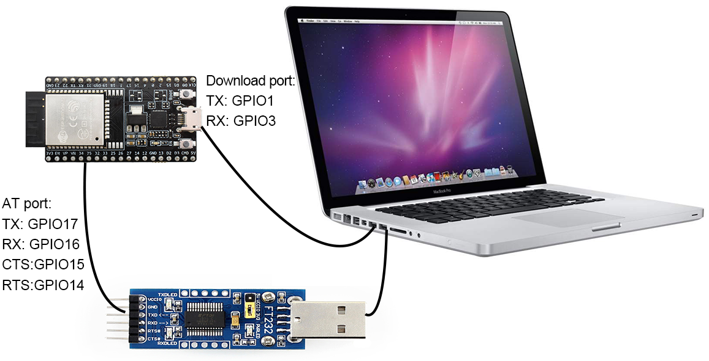
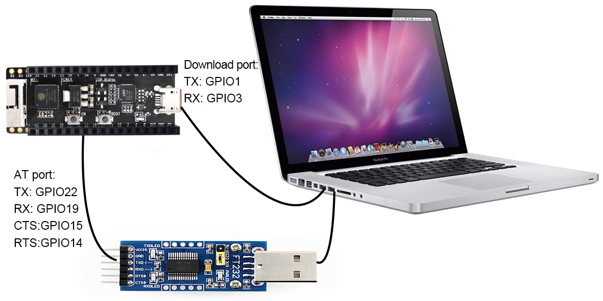
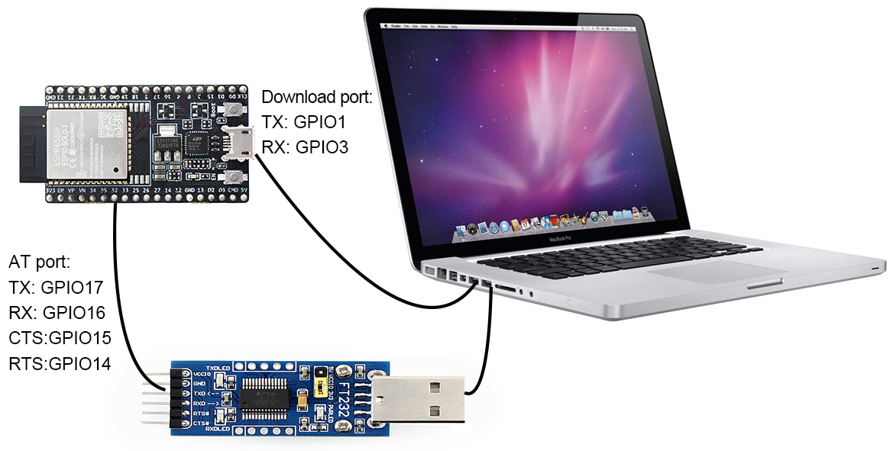

硬件连接
=================

## ESP32 Series

ESP32 AT 需要使用两个串口，UART0 用作下载和打印 log，UART1 发送 AT 命令，由于 ESP32 模组较多，并且每个模组占用的管脚不一样，所以针对不同的模组，UART1 分配的管脚不一样，在采用官方固件时，请一定采用模组对应的 AT 固件。

请参考 [https://docs.espressif.com/projects/esp-idf/en/stable/get-started/establish-serial-connection.html](https://docs.espressif.com/projects/esp-idf/en/stable/get-started/establish-serial-connection.html)，针对不同的模组，下载对应的 USB 驱动。  

模组和开发板信息请参考 [https://docs.espressif.com/projects/esp-idf/en/stable/hw-reference/modules-and-boards.html#wroom-solo-wrover-and-pico-modules](https://docs.espressif.com/projects/esp-idf/en/stable/hw-reference/modules-and-boards.html#wroom-solo-wrover-and-pico-modules)

### ESP32-WROOM-32 Series

开发板连线示意图

  

如果需要基于模组进行连接，请参考官方模组和开发板 datasheet 进行操作。

### ESP32-WROVER-32 Series

开发板连线示意图

  

如果需要基于模组进行连接，请参考官方模组和开发板 datasheet 进行操作。

### ESP32-PICO Series

开发板连线示意图
 

如果需要基于模组进行连接，请参考官方模组和开发板 datasheet 进行操作。

### ESP32-SOLO Series

开发板连线示意图
 

如果需要基于模组进行连接，请参考官方模组和开发板 datasheet 进行操作。

## ESP32S2 Series

ESP32S2 AT 需要使用两个串口，UART0 用作下载和打印 log，UART1 发送 AT 命令。

请参考 [https://docs.espressif.com/projects/esp-idf/en/latest/esp32s2/get-started/establish-serial-connection.html](https://docs.espressif.com/projects/esp-idf/en/latest/esp32s2/get-started/establish-serial-connection.html)，针对不同的模组，下载对应的 USB 驱动。  

模组和开发板信息请参考 [https://docs.espressif.com/projects/esp-idf/en/latest/esp32s2/hw-reference/index.html](https://docs.espressif.com/projects/esp-idf/en/latest/esp32s2/hw-reference/index.html)

开发板连线示意图
 

如果需要基于模组进行连接，请参考官方模组和开发板 datasheet 进行操作。

## ESP8266 Series

ESP8266 AT 需要使用两个串口，UART0 用作下载和发送 AT 命令，UART1 用于打印 log，官方默认适配的模组为 ESP-WROOM-02D。

模组和开发板信息请参考 [https://www.espressif.com/en/products/socs/esp8266](https://www.espressif.com/en/products/socs/esp8266)

开发板连线示意图
 

如果需要基于模组进行连接，请参考官方模组和开发板 datasheet 进行操作。
