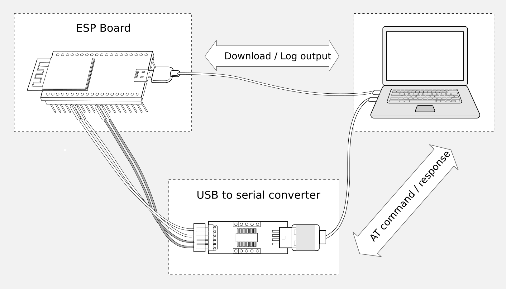

硬件连接
========

:link_to_translation:`en:[English]`

本文档主要介绍下载和烧录 AT 固件、发送 AT 命令和接收 AT 响应所需要的硬件以及硬件之间该如何连接。

不同系列的 AT 固件支持的命令不同，适用的模组或芯片也不尽相同，详情可参考 :doc:`/Compile_and_Develop/esp-at_firmware_differences`。

如果不想要使用 AT 默认管脚，可以参考 :doc:`/Compile_and_Develop/How_to_set_AT_port_pin` 文档更改管脚。

硬件准备
------------

.. list-table:: ESP-AT 测试所需硬件
   :header-rows: 1

   * - 硬件
     - 功能
   * - {IDF_TARGET_NAME} 开发板
     - 从机
   * - USB 数据线（连接 {IDF_TARGET_NAME} 开发板和 PC）
     - 下载固件、输出日志数据连接
   * - PC
     - 主机，将固件下载至从机
   * - USB 数据线（连接 PC 和 USB 转 UART 串口模块）
     - 发送 AT 命令、接收 AT 响应数据连接
   * - USB 转 UART 串口模块
     - 转换 USB 信号和 TTL 信号
   * - 杜邦线（连接 USB 转 UART 串口模块和 {IDF_TARGET_NAME} 开发板）
     - 发送 AT 命令、接收 AT 响应数据连接

   ESP-AT 测试硬件连接示意图

注意：

.. only:: esp32c2

  - 官方提供的默认 :doc:`../AT_Binary_Lists/index` 仅支持 26 MHz 晶振。如果您的 {IDF_TARGET_NAME} 晶振为 40 MHz，请参考 :doc:`../Compile_and_Develop/How_to_clone_project_and_compile_it` 自行编译 {IDF_TARGET_NAME} AT 固件。在第五步配置：

    ::

      python build.py menuconfig -> Component config -> Hardware Settings -> Main XTAL Config -> Main XTAL frequency -> 40 MHz

- 上图使用 4 根杜邦线连接 {IDF_TARGET_NAME} 开发板和 USB 转 UART 串口模块，但如果您不使用硬件流控功能，只需 2 根杜邦线连接 TX/RX 即可。

.. only:: esp32 or esp32c6 or esp32s2

  - 如果您使用的是 {IDF_TARGET_NAME} 模组，而不是开发板，则通过 UART 烧录时，您需要预留出 UART 管脚（参考 {IDF_TARGET_DATASHEET_CN_URL} > 章节管脚描述），预留出 Strapping 管脚（参考 {IDF_TARGET_DATASHEET_CN_URL} > 章节 Strapping 管脚），通过控制 Strapping 管脚电平进入下载模式。

.. only:: esp32c2

  - 如果您使用的是 {IDF_TARGET_NAME} 模组，而不是开发板，则通过 UART 烧录时，您需要预留出 UART 管脚（参考 {IDF_TARGET_DATASHEET_CN_URL} > 章节管脚描述），同时需要满足以下条件之一：

    - 预留出 Strapping 管脚（参考 {IDF_TARGET_DATASHEET_CN_URL} > 章节 Strapping 管脚），通过控制管脚电平进入下载模式
    - 通过发送 :ref:`AT+RST=1,1 <cmd-RST>` 命令，进入下载模式

.. only:: esp32c3

  - 如果您使用的是 {IDF_TARGET_NAME} 模组，而不是开发板，则通过 UART/USB 烧录时，您需要预留出 UART/USB 管脚（参考 {IDF_TARGET_DATASHEET_CN_URL} > 章节管脚描述），同时需要满足以下条件之一：

    - 预留出 Strapping 管脚（参考 {IDF_TARGET_DATASHEET_CN_URL} > 章节 Strapping 管脚），通过控制管脚电平进入下载模式
    - 通过发送 :ref:`AT+RST=1,1 <cmd-RST>` 命令，进入下载模式

.. only:: esp32

  {IDF_TARGET_NAME} 系列
  -----------------------

  {IDF_TARGET_NAME} AT 采用两个 UART 接口：UART0 用于下载固件和输出日志，UART1 用于发送 AT 命令和接收 AT 响应。默认情况下，UART0 和 UART1 均使用 ``115200`` 波特率进行通信。

  所有 {IDF_TARGET_NAME} 模组均连接 GPIO1 和 GPIO3 作为 UART0，但连接不同的 GPIO 作为 UART1，下文将详细介绍如何连接 {IDF_TARGET_NAME} 系列模组。

  更多有关 {IDF_TARGET_NAME} 模组和开发板的信息可参考 `{IDF_TARGET_NAME} 系列模组 <https://www.espressif.com/zh-hans/products/modules?id={IDF_TARGET_NAME}>`_ 和 `{IDF_TARGET_NAME} 系列开发板 <https://www.espressif.com/zh-hans/products/devkits?id={IDF_TARGET_NAME}>`_。

  ESP32-WROOM-32 系列
  ^^^^^^^^^^^^^^^^^^^^^^

  .. list-table:: ESP32-WROOM-32 系列硬件连接管脚分配
    :header-rows: 1

    * - 功能
      - {IDF_TARGET_NAME} 开发板/模组管脚
      - 其它设备管脚
    * - 下载固件/输出日志 :sup:`1`
      - UART0
          * GPIO3 (RX)
          * GPIO1 (TX)
      - PC
          * TX
          * RX
    * - AT 命令/响应 :sup:`2`
      - UART1
          * GPIO16 (RX)
          * GPIO17 (TX)
          * GPIO15 (CTS)
          * GPIO14 (RTS)
      - USB 转 UART 串口模块
          * TX
          * RX
          * RTS
          * CTS

  **说明** 1：{IDF_TARGET_NAME} 开发板和 PC 之间的管脚连接已内置在 {IDF_TARGET_NAME} 开发板上，您只需使用 USB 数据线连接开发板和 PC 即可。

  **说明** 2：CTS/RTS 管脚只有在使用硬件流控功能时才需连接。

  .. figure:: ../../_static/get_started/hw_connection/esp32-wroom-hw-connection.png
    :align: center
    :alt: ESP32-WROOM-32 系列硬件连接示意图
    :figclass: align-center

    ESP32-WROOM-32 系列硬件连接示意图

  如果需要直接基于 ESP32-WROOM-32 模组进行连接，请参考 `《ESP32-WROOM-32 技术规格书》 <https://www.espressif.com/sites/default/files/documentation/esp32-wroom-32e_esp32-wroom-32ue_datasheet_cn.pdf>`_。

  ESP32-MINI-1 系列
  ^^^^^^^^^^^^^^^^^^

  .. list-table:: ESP32-MINI-1 系列硬件连接管脚分配
    :header-rows: 1

    * - 功能
      - {IDF_TARGET_NAME} 开发板/模组管脚
      - 其它设备管脚
    * - 下载固件/输出日志 :sup:`1`
      - UART0
          * GPIO3 (RX)
          * GPIO1 (TX)
      - PC
          * TX
          * RX
    * - AT 命令/响应 :sup:`2`
      - UART1
          * GPIO19 (RX)
          * GPIO22 (TX)
          * GPIO15 (CTS)
          * GPIO14 (RTS)
      - USB 转 UART 串口模块
          * TX
          * RX
          * RTS
          * CTS

  **说明** 1：{IDF_TARGET_NAME} 开发板和 PC 之间的管脚连接已内置在 {IDF_TARGET_NAME} 开发板上，您只需使用 USB 数据线连接开发板和 PC 即可。

  **说明** 2：CTS/RTS 管脚只有在使用硬件流控功能时才需连接。

  .. figure:: ../../_static/get_started/hw_connection/esp32-mini-hw-connection.jpg
    :align: center
    :alt: ESP32-MINI-1 系列硬件连接示意图
    :figclass: align-center

    ESP32-MINI-1 系列硬件连接示意图

  .. _hw-connection-esp32-wrover-series:

  ESP32-WROVER 系列
  ^^^^^^^^^^^^^^^^^^^^^^^^
  .. list-table:: ESP32-WROVER 系列硬件连接管脚分配
    :header-rows: 1

    * - 功能
      - {IDF_TARGET_NAME} 开发板/模组管脚
      - 其它设备管脚
    * - 下载固件/输出日志 :sup:`1`
      - UART0
          * GPIO3 (RX)
          * GPIO1 (TX)
      - PC
          * TX
          * RX
    * - AT 命令/响应 :sup:`2`
      - UART1
          * GPIO19 (RX)
          * GPIO22 (TX)
          * GPIO15 (CTS)
          * GPIO14 (RTS)
      - USB 转 UART 串口模块
          * TX
          * RX
          * RTS
          * CTS

  **说明** 1：{IDF_TARGET_NAME} 开发板和 PC 之间的管脚连接已内置在 {IDF_TARGET_NAME} 开发板上，您只需使用 USB 数据线连接开发板和 PC 即可。

  **说明** 2：CTS/RTS 管脚只有在使用硬件流控功能时才需连接。

  .. figure:: ../../_static/get_started/hw_connection/esp32-wrover-hw-connection.png
    :align: center
    :alt: ESP32-WROVER 系列硬件连接示意图
    :figclass: align-center

    ESP32-WROVER 系列硬件连接示意图

  如果需要直接基于 ESP32-WROVER 模组进行连接，请参考 `《ESP32-WROVER 技术规格书》 <https://www.espressif.com/sites/default/files/documentation/esp32-wrover-e_esp32-wrover-ie_datasheet_cn.pdf>`_。

  ESP32-PICO 系列
  ^^^^^^^^^^^^^^^^^^

  .. list-table:: ESP32-PICO 系列硬件连接管脚分配
    :header-rows: 1

    * - 功能
      - {IDF_TARGET_NAME} 开发板管脚
      - 其它设备管脚
    * - 下载固件/输出日志 :sup:`1`
      - UART0
          * GPIO3 (RX)
          * GPIO1 (TX)
      - PC
          * TX
          * RX
    * - AT 命令/响应 :sup:`2`
      - UART1
          * GPIO19 (RX)
          * GPIO22 (TX)
          * GPIO15 (CTS)
          * GPIO14 (RTS)
      - USB 转 UART 串口模块
          * TX
          * RX
          * RTS
          * CTS

  **说明** 1：{IDF_TARGET_NAME} 开发板和 PC 之间的管脚连接已内置在 {IDF_TARGET_NAME} 开发板上，您只需使用 USB 数据线连接开发板和 PC 即可。

  **说明** 2：CTS/RTS 管脚只有在使用硬件流控功能时才需连接。

  .. figure:: ../../_static/get_started/hw_connection/esp32-pico-hw-connection.png
    :align: center
    :alt: ESP32-PICO 系列硬件连接示意图
    :figclass: align-center

    ESP32-PICO 系列硬件连接示意图

  如果需要直接基于 ESP32-PICO-D4 进行连接，请参考 `《ESP32-PICO-D4 技术规格书》 <https://www.espressif.com/sites/default/files/documentation/esp32-pico-d4_datasheet_cn.pdf>`_。

  ESP32-SOLO 系列
  ^^^^^^^^^^^^^^^^^^

  .. list-table:: ESP32-SOLO 系列硬件连接管脚分配
    :header-rows: 1

    * - 功能
      - {IDF_TARGET_NAME} 开发板/模组管脚
      - 其它设备管脚
    * - 下载固件/输出日志 :sup:`1`
      - UART0
          * GPIO3 (RX)
          * GPIO1 (TX)
      - PC
          * TX
          * RX
    * - AT 命令/响应 :sup:`2`
      - UART1
          * GPIO16 (RX)
          * GPIO17 (TX)
          * GPIO15 (CTS)
          * GPIO14 (RTS)
      - USB 转 UART 串口模块
          * TX
          * RX
          * RTS
          * CTS

  **说明** 1：{IDF_TARGET_NAME} 开发板和 PC 之间的管脚连接已内置在 {IDF_TARGET_NAME} 开发板上，您只需使用 USB 数据线连接开发板和 PC 即可。

  **说明** 2：CTS/RTS 管脚只有在使用硬件流控功能时才需连接。

  .. figure:: ../../_static/get_started/hw_connection/esp32-solo-hw-connection.png
    :align: center
    :alt: ESP32-SOLO 系列硬件连接示意图
    :figclass: align-center

    ESP32-SOLO 系列硬件连接示意图

  如果需要直接基于 ESP32-SOLO-1 进行连接，请参考 `《ESP32-SOLO-1 技术规格书》 <https://www.espressif.com/sites/default/files/documentation/esp32-solo-1_datasheet_cn.pdf>`_。

.. only:: esp32c2

  {IDF_TARGET_CFG_PREFIX}-4MB 系列
  --------------------------------

  {IDF_TARGET_CFG_PREFIX}-4MB 系列指的是内置 {IDF_TARGET_NAME}/ESP8684 芯片，同时有 4 MB flash 的模组/开发板，例如：{IDF_TARGET_NAME} MINI 系列设备、{IDF_TARGET_NAME} WROOM 系列设备。

  {IDF_TARGET_CFG_PREFIX}-4MB AT 采用两个 UART 接口：UART0 用于下载固件和输出日志，UART1 用于发送 AT 命令和接收 AT 响应。默认情况下，UART0 和 UART1 均使用 ``115200`` 波特率进行通信。因为使用 26 MHz 的 XTAL，所以在 ROM 阶段日志是以 ``74880`` 波特率通过 UART0（TX：GPIO20）输出；若更改使用 40 MHz 的 XTAL，则在 ROM 阶段日志是以 ``115200`` 波特率通过 UART0（TX：GPIO20）输出。

  .. list-table:: {IDF_TARGET_CFG_PREFIX}-4MB 系列硬件连接管脚分配
    :header-rows: 1

    * - 功能
      - {IDF_TARGET_CFG_PREFIX}-4MB 开发板/模组管脚
      - 其它设备管脚
    * - 下载固件/输出日志 :sup:`1`
      - UART0
          * GPIO19 (RX)
          * GPIO20 (TX)
      - PC
          * TX
          * RX
    * - AT 命令/响应 :sup:`2`
      - UART1
          * GPIO6 (RX)
          * GPIO7 (TX)
          * GPIO5 (CTS)
          * GPIO4 (RTS)
      - USB 转 UART 串口模块
          * TX
          * RX
          * RTS
          * CTS

  **说明** 1：{IDF_TARGET_CFG_PREFIX}-4MB 开发板和 PC 之间的管脚连接已内置在 {IDF_TARGET_CFG_PREFIX}-4MB 开发板上，您只需使用 USB 数据线连接开发板和 PC 即可。

  **说明** 2：CTS/RTS 管脚只有在使用硬件流控功能时才需连接。

  .. figure:: ../../_static/get_started/hw_connection/esp32-c2-4mb-hw-connection.png
    :align: center
    :alt: {IDF_TARGET_CFG_PREFIX}-4MB 系列硬件连接示意图
    :figclass: align-center

    {IDF_TARGET_CFG_PREFIX}-4MB 系列硬件连接示意图

  如果需要直接基于 {IDF_TARGET_CFG_PREFIX}-4MB 模组进行连接，请参考对应模组的 `技术规格书 <https://www.espressif.com/zh-hans/support/documents/technical-documents>`_。

  {IDF_TARGET_CFG_PREFIX}-2MB 系列
  --------------------------------

  {IDF_TARGET_CFG_PREFIX}-2MB 系列指的是内置 {IDF_TARGET_NAME}/ESP8684 芯片，同时有 2 MB flash 的模组/开发板。

  {IDF_TARGET_CFG_PREFIX}-2MB AT 采用两个 UART 接口：UART0 用于下载固件和输出日志，UART1 用于发送 AT 命令和接收 AT 响应。默认情况下，用于输出日志的 UART0 (GPIO8) 和 UART1 使用 ``115200`` 波特率进行通信。因为使用 26 MHz 的 XTAL，所以在 ROM 阶段日志是以 ``74880`` 波特率通过 UART0（TX：GPIO20）输出；若更改使用 40 MHz 的 XTAL，则在 ROM 阶段日志是以 ``115200`` 波特率通过 UART0（TX：GPIO20）输出。

  .. list-table:: {IDF_TARGET_CFG_PREFIX}-2MB 系列硬件连接管脚分配
    :header-rows: 1

    * - 功能
      - {IDF_TARGET_CFG_PREFIX}-2MB 开发板/模组管脚
      - 其它设备管脚
    * - 下载固件 :sup:`1`
      - UART0
          * GPIO19 (RX)
          * GPIO20 (TX)
      - PC
          * TX
          * RX
    * - AT 命令/响应 :sup:`2`
      - UART1
          * GPIO6 (RX)
          * GPIO7 (TX)
          * GPIO19 (CTS)
          * GPIO20 (RTS)
      - USB 转 UART 串口模块
          * TX
          * RX
          * RTS
          * CTS
    * - 输出日志
      - UART0
          * GPIO8 (TX)
      - USB 转 UART 串口模块
          * RX

  **说明** 1：{IDF_TARGET_CFG_PREFIX}-2MB 开发板和 PC 之间的管脚连接已内置在 {IDF_TARGET_CFG_PREFIX}-2MB 开发板上，您只需使用 USB 数据线连接开发板和 PC 即可。

  **说明** 2：CTS/RTS 管脚只有在使用硬件流控功能时才需连接。

  .. figure:: ../../_static/get_started/hw_connection/esp32-c2-2mb-hw-connection.png
    :align: center
    :alt: {IDF_TARGET_CFG_PREFIX}-2MB 系列硬件连接示意图
    :figclass: align-center

    {IDF_TARGET_CFG_PREFIX}-2MB 系列硬件连接示意图

  如果需要直接基于 {IDF_TARGET_CFG_PREFIX}-2MB 模组进行连接，请参考对应模组的 `技术规格书 <https://www.espressif.com/zh-hans/support/documents/technical-documents>`_。

.. only:: esp32c3

  {IDF_TARGET_NAME} 系列
  -----------------------

  {IDF_TARGET_NAME} 系列指的是内置 {IDF_TARGET_NAME} 芯片的模组/开发板，例如：{IDF_TARGET_CFG_PREFIX} MINI 系列设备、{IDF_TARGET_CFG_PREFIX} WROOM 系列设备。

  {IDF_TARGET_NAME} AT 采用两个 UART 接口：UART0 用于下载固件和输出日志，UART1 用于发送 AT 命令和接收 AT 响应。默认情况下，UART0 和 UART1 均使用 ``115200`` 波特率进行通信。

  .. list-table:: {IDF_TARGET_NAME} 系列硬件连接管脚分配
    :header-rows: 1

    * - 功能
      - {IDF_TARGET_NAME} 开发板/模组管脚
      - 其它设备管脚
    * - 下载固件/输出日志 :sup:`1`
      - UART0
          * GPIO20 (RX)
          * GPIO21 (TX)
      - PC
          * TX
          * RX
    * - AT 命令/响应 :sup:`2`
      - UART1
          * GPIO6 (RX)
          * GPIO7 (TX)
          * GPIO5 (CTS)
          * GPIO4 (RTS)
      - USB 转 UART 串口模块
          * TX
          * RX
          * RTS
          * CTS

  **说明** 1：{IDF_TARGET_NAME} 开发板和 PC 之间的管脚连接已内置在 {IDF_TARGET_NAME} 开发板上，您只需使用 USB 数据线连接开发板和 PC 即可。

  **说明** 2：CTS/RTS 管脚只有在使用硬件流控功能时才需连接。

  .. figure:: ../../_static/get_started/hw_connection/esp32-c3-hw-connection.png
    :align: center
    :alt: {IDF_TARGET_NAME} 系列硬件连接示意图
    :figclass: align-center

    {IDF_TARGET_NAME} 系列硬件连接示意图

  如果需要直接基于 {IDF_TARGET_NAME} 模组进行连接，请参考对应模组的 `技术规格书 <https://www.espressif.com/zh-hans/support/documents/technical-documents>`_。

.. only:: esp32c6

  {IDF_TARGET_CFG_PREFIX}-4MB 系列
  --------------------------------

  {IDF_TARGET_CFG_PREFIX}-4MB 系列指的是内置 {IDF_TARGET_NAME} 芯片，同时有 4 MB flash 的模组/开发板，例如：{IDF_TARGET_CFG_PREFIX} MINI 系列设备、{IDF_TARGET_CFG_PREFIX} WROOM 系列设备。

  {IDF_TARGET_CFG_PREFIX}-4MB AT 采用两个 UART 接口：UART0 用于下载固件和输出日志，UART1 用于发送 AT 命令和接收 AT 响应。默认情况下，UART0 和 UART1 均使用 ``115200`` 波特率进行通信。

  .. list-table:: {IDF_TARGET_CFG_PREFIX}-4MB 系列硬件连接管脚分配
    :header-rows: 1

    * - 功能
      - {IDF_TARGET_CFG_PREFIX}-4MB 开发板/模组管脚
      - 其它设备管脚
    * - 下载固件/输出日志 :sup:`1`
      - UART0
          * GPIO17 (RX)
          * GPIO16 (TX)
      - PC
          * TX
          * RX
    * - AT 命令/响应 :sup:`2`
      - UART1
          * GPIO6 (RX)
          * GPIO7 (TX)
          * GPIO5 (CTS)
          * GPIO4 (RTS)
      - USB 转 UART 串口模块
          * TX
          * RX
          * RTS
          * CTS

  **说明** 1：{IDF_TARGET_CFG_PREFIX}-4MB 开发板和 PC 之间的管脚连接已内置在 {IDF_TARGET_CFG_PREFIX}-4MB 开发板上，您只需使用 USB 数据线连接开发板和 PC 即可。

  **说明** 2：CTS/RTS 管脚只有在使用硬件流控功能时才需连接。

  .. figure:: ../../_static/get_started/hw_connection/esp32-c6-4mb-hw-connection.jpg
    :align: center
    :alt: {IDF_TARGET_CFG_PREFIX}-4MB 系列硬件连接示意图
    :figclass: align-center

    {IDF_TARGET_CFG_PREFIX}-4MB 系列硬件连接示意图

  如果需要直接基于 {IDF_TARGET_CFG_PREFIX}-4MB 模组进行连接，请参考对应模组的 `技术规格书 <https://www.espressif.com/zh-hans/support/documents/technical-documents>`_。

.. only:: esp32s2

  {IDF_TARGET_NAME} 系列
  -----------------------

  {IDF_TARGET_NAME} 系列指的是内置 {IDF_TARGET_NAME} 芯片的模组/开发板，例如：{IDF_TARGET_CFG_PREFIX} MINI 系列设备、{IDF_TARGET_CFG_PREFIX} WROOM 系列设备。

  {IDF_TARGET_NAME} AT 采用两个 UART 接口：UART0 用于下载固件和输出日志，UART1 用于发送 AT 命令和接收 AT 响应。默认情况下，UART0 和 UART1 均使用 ``115200`` 波特率进行通信。

  .. list-table:: {IDF_TARGET_NAME} 系列硬件连接管脚分配
    :header-rows: 1

    * - 功能
      - {IDF_TARGET_NAME} 开发板/模组管脚
      - 其它设备管脚
    * - 下载固件/输出日志 :sup:`1`
      - UART0
          * GPIO44 (RX)
          * GPIO43 (TX)
      - PC
          * TX
          * RX
    * - AT 命令/响应 :sup:`2`
      - UART1
          * GPIO21 (RX)
          * GPIO17 (TX)
          * GPIO20 (CTS)
          * GPIO19 (RTS)
      - USB 转 UART 串口模块
          * TX
          * RX
          * RTS
          * CTS

  **说明** 1：{IDF_TARGET_NAME} 开发板和 PC 之间的管脚连接已内置在 {IDF_TARGET_NAME} 开发板上，您只需使用 USB 数据线连接开发板和 PC 即可。

  **说明** 2：CTS/RTS 管脚只有在使用硬件流控功能时才需连接。

  .. figure:: ../../_static/get_started/hw_connection/esp32-s2-hw-connection.jpg
    :align: center
    :alt: {IDF_TARGET_NAME} 系列硬件连接示意图
    :figclass: align-center

    {IDF_TARGET_NAME} 系列硬件连接示意图

  如果需要直接基于 {IDF_TARGET_NAME} 模组进行连接，请参考对应模组的 `技术规格书 <https://www.espressif.com/zh-hans/support/documents/technical-documents>`_。
