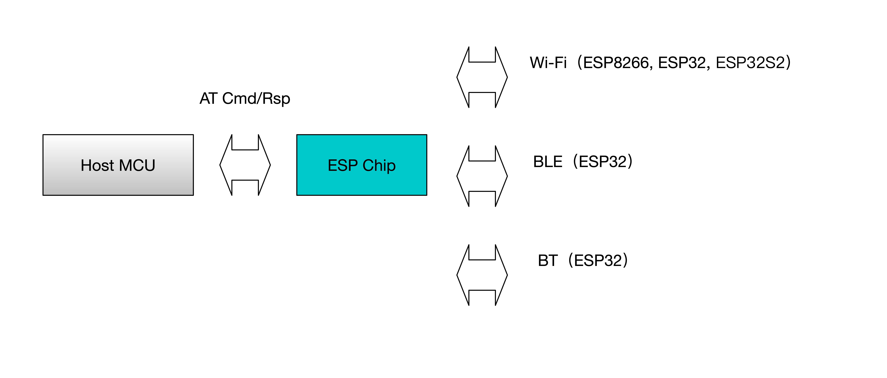

ESP-AT 是什么?
=================

ESP-AT 是乐鑫开发的可直接用于量产的物联网应用固件，旨在降低客户开发成本，快速形成产品。通过 ESP-AT 指令，你可以快速的加入无线网络、连接云平台、实现数据通信以及控制等功能，真正的通过无线通讯实现万物互联。

ESP-AT 是基于 ESP-IDF/ESP8266-RTOS-SDK 实现的一个软件工程。它让 ESP 模组作为 slave，连接一个 host MCU 进行工作。host MCU 发送 AT 命令给 ESP 模组，控制 ESP 模组执行不同的操作，并接收 ESP 模组返回的 AT 响应。   
ESP-AT 提供了大量 AT 命令实现不同的功能，例如，有 Wi-Fi 命令，TCPIP 命令，BLE 命令，BT 命令，MQTT 命令，HTTP 命令，Ethernet 命令等。使得 host MCU 可以直接通过发 AT 命令给 ESP 模组，来实现这些功能。

“AT” 是 “Attention” 的缩写。AT 命令以 “AT” 为开始，以新的一行 (CR LF) 为结尾。  
默认配置下，host MCU 应通过 UART 连接到 ESP 模组，并通过 UART 发送 AT 命令、接收 AT 响应。但是，开发者也可以自行修改程序，使用其他的通信接口，例如 SDIO。  
同样，开发者也可以基于 ESP-AT 工程，自行开发更多的 AT 命令，以实现更多的其他功能。

