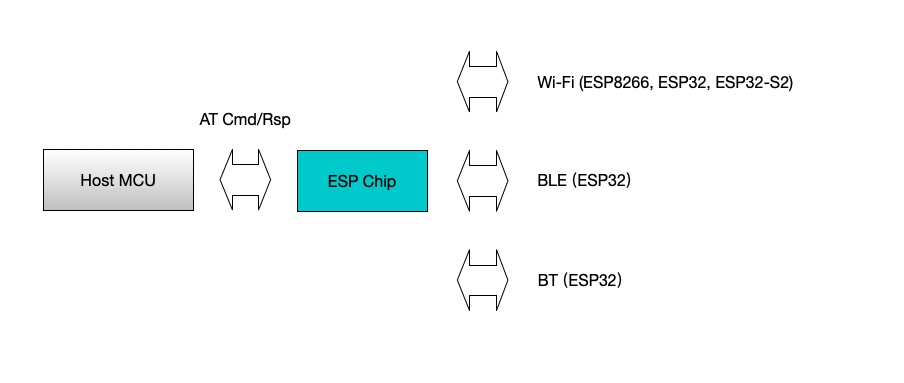

ESP-AT 是什么
==============

:link_to_translation:`en:[English]`

ESP-AT 是乐鑫开发的可直接用于量产的物联网应用固件，旨在降低客户开发成本，快速形成产品。通过 ESP-AT 命令，您可以快速加入无线网络、连接云平台、实现数据通信以及远程控制等功能，真正的通过无线通讯实现万物互联。

ESP-AT 是基于 ESP-IDF 实现的软件工程。它使 {IDF_TARGET_NAME} 模组作为从机，MCU 作为主机。MCU 发送 AT 命令给 {IDF_TARGET_NAME} 模组，控制 {IDF_TARGET_NAME} 模组执行不同的操作，并接收 {IDF_TARGET_NAME} 模组返回的 AT 响应。ESP-AT 提供了大量功能不同的 AT 命令，如 Wi-Fi 命令、TCP/IP 命令、Bluetooth LE 命令、Bluetooth 命令、MQTT 命令、HTTP 命令、Ethernet 命令等。

   ESP-AT 概览

AT 命令以 "AT" 开始，代表 Attention，以新的一行 (CR LF) 为结尾。输入的每条命令都会返回 ``OK`` 或 ``ERROR`` 的响应，表示当前命令的最终执行结果。注意，所有 AT 命令均为串行执行，每次只能执行一条命令。因此，在使用 AT 命令时，应等待上一条命令执行完毕后，再发送下一条命令。如果上一条命令未执行完毕，又发送了新的命令，则会返回 ``busy p...`` 提示。更多有关 AT 命令的信息可参见 :doc:`../AT_Command_Set/index`。

默认配置下，MCU 通过 UART 连接至 {IDF_TARGET_NAME} 模组、发送 AT 命令以及接收 AT 响应。但是，您也可以根据实际使用情况修改程序，使用其他的通信接口，例如 SDIO。

同样，您也可以基于 ESP-AT 工程，自行开发更多的 AT 命令，以实现更多的功能。