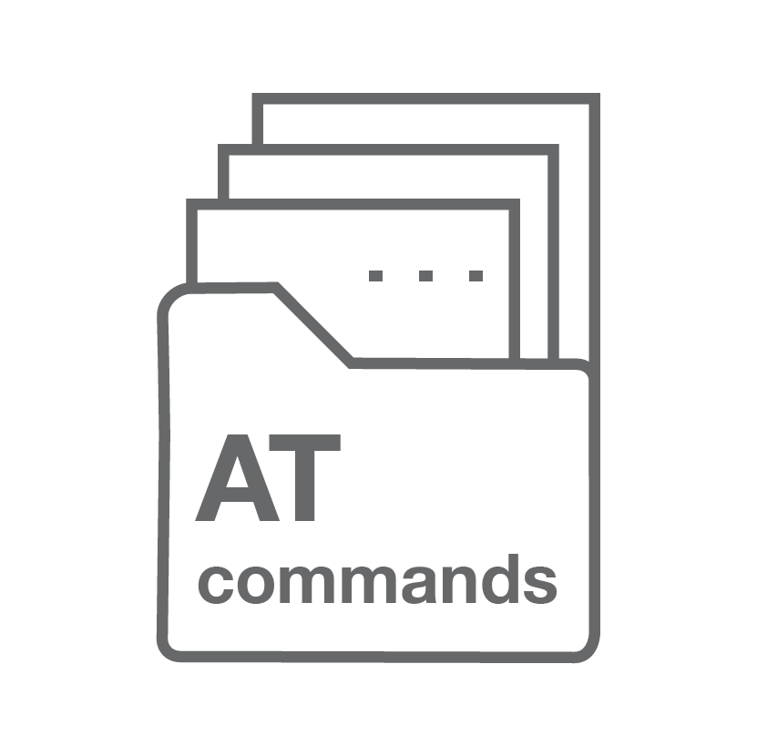
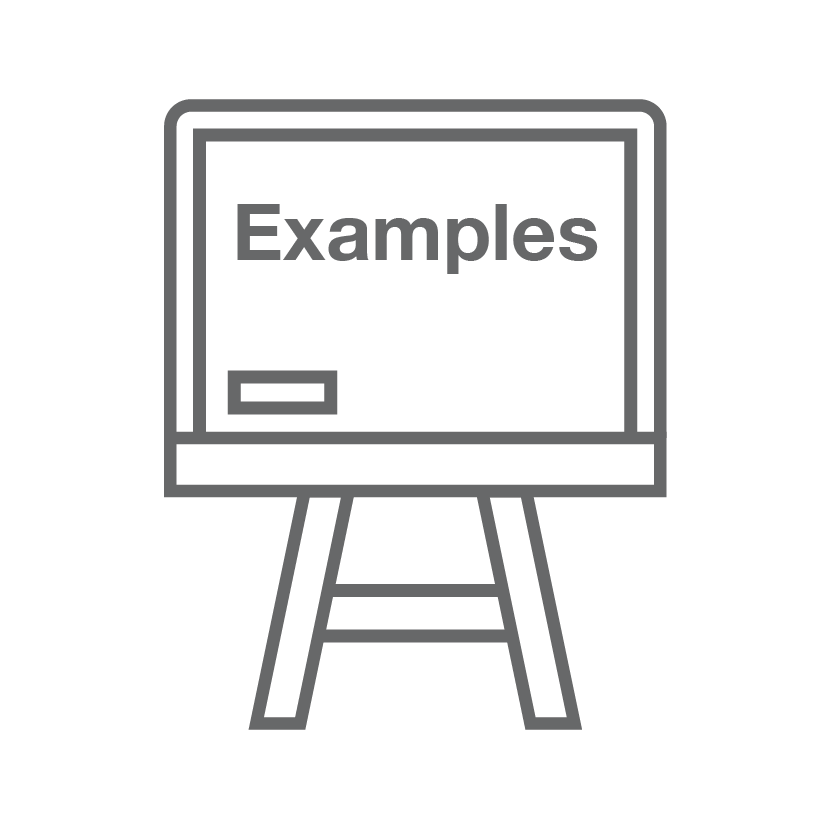

ESP-AT 用户指南
=================

:link_to_translation:`en:[English]`

这里是乐鑫 `ESP-AT <https://github.com/espressif/esp-at>`_ 开发框架的文档中心。ESP-AT 作为由 `Espressif Systems <https://www.espressif.com/zh-hans/home>`_ 发起和提供技术支持的官方项目，适用于 Windows、Linux、macOS 上的 `ESP32、ESP32-C2、ESP32-C3、ESP32-C6、和 ESP32-S2 <https://www.espressif.com/zh-hans/products/socs>`_ 系列芯片。

.. only:: html

    **本文档仅包含针对 {IDF_TARGET_NAME} 芯片的 ESP-AT 使用**。如需了解其他芯片，请在页面左上方的下拉菜单中选择您的目标芯片。

.. only:: latex

    **本文档仅包含针对 {IDF_TARGET_NAME} 芯片的 ESP-AT 使用**。

======================================  ======================================  ======================================
|入门|_                                  |AT Binary 列表|_                        |AT 命令集|_    
--------------------------------------  --------------------------------------  --------------------------------------
`入门`_                                  `AT Binary 列表`_                        `AT 命令集`_   
--------------------------------------  --------------------------------------  --------------------------------------
|AT 命令示例|_                            |编译和开发|_                             |第三方定制化 AT 命令和固件|_
--------------------------------------  --------------------------------------  --------------------------------------
`AT 命令示例`_                            `编译和开发`_                             `第三方定制化 AT 命令和固件`_
======================================  ======================================  ======================================

.. _入门: Get_Started/index.html

.. _AT Binary 列表: AT_Binary_Lists/index.html

.. _AT 命令集: AT_Command_Set/index.html

.. _AT 命令示例: AT_Command_Examples/index.html

.. _编译和开发: Compile_and_Develop/index.html

.. _第三方定制化 AT 命令和固件: Customized_AT_Commands_and_Firmware/index.html

.. toctree::
   :hidden:

   入门 <Get_Started/index>
   AT Binary 列表 <AT_Binary_Lists/index>
   AT 命令集 <AT_Command_Set/index>
   AT 命令示例 <AT_Command_Examples/index>
   AT 版本简介 <versions>
   编译和开发 <Compile_and_Develop/index>
   第三方开放云平台定制化 AT <Customized_AT_Commands_and_Firmware/index>
   FAQ <faq>
   缩写词索引 <index_of_abbreviations>
   关于 ESP-AT <about>
   
* :ref:`genindex`
