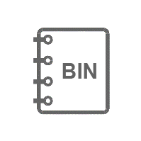
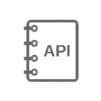

ESP-AT 用户指南
=================

This is the documentation for the ESP-AT.

======================  ======================  ======================  ======================  ======================
    |入门|_               |AT Binary 列表|_         |AT 命令集|_              |AT 命令示例|_            |编译和开发|_     
----------------------  ----------------------  ----------------------  ----------------------  ----------------------
    `入门`_               `AT Binary 列表`_         `AT 命令集`_              `AT 命令示例`_            `编译和开发`_     
======================  ======================  ======================  ======================  ======================

.. _入门: Get_Started/index.html

.. _AT Binary 列表: AT_Binary_Lists/index.html

.. _AT 命令集: AT_Command_Set/index.html

.. _AT 命令示例: AT_Command_Examples/index.html

.. _编译和开发: Compile_and_Develop/index.html

.. toctree::
   :hidden:

   入门 <Get_Started/index>
   AT Binary 列表 <AT_Binary_Lists/index>
   AT 命令集 <AT_Command_Set/index>
   AT 命令示例 <AT_Command_Examples/index>
   编译和开发 <Compile_and_Develop/index>
   
* :ref:`genindex`
