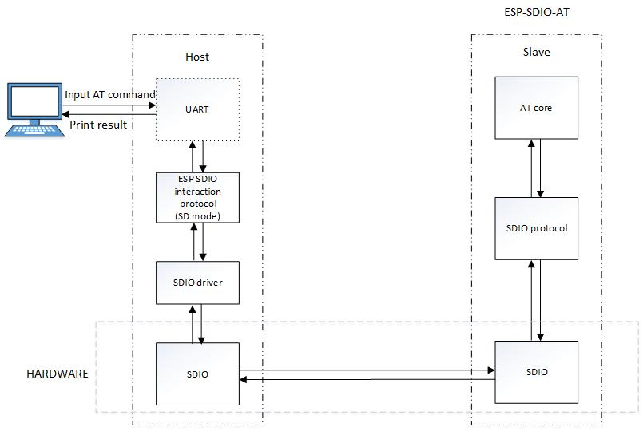

## 简介

SDIO AT 是 MCU 通过 SDIO 协议与 ESP32 侧的 SDIO 进行通信，通信流程如下图所示：



- 作为 Slave 的 ESP32 使用 SDIO 硬件接口，通过 SDIO 协议和 host 进行通信.
- 作为 host 的 MCU 同样使用 SDIO 硬件接口，通过传输 SDIO 协议数据，和 Slave 进行 SDIO 通信.

考虑到与 ESP32 SDIO 交互的协议是纯软件的部分，且与硬件耦合程度较低，因此将这部分进行封装，转换为与平台无关的形式，只需要使用 SDIO 驱动适配需要的接口即可。

## 硬件接口

SDIO slave 可以运行在如下 3 中模式： SPI， 1bit SD 和 4 bit SD 模式。 本文只讲述 SD 模式，对于 SDIO 的 SPI 协议可以参考：[at_sdspi_host](https://github.com/espressif/esp-at/tree/master/examples/at_sdspi_host)，两者的区别在于 MCU 硬件可以使用 SPI， 而不是 SDIO。 

MCU 与  ESP32 的 SDIO 通信硬件管脚连接如下图所示：

| MCU  | ESP32 |
| ---- | ----- |
| CLK  | 14    |
| CMD  | 15    |
| DAT0 | 2     |
| DAT1 | 4     |
| DAT2 | 12    |
| DAT3 | 13    |

- 1-bit SD 模式： 连接 CLK， CMD，DAT0，DAT1 管脚以及 GND
- 4-bit SD 模式： 连接上述全部管脚以及 GND
- 无论 1-bit 模式还是 4-bit SD 模式， SDIO slave 的 CMD 和 D0-D3 都应该连接一个 10K 的上拉电阻，另外需要将电压选择 efuse 烧写为 3.3v，具体注意事项请参考[SD Pullup Requirements](https://espressif-docs.readthedocs-hosted.com/projects/esp-idf/en/latest/api-reference/peripherals/sd_pullup_requirements.html)

## MCU 软件架构

我们提供了 ESP32 以及 STM32F103 作为 MCU 的方案，本章节以 ESP32 为例介绍 MCU 的软件设计架构，STM32 的实现跟 ESP32 相比只是 SDIO 驱动接口有差别，其他代码完全相同。

```
├── components
│   ├── platform    // MCU 的适配层，移植时需要根据自己的平台适配
│   │   ├── component.mk
│   │   └── esp32
│   │       ├── include
│   │       │   ├── platform_os.h
│   │       │   └── sdio_driver_port.h
│   │       ├── platform_os.c   // 操作系统相关接口
│   │       └── sdio_driver_port.c   // sdio 驱动接口
│   └── sdio_host     // 跟 ESP 设备交互的抽象层，剥离了底层 sdio 接口，STM32 和 ESP32 完全相同
│       ├── component.mk
│       ├── include
│       │   ├── sdio_config.h   // 配置信息，选择使用哪个 ESP 设备作为 slave
│       │   ├── sdio_host_error.h
│       │   ├── sdio_host_log.h
│       │   ├── sdio_host_reg.h   // Slave 寄存器
│       │   └── sdio_host_transport.h
│       └── sdio_host_transport.c  // 封装了交互需要的流程
├── main
│   ├── app_main.c
│   ├── component.mk
│   └── Kconfig.projbuild
├── Makefile
└── sdkconfig
```

###  platform

平台相关的接口，应用到不同的平台需要适配这一部分。需要适配的是 SDIO 相关的接口以及 OS 相关的接口。

SDIO 接口主要包括  SDIO 硬件的初始化 （sdio_driver_init）， byte（CMD52 命令）读写操作 （sdio_driver_read/write_byte）， bytes (sdio_driver_read/write_bytes)和 blocks（CMD53）(sdio_driver_read/write_blocks)读写操作以及 SDIO slave 发送数据时的中断操作(sdio_driver_wait_int)。

OS 的接口目前只需要支持 delay 接口即可， 默认支持 freeRTOS 系统。

### sdio_host

平台无关的接口，封装了与 ESP 设备进行 SDIO 通讯时需要用到的各种读写寄存器操作，并提供上层调用接口，上层应该只使用 sdio_host / include 目录下的接口。

例如 SDIO host 要发送数据给 ESP32，在上层只需要调用 sdio_host_send_packet() 即可，而在 sdio_host 内部首先会读取 ESP32 当前可以容纳的最大长度，在满足条件之后才能向指定地址（0x1f800 - 数据长度）发送数据。

## STM32 适配

STM32 相对于 ESP32 的主要区别在于 platform 下面的 SDIO 硬件驱动适配。ST 公司默认只提供了 SDMMC 相关的硬件驱动，SDIO 的驱动需要自己实现， 而我们提供的 STM32 示例中在 STM32F103ZET 上基于 HAL 库实现了 SDIO 相关的驱动，只需要按照相关接口适配到 STM32 其他芯片即可。

STM32 platform 的代码目录结构如下所示

```
├── include
│   ├── platform_os.h
│   ├── sdio_driver_port.h
│   └── sdio.h
├── platform_os.c
├── sdio.c           // STM32 SDIO 驱动实现
└── sdio_driver_port.c   // 驱动中间层，调用 SDIO 驱动，并封装接口给上层调用
```

其中，SDIO 的驱动主要集中在 sdio.c 文件，主要实现如下接口

1. SDIO 硬件初始化（STM32SdioInit）

   硬件初始化包含两部分，自身 SDIO 外设的初始化以及对 SDIO slave 的硬件初始化。STM32SdioInit 接口包含两个参数，分别对应传输模式（1bit 或者 4bit），SDIO 时钟。

2. CMD52 读/写（STM32ReadReg / STM32WriteReg）

   调用 CMD52 进行读写操作，一次只能读写一个字节。

3. CMD53 读/写（STM32ReadData / STM32WriteData）

   调用 DMA 进行数据读写操作，当超过 512 字节时，会使用块传输。

4. 等待 SLAVE 中断 (STM32WaitIntr)

   堵塞等待 SLAVE 发送数据，除非超时或者等到 slave 发送数据触发了中断。

### 适配方法         

> 适配一开始建议使用 1-bit 模式，并将 SDIO clock 尽量调低。
>

在适配到其他 STM32 芯片时，整体架构无需改变，只需要更改 platform 目录下 SDIO 驱动（sdio.c）如下几个部分：

1. 硬件管脚

   1. 寻找芯片对应的 SDIO 管脚以及对应的 DMA channel。建议使用 STM32CubeMx 快速的确认所使用芯片的相应管脚。

2. 寄存器配置

   1. 不同的 STM32 芯片 SDIO 相关的结存器会存在微小的差别，需要根据对应芯片的技术手册来修改，主要涉及如下几个寄存器： 状态寄存器（SDIO_STA），数据控制寄存器（SDIO_DCTRL）。

### 运行信息

如果 STM32 适配完成，正常的启动 log 如下（需要将 sdio_debugLevel设为3，即打开 debug 信息）

```
I sdhost: host ready, start initializing slave...
I STM32_sdio: [Clock] freq=400.0kHz, requested=400.0kHz, divider=118

D STM32_sdio: Relative Card Address: 0x0001

D STM32_sdio: Card selected! RESP1_00001e00

I STM32_sdio: Use 1bit bus width
esp_slave_init_io
D sdio_transport: IOE: 0x00
D sdio_transport: IOR: 0x02
D sdio_transport: IOE: 0x06
D sdio_transport: IOE: 0x02
D sdio_transport: IE: 0x00
D sdio_transport: IE: 0x07
D sdio_transport: Function 0 BSL: 0x00
D sdio_transport: Function 0 BSH: 0x02
D sdio_transport: Function 1 BSL: 0x00
D sdio_transport: Function 1 BSH: 0x02
D sdio_transport: Function 2 BSL: 0x00
D sdio_transport: Function 2 BSH: 0x02
Sdio init done
```

能够正常打印这些 log，说明初始化以及 CMD52 读写均已经成功，但是并不代表数据通信没问题，因为数据通讯依靠 CMD53 命令，只有测试 AT 命令收发没有问题，才能说明整个适配已经成功。

> 如果出现 IOE 和 IOR 等信息全为 0x00，说明硬件通信存在问题，需要检查 SDIO 接线以及初始化流程。

## 使用方法

按照硬件接口的信号线对接即可测试 SDIO 通信

- MCU 需要运行 `at_sdio_host` 示例程序
- ESP 设备在 slave 侧运行 SDIO AT 程序（在 ESP-AT 目录下配置 `./build.py menuconfig` --> `Component config` --> `AT` --> `communicate method for AT command` --> `AT through SDIO`）

## 测试速率

### ESP32

测试 ESP32 作为 SDIO SLAVE，速率如下

| MCU   | SDIO 速率 | SD 模式 | TX       | RX       |
| ----- | --------- | ------- | -------- | -------- |
| ESP32 | 20M       | 4-bit   | 13.3Mbps | 12.4Mbps |
| STM32 | 12M       | 4-bit   | 12Mbps   | 10.2Mbps |

其中：

- TX 表示 MCU 通过 SDIO 传输给 ESP 设备，然后通过 TCP 传输给 TCP server 的速率
- RX 表示 ESP 设备接收到 TCP server 的数据，然后通过 SDIO 传输给 MCU 的速率
- 默认配置项考虑到内存因素无法达到如此高的速率要求，如果需要达到此速率，需要参照 iperf 的配置项修改
