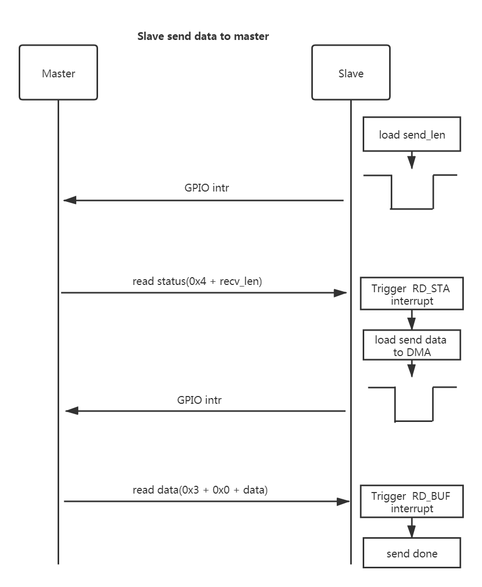
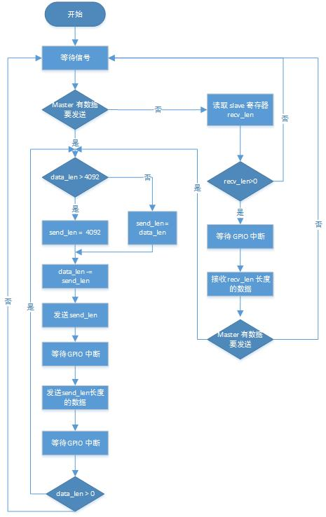
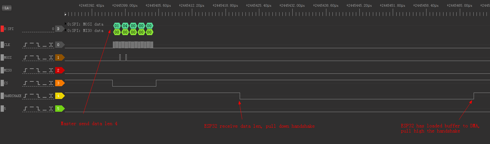
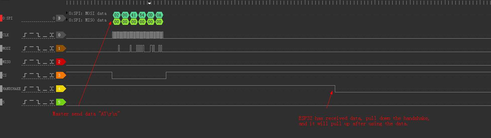
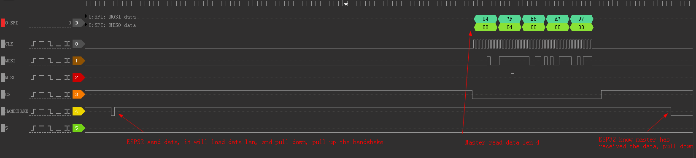
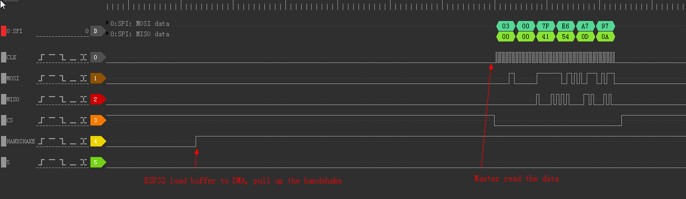

## ESP32 SPI demo 使用说明

### 简介

ESP32 AT SPI slave 驱动使用了 4 个中断进行控制，分别对应读写长度信息和读写数据。读写完之后触发对应的中断，在中断中继续进行下一步的操作，以此来满足更复杂的应用。但是受限于 ESP32 SPI 的硬件限制， SPI 支持的最高 clock 不能超过 10M。

> IDF 的 ESP32 SPI slave 驱动只使用了一个中断（trans_done），无法应用于 ESP32 AT 这种即考虑收又考虑主动发送的复杂情况。 

### 硬件连接

ESP32 SPI slave 支持 IO_MUX，因此可以使用任意空闲管脚。但对于 ESP32 AT 侧，建议使用原生管脚，以降低 IO_MUX 产生的影响。

ESP32 AT （以两个 ESP32 对发为例）中使用了如下管脚进行 SPI 通信，

| Signal    | Slave  | Master |
| --------- | ------ | ------ |
| SCLK      | GPIO15 | GPIO15 |
| MOSI      | GPIO13 | GPIO13 |
| MISO      | GPIO12 | GPIO12 |
| CS        | GPIO14 | GPIO14 |
| HANDSHAKE | GPIO4  | GPIO4  |
| GND       | GND    | GND    |

**备注**： GPIO 中断由上升沿触发

# 软件介绍

### SPI 通信命令

MCU 在与 ESP32 通信时采用半双工模式， MCU 通过使用不同的命令表示读数据或者写数据。数据格式如下所示：

|        | 命令（1byte） | 地址（1byte） | 数据（最长 4092byte） |
| :----: | :-----------: | ------------- | --------------------- |
| 读数据 |      0x3      | 0x0           | recv_data             |
| 写数据 |      0x2      | 0x0           | send_data             |

除了收发数据命令之外，ESP32 有两个 MCU 可访问的 32bit 寄存器（RD_STA 和 WR_STA）。MCU 通过读写这两个 status 寄存器，以此实现传递数据长度信息。通信格式如下所示：

|                 | 命令（1byte） | 数据长度（4byte）         |
| :-------------: | :-----------: | ------------------------- |
| 读寄存器 RD_STA |      0x4      | MCU 读取 ESP32 传输的长度 |
| 写寄存器 WR_STA |      0x1      | MCU 写入需要传输的长度    |

需要注意的是，**MCU 读写 status 不需要使用地址位**，因此在 MCU 开发中需要将读写 status 与读写数据区分开。

### MCU 发送数据给 ESP32

MCU 主动发送的流程如下：

1. MCU 主动发起数据，首先检测  ESP32 是否正在发送数据（避免同时发送），如果正在发送，则 MCU 需要等待。
2. MCU 向 WR_STA 寄存器写入本次需要发送的数据长度。发送长度最多为  4092bytes 的数据（因为 ESP32 SPI DMA 链表最大长度为 4092bytes）
3. ESP32 产生 WR_STA_DONE 中断， 在中断处理中，ESP32 拉低 handshake 管脚，读取需要接收的长度信息，并挂载 buffer 到 DMA，拉高 handshake 管脚触发 GPIO 中断（上升沿）通知 MCU 可以发送数据。
4. MCU 接收到 GPIO 中断信号后，根据之前数据长度发送实际数据。
5. ESP32 接收到数据后， 会产生 WR_BUF_DONE 中断，ESP32 首先拉低 handshake 管脚，在使用完这些数据后拉高 handshake 管脚触发 GPIO 中断（上升沿）通知到 MCU 数据已经取出，可以继续发送。
6. MCU 接收到 GPIO 中断后，一次传输完成。
7. MCU 查询是否还有数据需要发送，如果有则 MCU 继续发送数据，重复步骤 2～6。

### ESP32 发送数据给 MCU

ESP32 发送的流程与 MCU 发送的流程基本类似：

1. ESP32 发数据给 MCU，需要检测 MCU 是否空闲，只有 MCU 空闲时，才能进行传输。
2. ESP32 向 RD_STA 寄存器中写入本次需要发送的数据长度，然后拉低并拉高 handshake 管脚（上升沿）触发 GPIO 中断通知 MCU 取数据。
3. MCU 读取 RD_STA 寄存器中的数据长度信息，ESP32 会产生 RD_STA_DONE 中断。
4. ESP32 在 RD_STA_DONE 中断中拉低 handshake 管脚，将需要发送的数据挂载到 DMA，拉高 handshake 管脚触发 GPIO 中断（上升沿）通知 MCU 读取数据。
5. MCU 在接收到 GPIO 中断后会发起一次 SPI 读数据传输。
6. ESP32 产生 RD_BUF_DONE 中断，传输给上层，标明读数据结束。

### Handshake 线在 SPI-AT 中的作用

Handshake 线在 SPI 相互通信中需要保证传输数据完成，并担任 SLAVE 侧主动发起传输的任务，其主要作用体现在如下两点：

1. ESP32 在准备好接收/发送数据时将此针脚拉高，此时 MCU 会产生一个 GPIO 中断信号，MCU 在接收到中断信号后会读取 ESP32 中的数据。
2. MCU 在发送完数据之后需要堵塞等待 GPIO 中断信号，ESP32 在将 SPI 寄存器中的数据取出后会拉高管脚，从而 MCU 会产生 GPIO 中断，之后 MCU 可以继续传输

### 测试速率

一个 ESP32 作为 MCU 充当 SPI master， 另一个 ESP32 作为 SPI slave 运行 ESP-AT 程序，两者 CPU 同时跑在 240M ，SPI 速率为 9M， 在透传模式下每次发送 2048bytes，屏蔽箱测试 TCP 吞吐如下:

| SPI  时钟 | TX      | RX      |
| --------- | ------- | ------- |
| 9M        | 975KB/s | 660KB/s |

其中：

- TX 表示 MCU 通过 SPI 传输给 ESP 设备，然后通过 TCP 传输给 TCP server 的速率
- RX 表示 ESP32 接收到 TCP server 的数据，然后通过 SPI 传输给 MCU 的速率
- 默认配置项考虑到内存因素无法达到如此高的速率要求，如果需要达到此速率，需要参照 iperf 的[配置项](https://github.com/espressif/esp-idf/blob/release/v4.0/examples/wifi/iperf/sdkconfig.defaults)修改
- 测试版本: release/v2.1.0.0_esp32

## 移植

### MCU 流程

MCU demo 的主要流程如下所示：

1. 首先以阻塞的形式等待信号量，可由以下两种情况解除
    1.  MCU 发送数据时，主动设置信号量解除阻塞
    2.  ESP32 需要发送数据，通过拉高 Handshake 管脚，触发 MCU 产生中断解除阻塞
2. 解除堵塞后，MCU 首先判断发送 buffer 是否存在数据，如果存在，说明此次为 MCU 需要发送数据。跳转到步骤 4 进行 MCU 数据发送。
3. 如果 MCU 发送 buffer 没有数据，则说明  ESP32 需要发送数据，首先发起一次 SPI 传输读取 ESP32 需要发送的长度，如果读取到的长度大于 0， 跳转到步骤 5 进行数据接收；如果读到的长度为 0，说明此次是一次误触发，重新阻塞等待信号。
4. MCU 发送数据，会先检测要发送的数据长度，每次发送长度不能超过 4092 字节（ESP32 DMA 一次接收最大为 4092 bytes），发送数据长度后需要等待 ESP32 拉 Handshake管脚触发  GPIO 中断，接着再发送数据，同样等待 ESP32 将数据处理完成并触发 GPIO 中断。一次发送结束，跳转到步骤 6。
5. ESP32 主动发送数据，MCU 此时已经获取到 ESP32 需要发送的长度，同样需要等待 ESP32 拉 Handshake管脚触发 GPIO 中断。 MCU 去读取对应的数据。一次接收完成，跳转到步骤 6。
6. 检测 MCU 是否还有数据未发送，如果有则继续发送，如果没有则阻塞等待信号。

### 收发控制

当前驱动采用的先发长度，然后发数据的方式，因此任何时候都应该保证在一次传输完成之前不能切换读写状态。SPI slave 驱动只负责监测当前中断状态是否符合预期，如果出错只会打印错误信息，并不会做纠正， 控制由 master 和 slave 各自上层使用控制，建议在收发开始和结束时使用互斥锁。 

### Debug

以 MCU 发送 AT\r\n ， ESP32 返回 AT\r\n 为例， 描述 AT 命令的一次收发流程。

[示例抓包](res/esp32_spi_at_send_at.dsl) 可以下载 [DSView](www.dreamsourcelab.com/download/) 查看，其中 channel0 为 SCLK  ， channel1 为 MOSI，channel2 为 MISO，channel3 为 CS，channel4 为 handshake 线

- SPI_MASTER_WRITE_STATUS_TO_SLAVE

MCU 发送长度命令 0x01，后面跟着需要发送的数据长度 4，第一次发送时 handshake 为初始高电平。ESP32 收到数据长度后会拉低 handshake 线，在将 buffer 挂载到 DMA 后会拉高 handshake 线通知 MCU 可以发送数据。

- SPI_MASTER_WRITE_DATA_TO_SLAVE

MCU 发送数据命令 0x02, 后跟 8bit 长的地址 0x0，后面跟上实际数据长度 4 字节的数据，注意在发送过程中 handshake 是一直拉高的。 ESP32 收到数据后将拉低 hanshke，并在使用完这些数据后重新拉高 handshake 线。

- SPI_MASTER_READ_STATUS_FROM_SLAVE

ESP32 想要发送数据给 MCU， 会先把需要发送的数据长度写入寄存器，拉低拉高 handshake 通知 MCU， MCU 会发送读取长度命令 0x04， slave 会返回长度信息 4。 读取完成之后 ESP32 会拉低 handshake 并将 buffer 挂载到 DMA， 拉高 hanshake 线通知 MCU 读取数据

- SPI_MASTER_READ_DATA_FROM_SLAVE

发送读取数据命令 0x03，后跟 8bit 长的地址 0x0， 之后就是 slave 返回的实际数据， 发送完成后， hanshake 线一直保持高电平。
