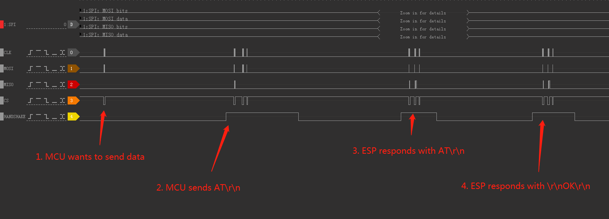
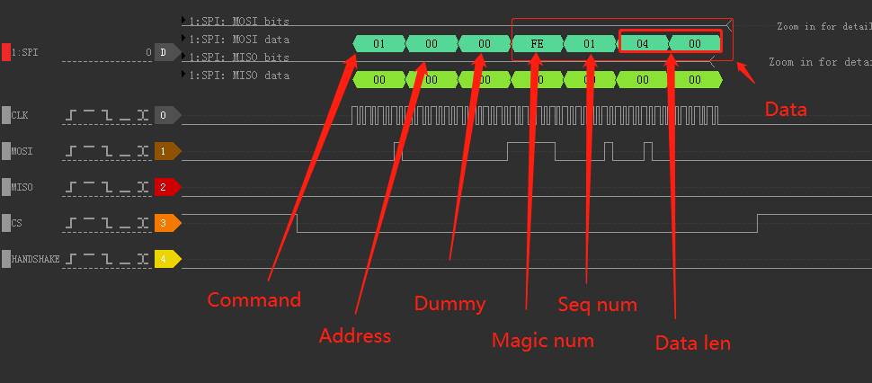
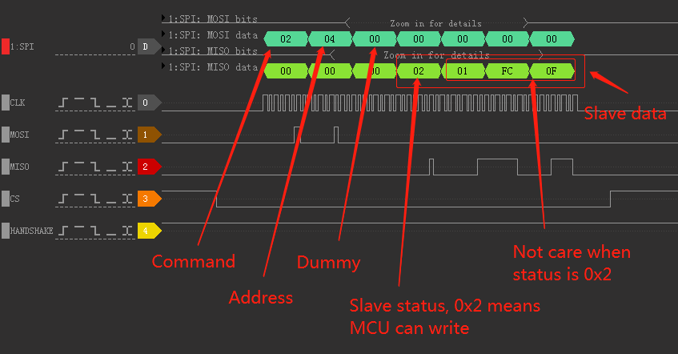
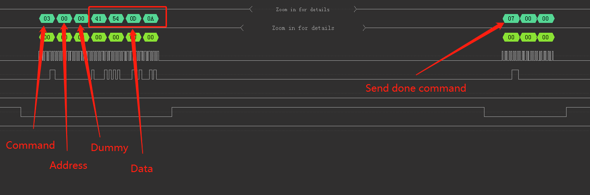
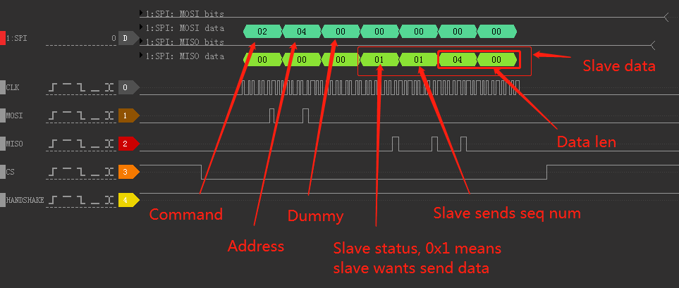
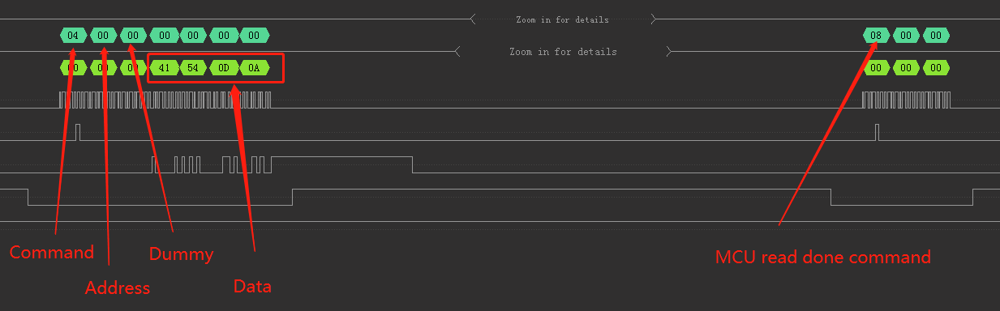

# AT ESP32 SPI Master Example

## Overview

This code demonstrates how to implement the SPI master to read/write a SPI AT slave. Please refer to [ESP SPI AT](https://docs.espressif.com/projects/esp-at/en/latest/esp32c3/Compile_and_Develop/How_to_implement_SPI_AT.html)  for more information about SPI AT.

To facilitate testing, we added an UART task to receive AT commands and print the AT responses. So the schematic of data transmission is as follows：

```
                    （SPI Master)                                 (SPI Slave)
        +-----------------x-----------------+                  +-------x-------+
     TX |                                   |                  |               |
    ----|--------------     ----------------|                  |               |
        | UART Task   |<--->|    SPI Task   |  <----------->   |    SPI AT     |
    ----|--------------     ----------------|                  |               |
     RX |                                   |                  |               |
        +-----------------x-----------------+                  +-------x-------+

```
Please refer to the example code and set up a serial terminal program to the same settings as of UART in ESP32 board, and then you can send AT commands through the serial terminal.

## Pin Assignment

| Signal           | Master(ESP32) | Master(ESP32C3) |
| ---------------- | ------------- | -------------   |
| SCLK             | GPIO15        | GPIO6           |
| MISO             | GPIO12        | GPIO2           |
| MOSI             | GPIO13        | GPIO7           |
| CS               | GPIO14        | GPIO10          |
| HANDSHAKE        | GPIO5         | GPIO3           |
| GND              | GND           | GND             |
| QUADWP(qio/qout) | GPIO16        | GPIO8           |
| QUADHD(qio/qout) | GPIO17        | GPIO9           |

**Note**： QUADWP and QUADHD only used for 4-bit(qio/qout) transactions.

## How to use example

### Hardware Required

To run this example, you need an ESP32 or ESP32-C3 development board.

### Configure the project

Open the project configuration menu (`idf.py menuconfig`). Then go into `SPI master Configuration` menu.

- Set the transmission mode and change the pin assignment if necessary.

### Build and Flash

Run `idf.py -p PORT flash` to build and flash the project.

**Note**： After flashing the project, please close the current terminal to avoid occupying the current serial port.

### Setup external terminal software
Refer to the example code and set up a serial terminal program to the same settings as of UART in ESP32 board. Open the serial interface in the terminal,  connect to the ESP32 UART port, and send "AT\r\n" command. If you can receive the "OK" response, it means the communication is normal.

For more details about AT commands, please refer to [AT Command Set](https://docs.espressif.com/projects/esp-at/en/latest/AT_Command_Set/index.html) .

## Troubleshooting
If you do not see any output from UART port, please check the pin used by the project.

## Communication sample
This section uses the sending of the `AT\r\n` command as an example to describe the process of SPI AT. Because the response flow is the same, we'll just show returning `AT\r\n`.

You can also view the [logic analyzer data](res/send_at_command.dsl) using [DSView](https://www.dreamsourcelab.com/download/).



### 1. Master requests to send data 

Master cannot actively send data to the ESP chip, so before sending, Master needs to request to send data and wait for the ESP chip to pull up the Handshake pin.
As shown below, `Seq num` accumulates each time a Master request is sent.



### 2. Master sends data

Below is the flow of Master sending data.

1. The ESP chip pulls up the Handshake pin.
2. After receiving the Handshake pullup signal, Master reads the slave status, and checks if the status is 0x2 (writable). If yes, Master will start to send data of the length specified in the previous request.
3. Master sends data and notifies the ESP chip that writing data is done.
4. The ESP chip pulls the Handshake pin down.

**2.1 Master reads the status of the slave**

Master needs to read the slave's status to determine whether it can send data. When the status value is 0x2 (writable), Master can write data.

> If the salve status value is 0x1 (readable), it means the ESP chip needs to send data. Master **must** receive the data first. After it is received, the ESP chip detects that Master has data to send and will pull up the Handshake pin.



**2.2 Master sends data**

Master sends data. After sending data, it needs to tell the ESP chip that sending data is done.



### 3. ESP chip response data

The ESP chip response data can be divided into the following steps.

1. The ESP chip pulls up the Handshake pin.
2. Master reads the status and finds the slave status value is 0x1 (readable), and the length of data that is currently being sent by the ESP chip.
3. Master reads data and tells the ESP chip that the reading is done.
4. The ESP chip pulls down the Handshake pin.

**3.1 Master reads the status**



3.2 Master reads the data



